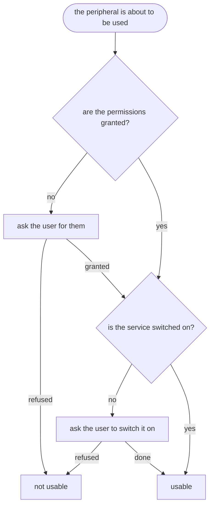

<!--
SPDX-FileCopyrightText: 2024 Benoit Rolandeau <benoit.rolandeau@allcircuits.com>

SPDX-License-Identifier: LicenseRef-ALLCircuits-ACT-1.1
-->

# ACT Abstract peripherals manager <!-- omit from toc -->

## Table of contents <!-- omit from toc -->

- [Presentation](#presentation)
- [Architecture](#architecture)
- [How to use](#how-to-use)
  - [Installation](#installation)
  - [Write the manager](#write-the-manager)
  - [Ask for what the peripheral needs](#ask-for-what-the-peripheral-needs)
- [Testing](#testing)

## Presentation

A peripheral of a device needs two things before it can be used: the permissions the user grants,
and the service the user switches on. This package holds the one sentence which is true of every
peripheral: both are needed, and they are asked for in that order.

It is the base class of the managers of the Bluetooth, of the location, of the WiFi and of anything
else a device answers over. It adds no reading and no asking of its own: the permissions come from
`act_permissions_manager` and the switching on from `act_enable_service_utility`. What it brings is
the two of them put together, so that a manager of a peripheral does not have to remember the order.

## Architecture



The order is the whole point. The service of a peripheral often cannot even be read before its
permissions are granted: asking whether the Bluetooth is switched on, on a device which never
granted the Bluetooth permissions, answers nothing usable.
`checkAndAskForPermissionsAndServices` waits for the permissions to be answered before it looks at
the service, and it stops as soon as one of the two is refused.

`isFullyEnabled` is the same sentence read rather than asked: it answers what is already known,
without displaying anything or reaching the device.

## How to use

### Installation

Add the package to the `dependencies` of your package:

```yaml
dependencies:
  act_abs_peripherals_manager:
    path: ../act_abs_peripherals_manager
```

### Write the manager

```dart
class BleManager extends AbstractPeriphManager {
  @override
  List<PermissionConfig> getPermissionsConfig() => const [
    PermissionConfig(element: PermissionElement.locationWhenInUse),
    PermissionConfig(
      element: PermissionElement.ble,
      whenAskingDependsOn: [PermissionElement.locationWhenInUse],
    ),
  ];

  @override
  EnableServiceElement getElement() => EnableServiceElement.ble;

  @override
  Future<bool> askForEnabling({
    bool isAcceptanceCompulsory = false,
    bool displayContextualIfNeeded = true,
  }) async {
    ...
  }
}

class BleBuilder extends AbstractPeriphBuilder<BleManager> {
  BleBuilder() : super(BleManager.new);
}
```

The manager tells the rest of the application what it reads of its service:

```dart
_adapterStateSub = _ble.adapterState.listen((state) => setEnabled(state.isOn));
```

### Ask for what the peripheral needs

```dart
final manager = globalGetIt().get<BleManager>();

if (await manager.checkAndAskForPermissionsAndServices()) {
  await manager.startScan();
}
```

Reading what is already known, without asking the user anything:

```dart
if (manager.isFullyEnabled()) {
  ...
}
```

## Testing

The tests drive the manager of a peripheral over the permissions of a device which answer what each
test decided, and over a service the test switches on and off. Both are the boundary of the packages
this one builds on, so what is covered here is only the putting together.

Reading a peripheral is covered on the four cases of the permissions and of the service: neither,
one, the other, and both. Asking is covered on the permissions which are asked before the service,
on the permission which is refused and stops everything before the service is reached, on the
service which stays off, on what the service is told of the page which has to stay up, and on the
caller which asks nothing of the user.

```console
> flutter test
```
