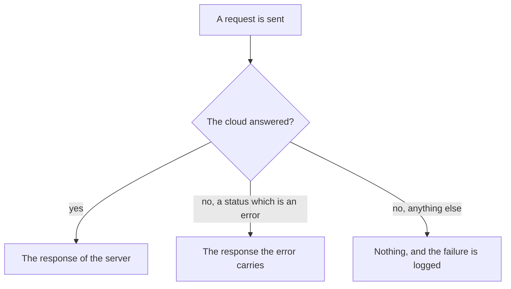

<!--
SPDX-FileCopyrightText: 2024 Benoit Rolandeau <benoit.rolandeau@allcircuits.com>

SPDX-License-Identifier: LicenseRef-ALLCircuits-ACT-1.1
-->

# ACT Amplify API <!-- omit from toc -->

## Table of contents

- [Table of contents](#table-of-contents)
- [Presentation](#presentation)
- [Architecture](#architecture)
  - [The requests](#the-requests)
  - [What a failure answers](#what-a-failure-answers)
  - [The failures of the credentials](#the-failures-of-the-credentials)
  - [Reading a response](#reading-a-response)
- [How to use](#how-to-use)
  - [Installation](#installation)
  - [Register the service](#register-the-service)
  - [Call the API](#call-the-api)
  - [Watch the failures of the credentials](#watch-the-failures-of-the-credentials)
- [Declaring an API which Amplify did not create](#declaring-an-api-which-amplify-did-not-create)
- [Configuration](#configuration)
- [Testing](#testing)

## Presentation

This package is the service which calls the REST APIs of a cloud through Amplify. It is one service
of [the core package](../act_amplify_core/README.md), so an application registers it among the
services of its Amplify manager rather than as a manager of its own.

It covers the REST part of the API category alone. The GraphQL part of Amplify is left out, and so
is everything about the credentials of the user, which belongs to `act_amplify_cognito`.

## Architecture

### The requests

The service offers the HTTP methods an application calls: `get`, `head`, `put`, `post` and
`delete`. The path of a request is relative to the endpoint the configuration of the cloud names,
and an application which reaches more than one endpoint names the one it wants for each request.

A request never throws. What it answers is the response of the server, or nothing at all when there
is no response to answer with, so a caller reads the answer instead of catching an exception.

### What a failure answers



A status which is an error is still an answer of the server: Amplify raises it as an exception which
carries the response, and the service hands that response back. A caller therefore reads the status
of the response rather than telling the two apart.

Nothing is answered when the request never reached a server, or when the answer could not be read.
Those are the failures which are logged, under the logs of the Amplify manager.

### The failures of the credentials

Some failures mean the user has to sign in again, and an application usually wants to leave what it
is doing and say so rather than reading them one request at a time. The service announces them on
`authFailuresStream`, and the application declares which types belong there when it builds the
service. An application which declares none is announced nothing.

Every failure is announced on that stream, whichever request it comes from, and the stream is
closed with the service.

### Reading a response

`HttpResponseUtility` reads what the server answered: the body as text, which is nothing when the
bytes are not the text the encoding expects, and the status as the one `act_http_core` names, which
falls back to the family of a status it does not name.

## How to use

### Installation

Add the package to the `dependencies` of the application:

```yaml
dependencies:
  act_amplify_api:
    path: ../act_amplify_api
```

### Register the service

The service is one of the services of the Amplify manager of the application, and it reads the
endpoints out of the configuration manager it is given as a type:

```dart
class AppConfigManager extends AbstractConfigManager with MixinAmplifyApiConfig {}

class AppAmplifyManager extends AbsAmplifyManager {
  @override
  Future<AmplifyManagerConfig> getAmplifyConfig() async => AmplifyManagerConfig(
        loggerEnabled: true,
        amplifyConfig: await rootBundle.loadString("lib/amplifyconfiguration.dart"),
        amplifyServices: [AmplifyApiService<AppConfigManager>()],
      );
}
```

### Call the API

```dart
final response = await apiService.post(
  "items",
  body: HttpPayload.json({"name": "Mow the lawn"}),
);

if (response == null) {
  // the server was not reached
  return;
}

final status = HttpResponseUtility.getStatus(response);
final body = HttpResponseUtility.tryDecodeBody(response);
```

### Watch the failures of the credentials

```dart
final apiService = AmplifyApiService<AppConfigManager>(
  nonTransientAuthFailureTypes: {SessionExpiredException},
);

apiService.authFailuresStream.listen((_) => goToTheSignInPage());
```

## Declaring an API which Amplify did not create

Amplify has no command which imports an API it did not create, even one which is an AWS API
Gateway. The only way in is the configuration file Amplify generates, and that file is not committed
and depends on the environment; so what the application declares is merged into it instead.

That is what the configuration key below is for: its content is merged with the generated file
before Amplify reads it. Only the `awsAPIPlugin` part of it is used.

For what the content of that part looks like, read
https://docs.amplify.aws/gen1/flutter/build-a-backend/restapi/existing-resources/

## Configuration

| Key                  | Type                   | Description                                                                                 |
| -------------------- | ---------------------- | ------------------------------------------------------------------------------------------- |
| `amplify.api.config` | `Map<String, dynamic>` | Merged with the configuration file Amplify generates. Only the `awsAPIPlugin` part is read. |

## Testing

The tests answer for the REST API of a cloud and read back what it was asked, which covers each
HTTP method reaching the cloud, the path, the headers, the query and the name of the endpoint being
handed over, the body of the requests which carry one, the endpoints read from the configuration and
merged into the one of Amplify, and the failures: the response an error carries, the nothing which
is answered otherwise, what is logged, and what is announced to an application which named the types
it watches.

The categories of Amplify are shared by the whole test file, so each test adds the API of its own
cloud and forgets it once it is over.

```console
> flutter test
```
