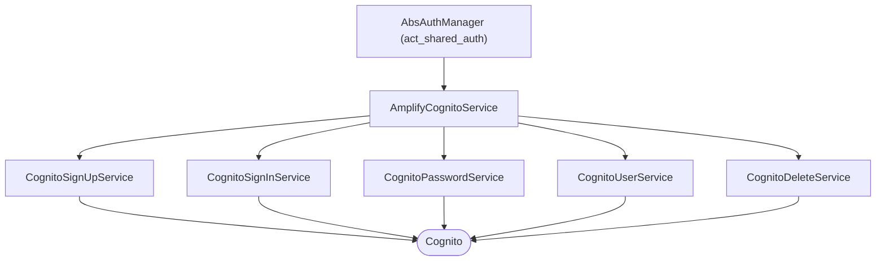

<!--
SPDX-FileCopyrightText: 2024 Benoit Rolandeau <benoit.rolandeau@allcircuits.com>

SPDX-License-Identifier: LicenseRef-ALLCircuits-ACT-1.1
-->

# ACT Amplify cognito <!-- omit from toc -->

## Table of contents

- [Table of contents](#table-of-contents)
- [Presentation](#presentation)
- [Architecture](#architecture)
  - [The service and the five it holds](#the-service-and-the-five-it-holds)
  - [Where the status of the user comes from](#where-the-status-of-the-user-comes-from)
  - [The steps of a sign in](#the-steps-of-a-sign-in)
  - [What an error of the cloud becomes](#what-an-error-of-the-cloud-becomes)
- [How to use](#how-to-use)
  - [Installation](#installation)
  - [Register the service](#register-the-service)
  - [Sign a user in](#sign-a-user-in)
  - [Sign an URL of the cloud](#sign-an-url-of-the-cloud)
- [How to add a Amplify cognito support](#how-to-add-a-amplify-cognito-support)
  - [Create the Amplify Cognito user or identity pool](#create-the-amplify-cognito-user-or-identity-pool)
  - [Import Cognito resources](#import-cognito-resources)
- [AWS Cognito tips and tricks](#aws-cognito-tips-and-tricks)
  - [User pool kinds](#user-pool-kinds)
- [Testing](#testing)

## Presentation

This package signs the users of an application in through AWS Cognito. It is the authentication
service of `act_shared_auth` written over the Cognito plugin of Amplify, and it is registered next
to the other Amplify services of `act_amplify_core`.

What it brings is the translation between the two: every step and every error of Cognito becomes one
of the statuses the rest of an application reads, so a page which shows a sign in knows nothing of
Cognito.

## Architecture

### The service and the five it holds



`AmplifyCognitoService` is what an application registers and calls; each of its methods is handed to
one of the five services, which are split by what a user is doing: registering, signing in,
changing a password, reading or writing what the account carries, and deleting the account.

The five are independent of each other, which is why they are initialized together rather than one
after the other.

### Where the status of the user comes from

The status of the user is not asked for, it is listened to: Cognito tells the application on its own
hub when a user signed in, signed out, saw a session expire or was deleted, and the service turns
each of those into an `AuthStatus` and pushes it on its stream. A status which does not change is
not pushed again.

What the service does ask for, once, is the session of the start: an application which was closed
with a user signed in finds it signed in.

### The steps of a sign in

A sign in with Cognito is rarely one call. What comes back is a step, and the status the application
reads says what to do with it:

| The step of Cognito                     | What the application reads      |
| --------------------------------------- | ------------------------------- |
| The sign in is over                     | `done`                          |
| A new password is needed                | `confirmSignInWithNewPassword`  |
| The sign up was never confirmed         | `confirmSignUp`                 |
| The password has to be reset            | `resetPassword`                 |
| Anything which needs a second factor    | `notSupportedYet`               |

The steps which ask for a second factor are the ones this package does not speak yet: they are read
and named, so that an application shows something rather than hanging, but nothing is done with
them.

### What an error of the cloud becomes

Cognito raises rather than answering, and every call of this package catches that and gives back a
status with the exception next to it, so an application which wants the detail still has it:

| The exception of Cognito       | What it means to the application               |
| ------------------------------ | ---------------------------------------------- |
| `NetworkException`             | The device is not online                       |
| `NotAuthorizedServiceException` | The credentials are wrong, or the session ended |
| `InvalidPasswordException`     | The password does not follow the rules         |
| `UsernameExistsException`      | The account is already taken                   |
| `AliasExistsException`         | The email address is already taken             |
| `CodeMismatchException`        | The code the user read is not the one which was sent |
| `ExpiredCodeException`         | The code is too old                            |
| `InvalidParameterException`    | One of the values is not one the pool takes    |

The session which ended is told from the credentials which are wrong by the message of the
exception: Cognito raises the same one for both, and only the message says that a session expired
while the user was choosing a password.

`getNonTransientAuthFailureTypes` names the exceptions an application catches to know that a user
has to sign in again rather than to try again.

## How to use

### Installation

Add the package to the `dependencies` of your package:

```yaml
dependencies:
  act_amplify_cognito:
    path: ../act_amplify_cognito
```

### Register the service

The service is one of the Amplify services of the application, so it is registered with them:

```dart
class AppAmplifyManager extends AbsAmplifyManager {
  @override
  Future<List<AbsAmplifyService>> getAmplifyServices() async => [AmplifyCognitoService()];
}
```

The authentication manager of the application is then handed that service:

```dart
class AppAuthManager extends AbsAuthManager {
  @override
  Future<MixinAuthService> getAuthService() async => globalGetIt().get<AppAmplifyManager>()
      .getService<AmplifyCognitoService>()!;
}
```

### Sign a user in

```dart
final result = await authManager.signInUser(username: username, password: password);

switch (result.status) {
  case AuthSignInStatus.done:
    _openTheHomePage();
  case AuthSignInStatus.confirmSignInWithNewPassword:
    _askForANewPassword();
  case AuthSignInStatus.confirmSignUp:
    _askForTheCodeOfTheSignUp();
  default:
    _showTheError(result.status);
}
```

### Sign an URL of the cloud

An application which reaches a service of AWS directly, rather than through Amplify, signs the URL
with the credentials of the session:

```dart
final session = await cognitoService.getAwsAuthSession();

final url = cognitoService.signUrl(
  creds: session.credentialsResult.value,
  service: AWSService.s3,
  region: "eu-west-3",
  endpoint: "a.bucket.s3.eu-west-3.amazonaws.com",
  signerValidityDuration: const Duration(minutes: 5),
  urlPath: "/a/file.png",
  scheme: "https",
);
```

## How to add a Amplify cognito support

### Create the Amplify Cognito user or identity pool

First create the user or identity pool in your AWS Web console. Don't do it through the CLI.
Choose pool kind very carefully (see [User pool kinds](#user-pool-kinds) chapter).

### Import Cognito resources

_We follow this page:
[Use an existing Cognito User Pool and Identity Pool](https://docs.amplify.aws/gen1/flutter/build-a-backend/auth/import-existing-resources/)_

If you aren't already connected, you have to be logged in (and to the right AWS account).

In your bash, call the following command:

> amplify import auth

Choose user or identity pool.

If you have several resources, it will ask you to choose one. If not it will select the only one
available for you.

Finally call the push command to send your new configuration to the cloud:

> amplify push

## AWS Cognito tips and tricks

### User pool kinds

Cognito user pools can be created either username-centric or email-centric.
This can not be changed afterward and this impacts API usage, especially self sign-up.

If user pool has been created username-centric (default), account is identified by its username.

- user must choose a unique username during sign-up
- app can not really compute a derived one from initial email address (replacing @ sign) since
  someone can have mistakenly used a wrong email (and would lock it due to username collision) and
  since username will not change when user changes its email which leads to a very insane state
  locking initial email.
- user can sign-in using its username, or using its email address if stored in user profile
  and if validated. Note that several accounts can share a same email address in their profile,
  but since validating an email address for an account invalidates this same email address from all
  other accounts, email-based sign-in selects the account with latest verified email.
- cognito can be configured to enforce email address uniqueness among accounts, but this is actually
  checked after account creation, upon confirmation code submission, leading to an unusable account
  since sign-in attempts to update profile requires the confirmation code which complains about
  email address collision and sign-up attempts to override email address complains about username
  collision.

If user pool has been created email-centric, account is identified by its email.

- all user identification API arguments must be given email values
- user can sign-in only using its email address
  - cognito user UUID actually works too but user is never given this UUID
- attempting to sign-up with a colliding email address is properly and early rejected
  - attempting to later change email address with a colliding one is also rejected

## Testing

The tests drive the services over an authentication which answers what each test lined up: Cognito
opens a session with a server, which no test can do, so it is the plugin of Amplify which is stood
in for. The events of the cloud are sent on the hub of Amplify, the way Cognito sends them.

Every call is covered on what it sends to the cloud, on the step which comes back, and on the
exceptions which are turned into a status, including the two which share an exception and are told
apart by its message. The registering is covered on the values it refuses before sending anything,
and the address of a user on the attribute it is read from and written to.

The status of the user is covered on the session of the start, on each of the four events of the
cloud, and on the event which changes nothing and is not pushed again.

Two things are out of reach. The results of a sign out are built by Cognito itself, and neither the
one which says that it went through nor the one which says that it did not has a constructor a test
can call. The tokens of a session are signed by Cognito, so what is covered of reading them is what
happens when the session carries none.

```console
> flutter test
```
