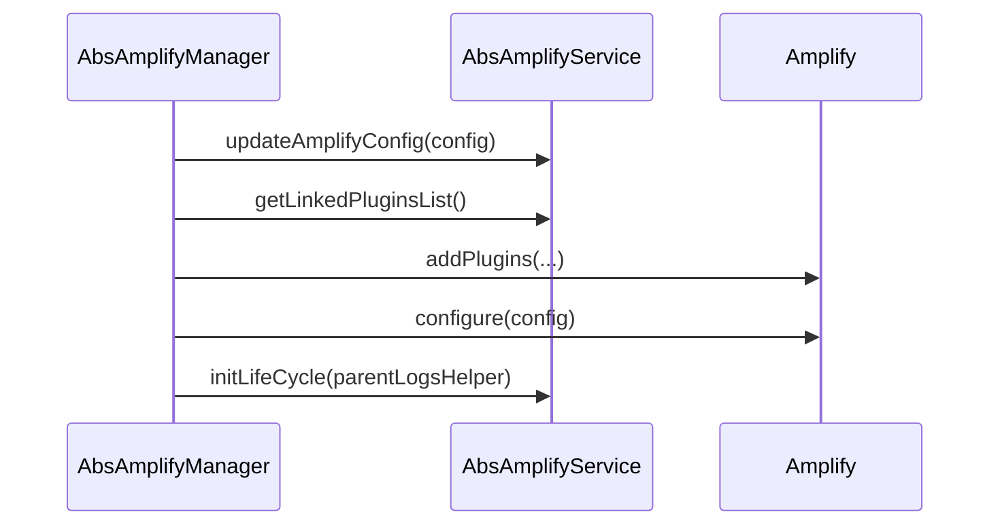

<!--
SPDX-FileCopyrightText: 2024 Benoit Rolandeau <benoit.rolandeau@allcircuits.com>

SPDX-License-Identifier: LicenseRef-ALLCircuits-ACT-1.1
-->

# ACT Amplify Core  <!-- omit from toc -->

## Table of contents

- [Table of contents](#table-of-contents)
- [Presentation](#presentation)
- [Architecture](#architecture)
  - [The manager and its services](#the-manager-and-its-services)
  - [Completing the configuration](#completing-the-configuration)
  - [Giving up rather than half configuring](#giving-up-rather-than-half-configuring)
- [How to use](#how-to-use)
  - [Installation](#installation)
  - [Write a service](#write-a-service)
  - [Register the manager](#register-the-manager)
- [Amplify Gen 1](#amplify-gen-1)
  - [Amplify presentation](#amplify-presentation)
  - [Install Amplify CLI](#install-amplify-cli)
  - [Add Amplify to the project](#add-amplify-to-the-project)
  - [Import AWS objects in the project](#import-aws-objects-in-the-project)
  - [Delete imported AWS objects](#delete-imported-aws-objects)
- [Testing](#testing)

## Presentation

This package is where an application configures the cloud it talks to, once, for every feature it
uses. It offers no feature of its own: authentication, storage and the rest come from the other
`act_amplify_*` packages, and this one is what they hang on.

The cloud itself is reached through [amplify_flutter](https://pub.dev/packages/amplify_flutter),
which has to be configured before any of its features answers, and configured only once. That is
what this package owns.

## Architecture

### The manager and its services

`AbsAmplifyManager` is the manager an application registers, and `AbsAmplifyService` is one feature
of the cloud. A service brings the plugins it needs, the part of the configuration it wants
completed, and what it does once the cloud is configured.



A service is only initialized once the cloud answers, so it never runs against a cloud which is not
configured.

### Completing the configuration

The configuration of the cloud is generated by the tools of Amplify, and an application sometimes
has to change it at run time: an address which depends on the environment, a value which is read
elsewhere. Each service is handed the configuration in turn, and each is handed what the previous
one gave back, so a service builds on the changes of the ones before it.

The plugins are added service by service. Two services which add the same plugin make Amplify
fail, and that is wanted: two services may configure the same plugin differently, and a failure
says so rather than letting one win silently.

### Giving up rather than half configuring

The manager stops, and logs, rather than going on with a cloud which is half configured: when the
configuration cannot be read, when a service refuses to complete it, and when the cloud refuses the
configuration. In each of those cases no service is initialized.

The logs of the manager are turned off by its configuration, for an application which does not want
the traces of the cloud, and each service logs under the category of the manager and its own.

## How to use

### Installation

Add the package to the `dependencies` of your package:

```yaml
dependencies:
  act_amplify_core:
    path: ../act_amplify_core
```

### Write a service

A service of an application is usually brought by one of the other `act_amplify_*` packages; an
application writes one when it needs a feature none of them covers:

```dart
class MyService extends AbsAmplifyService {
  late final LogsHelper _logsHelper;

  @override
  Future<List<AmplifyPluginInterface>> getLinkedPluginsList() async => [AmplifyMyPlugin()];

  @override
  Future<void> initLifeCycle({LogsHelper? parentLogsHelper}) async {
    await super.initLifeCycle();
    _logsHelper = AbsAmplifyService.createLogsHelper(
      logCategory: "myService",
      parentLogsHelper: parentLogsHelper,
    );
  }
}
```

### Register the manager

```dart
class AppAmplifyManager extends AbsAmplifyManager {
  @override
  Future<AmplifyManagerConfig> getAmplifyConfig() async => AmplifyManagerConfig(
        loggerEnabled: globalGetIt().get<AppConfigManager>().amplifyLogsEnabled.load(),
        amplifyConfig: amplifyconfig,
        amplifyServices: [MyService()],
      );
}

class AppAmplifyBuilder extends AbsAmplifyBuilder<AppAmplifyManager, AppConfigManager> {
  AppAmplifyBuilder() : super(AppAmplifyManager.new);
}
```

```dart
GlobalManager.instance.register(AppAmplifyBuilder());
```

`amplifyconfig` is the constant of the file the tools of Amplify generate, which the next section
explains how to produce.

## Amplify Gen 1

### Amplify presentation

This package needs the usage of the Amplify code creation. The way it creates the code depends of
the Amplify Gen. In our case, we choose to go with Amplify Gen1 version 2.

Once Amplify tools are installed (see below), you can configure a project using amplify CLI. This
will create a `amplify` folder at the root of your project, containing the configuration of your
project. It will also create a `lib/amplifyconfiguration.dart` file that will be used by the
Amplify DART libraries to connect to your AWS resources (Cognito, S3 etc).

### Install Amplify CLI

_Source: https://docs.amplify.aws/gen1/flutter/start/getting-started/installation/_

_This part is only needed if you haven't done yet_

First, you need to have nodejs installed on your PC.

Open a bash prompt on the root of the project.

Then, install amplify cli:

> npm install -g @aws-amplify/cli

If you don't have an AWS IAM account yet, ask an AWS administrator to create you
a XXX-dev-amplify account with a permanent token (access key).
_(for admins, follow [this](https://docs.amplify.aws/gen1/javascript/tools/cli/start/set-up-cli/#configure-the-amplify-cli)
process)._

Configure amplify:

> amplify configure

- Ignore opened AWS console (press enter)
- Select _project_ region (see project README.md)
- Ignore user creation (press enter)
- Enter your 20-char accessKeyId (given to you by the admin)
- Enter your 40-char secretAccessKey (given to you by the admin)
- Set a project-specific profile name (see project README.md,
  typically `<project>-[dev|qualif|prod]`)

### Add Amplify to the project

In the root folder of your project, you have to init amplify by calling:

> amplify init

- Environment name: `[default|dev|qualif|prod]`, likely `default`
- Authentication: AWS profile
- Choose the previously-created `<project>-[dev|qualif|prod]` profile

### Import AWS objects in the project

You may need to import new AWS objects during the development of the project. For example you might
want to access an [aws S3 bucket](https://aws.amazon.com/fr/s3/) or use an
[aws cognito user pool](https://docs.aws.amazon.com/cognito/latest/developerguide/cognito-user-pools.html).
In this case, you can just run the following command (given that a user pool and an S3 bucket exist
in aws):

Identify the aws service related to the object you want to import (e.g. `auth` for cognito, `storage`
for S3) and run the following command:

```bash
amplify <service> import
# for example to import a cognito user pool:
amplify auth import
# then follow the instructions in cli
# for example to import an S3 bucket:
amplify storage import
# then follow again the instructions in cli
```

Once your objects are imported, do not forget to push the changes to the cloud:

```bash
amplify push
```

### Delete imported AWS objects

At some point during the development, you might want to delete an imported object to replace it with
another one. To do so, you can run the following command:

Identify the aws service related to the object you want to delete (e.g. `auth` for cognito, `storage`
for S3) and run the following command:

```bash
amplify <service> remove
# for example to remove a cognito user pool:
amplify auth remove
# follow the instructions in cli
# and to remove an S3 bucket:
amplify storage remove
# follow again the instructions in cli
```

## Testing

The tests drive the manager with services the test answers for, which covers every service being
asked to complete the configuration, each of them being handed what the previous one gave back, and
the services being disposed with the manager.

Every way the manager gives up is covered by the services which are then not initialized: the
configuration which cannot be read, the service which refuses to complete it, and the cloud which
refuses it, which is what a test always gets since no cloud answers there.

For the same reason, what happens once the cloud is configured is not covered.

```console
> flutter test
```
