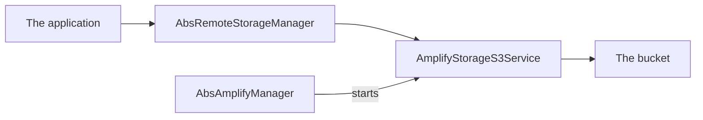

<!--
SPDX-FileCopyrightText: 2024 Théo Magne <theo.magne@allcircuits.com>

SPDX-License-Identifier: LicenseRef-ALLCircuits-ACT-1.1
-->

# Act Amplify Storage <!-- omit from toc -->

## Table of contents

- [Table of contents](#table-of-contents)
- [Presentation](#presentation)
- [Architecture](#architecture)
  - [Two managers, one service](#two-managers-one-service)
  - [Listing the objects of a bucket](#listing-the-objects-of-a-bucket)
  - [Downloading an object](#downloading-an-object)
  - [What a failure says](#what-a-failure-says)
- [How to use](#how-to-use)
  - [Installation](#installation)
  - [Register the service](#register-the-service)
  - [Read a bucket](#read-a-bucket)
- [Testing](#testing)

## Presentation

This package reads the objects of an S3 bucket through Amplify. It is the S3 answer to what
[the remote storage manager](../act_remote_storage_manager/README.md) asks a storage service for, so
an application drives it through that manager and its cache rather than directly.

It reads a bucket and does not write to it: the objects can be listed, downloaded and linked to.
Uploading, copying and removing are left out, and so is everything about the credentials of the
user, which belongs to `act_amplify_cognito`.

## Architecture

### Two managers, one service

The service wears two hats. It is a service of the Amplify manager, which starts it and brings the
S3 plugin along, and it is the storage service of the remote storage manager, which is what an
application calls.



Both managers therefore have to be registered by the application, and the same instance of the
service given to both.

### Listing the objects of a bucket

A path names a folder of the bucket, and what is listed is a page of the objects under it: as many
as a page holds, and a token for the page which comes next. What lies under the folders of that
path is left out unless the listing is asked to go through them.

### Downloading an object

An object is downloaded to a file of the device, under the directory the caller names or under the
cache of the application when it names none. The folders of the path are created along the way, so
an object named `aFolder/anObject` lands in a folder of that name.

A caller which follows the download is told how far it went and which state it is in, at every step
the device reports one.

### What a failure says

Nothing throws. Every call answers a result, and the caller reads it:

| The bucket                        | The result     |
| --------------------------------- | -------------- |
| answered                          | `success`      |
| refused the access                | `accessDenied` |
| answered that the session is over | `accessDenied` |
| anything else                     | `genericError` |

A device which holds no directory to download to answers `ioError`, which is the one failure which
comes from the device rather than from the bucket. Every failure is logged under the logs of the
Amplify manager.

## How to use

### Installation

Add the package to the `dependencies` of the application:

```yaml
dependencies:
  act_amplify_storage_s3:
    path: ../act_amplify_storage_s3
```

### Register the service

The service belongs to the Amplify manager, which starts it, and to the remote storage manager,
which calls it:

```dart
final storageService = AmplifyStorageS3Service();

class AppAmplifyManager extends AbsAmplifyManager {
  @override
  Future<AmplifyManagerConfig> getAmplifyConfig() async => AmplifyManagerConfig(
        loggerEnabled: true,
        amplifyConfig: await rootBundle.loadString("lib/amplifyconfiguration.dart"),
        amplifyServices: [AmplifyCognitoService(), storageService],
      );
}

class AppStorageManager extends AbsRemoteStorageManager {
  AppStorageManager() : super(storageService: storageService);
}
```

The credentials of the bucket come from the Amplify configuration of the application, so the
service takes no configuration of its own.

### Read a bucket

```dart
final storage = globalGetIt().get<AppStorageManager>();

final (result: _, page: page) = await storage.listFiles("aFolder/");

final (result: result, file: file) = await storage.getFile(
  "aFolder/anObject",
  onProgress: (progress) => print(progress.progress),
);
```

## Testing

The tests answer for the storage of a bucket and read back what it was asked, which covers the path
the objects are listed under, the page size and the token handed over, the folders left out of a
listing which is not recursive, the objects handed back as the files of a page, the object
downloaded under the directory it is given and under the cache of the application when it is given
none, the folders created along the way, the progress reported at every state a download goes
through, and the link to an object.

Every failure is covered by the result it answers, including the one of a device which holds no
directory to download to, for which the directories of the device are answered by the test as well.

The categories of Amplify are shared by the whole test file, so each test adds the storage of its
own bucket and forgets it once it is over.

```console
> flutter test
```
