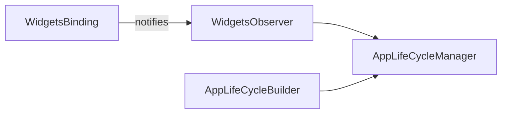

<!--
SPDX-FileCopyrightText: 2020 - 2023 Sami Kouatli <sami.kouatli@allcircuits.com>
SPDX-FileCopyrightText: 2023 Benoit Rolandeau <benoit.rolandeau@allcircuits.com>

SPDX-License-Identifier: LicenseRef-ALLCircuits-ACT-1.1
-->

# ACT App life cycle manager <!-- omit from toc -->

## Table of contents

- [Table of contents](#table-of-contents)
- [Presentation](#presentation)
- [Architecture](#architecture)
  - [The state and its stream](#the-state-and-its-stream)
  - [Waiting for the return of the application](#waiting-for-the-return-of-the-application)
- [How to use](#how-to-use)
  - [Installation](#installation)
  - [Register the manager](#register-the-manager)
  - [React to the state of the application](#react-to-the-state-of-the-application)
  - [Wait for the return from a system page](#wait-for-the-return-from-a-system-page)
- [Testing](#testing)

## Presentation

This package contains the manager for the life cycle of the application.

It exists so that a service can know whether the application is in the foreground without being a
widget: watching that state means registering an observer on the widgets binding, which a manager
should not have to do itself.

The package reports the state of the application. It does not act on it: stopping a poll when the
application goes to the background, or refreshing a token when it comes back, belongs to whoever
owns that poll or that token.

## Architecture



The observer is private: it is registered on the binding by `initLifeCycle` and removed by
`disposeLifeCycle`, so nothing outside the manager has to know that the state comes from the widgets
layer.

### The state and its stream

`lifeCycleState` is the last state the application reported, and is null until it reports one, which
is the case as long as the application has not been through its first transition.

`lifeCycleStream` is a broadcast stream of those states, so several services can watch it. It only
carries the changes: a state which repeats itself is dropped, and a listener which subscribes late
gets nothing until the next change.

`disposeLifeCycle` closes the stream and unregisters the observer, after which the state stops
following the application.

### Waiting for the return of the application

`waitForegroundApp` covers the case of a system page: the application opens one, goes to the
background, and the caller wants to know when the user comes back.

It waits for the paused state, then for the resumed one. The action which makes the application
leave is given to it rather than being run before, so that the wait is already in place when the
application leaves, which is what keeps the transition from being missed.

The action returns a `bool`: `false` says it failed and that there is no point in waiting, which is
what keeps the caller from waiting forever for a page which never opened.

## How to use

### Installation

Add the package to the `dependencies` of your package:

```yaml
dependencies:
  act_app_life_cycle_manager:
    path: ../act_app_life_cycle_manager
```

### Register the manager

```dart
GlobalManager.instance.register(AppLifeCycleBuilder());
```

### React to the state of the application

```dart
final appLifeCycleManager = globalGetIt().get<AppLifeCycleManager>();

_subscription = appLifeCycleManager.lifeCycleStream.listen((state) {
  if (state == AppLifecycleState.paused) {
    _pausePolling();
  } else if (state == AppLifecycleState.resumed) {
    _resumePolling();
  }
});
```

### Wait for the return from a system page

```dart
await appLifeCycleManager.waitForegroundApp(leaveTheApp: _openSystemSettings);

await _readPermissionAgain();
```

## Testing

The tests drive the widgets binding through the transitions the platform would produce, and cover
the state the manager keeps, the changes its stream emits and the repetitions it drops, the two
waits of `waitForegroundApp` including the case where the action reports a failure, and what the
dispose closes and unregisters.

```console
> flutter test
```
