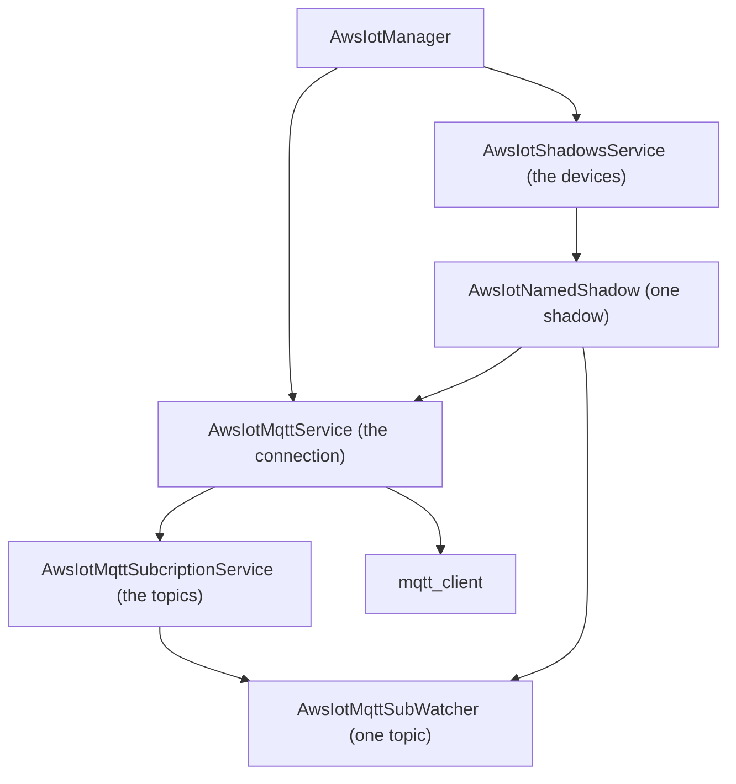
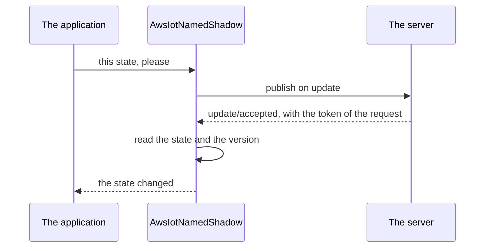

<!--
SPDX-FileCopyrightText: 2024 Théo Magne <theo.magne@allcircuits.com>
SPDX-FileCopyrightText: 2026 Benoit Rolandeau <benoit.rolandeau@allcircuits.com>

SPDX-License-Identifier: LicenseRef-ALLCircuits-ACT-1.1
-->

# ACT AWS IoT core <!-- omit from toc -->

## Table of contents <!-- omit from toc -->

- [Presentation](#presentation)
- [Architecture](#architecture)
  - [What the manager is made of](#what-the-manager-is-made-of)
  - [Staying connected](#staying-connected)
  - [Reaching the server](#reaching-the-server)
  - [The topics which are shared](#the-topics-which-are-shared)
  - [The shadows of a device](#the-shadows-of-a-device)
  - [The state of a shadow](#the-state-of-a-shadow)
- [How to use](#how-to-use)
  - [Installation](#installation)
  - [Register the manager](#register-the-manager)
  - [Follow a shadow](#follow-a-shadow)
  - [Ask for a state](#ask-for-a-state)
  - [Read a topic of your own](#read-a-topic-of-your-own)
- [Config manager usage](#config-manager-usage)
- [Testing](#testing)

## Presentation

This package reaches the MQTT server of AWS IoT Core and the shadows of the devices it holds. It
publishes on the topics of the server, reads the topics an application asks for, and answers the
state of a device as two maps: the one the device reports and the one which is asked of it.

The connection is authenticated with the credentials of the user who is signed in, over Amplify:
there is nothing to configure beyond the address of the server, and the role the user is signed in
under is what says whether it may connect, subscribe and publish.

What it adds to the `mqtt_client` plugin is everything around one connection: the conditions under
which it is worth having, the sharing of a topic between the readers of an application, and the
shadows read as a state rather than as a stream of documents.

## Architecture

### What the manager is made of



The manager owns the two services an application deals with: the MQTT one, which is the connection
and the topics, and the shadows one, which is the devices. Everything below is reached through them.

### Staying connected

The connection is not asked for by the application: the service keeps it up for as long as it is
worth having. What makes it worth having is a list of observers, each of which says whether the
condition it watches is met. Two of them come with the package, the internet of the device and the
user who is signed in, and an application adds the ones of its own.

Any observer which stops being valid has the connection given up, and any observer which becomes
valid has it asked for again. A connection which fails while every observer is valid is asked for
again after a delay which grows with each failure, up to five minutes, and which is reset once every
topic is subscribed again.

A connection which is lost is told apart from one which was given up on purpose, because only the
first one is worth taking again by itself.

### Reaching the server

The server is reached over websockets, which is what Amplify leaves as the only choice: the URL is
signed with the AWS signature V4 and the credentials of the session, and the identity of the user is
what the server knows the client under. The messages are published and read with the quality of
service AWS answers for, which is the one where a message is delivered at least once.

### The topics which are shared

A topic is followed once, however many readers of the application need it. Each of them asks the
service for a handler and closes it when it is done: the first handler has the topic subscribed to
and the last one which is closed has it given up. A reader is told the messages of its topic and,
when it asks for them, what became of the subscription.

A subscription is what the server answers, not what was asked for: asking is what the service does,
and the topic is only held to be followed once the server said so. A connection which is lost has
every topic forgotten and subscribed again as soon as the server is reached, so that an application
which lost the network for a while does not have to ask for anything.

### The shadows of a device

A shadow is named after the device and after itself, and the topics of the server follow from those
two names. An application says which shadows it follows, and the service builds them for each device
it is asked about; a device which is already followed is answered as it is rather than built again.



Every request waits for an answer on two topics, the one of the requests which went through and the
one of those which did not, and gives up after ten seconds. An update carries a token of its own, so
that the answer to the request of another application is not read as the answer to this one.

### The state of a shadow

The state of a shadow is a version, the state the device reports, and the state which is asked of
it. What the server answers is read against the version which is already known: an older answer is
dropped, an answer of the same version is added to what is known, and a newer answer replaces it.

An update only asks for what changed: a state which is already the one asked for is not published at
all. The state which is published is the one which is known plus what the caller asked for, so that
an application which asks for one key does not drop the others.

## How to use

### Installation

Add the package to the `dependencies` of your package:

```yaml
dependencies:
  act_aws_iot_core:
    path: ../act_aws_iot_core
```

### Register the manager

```dart
enum AppShadows with MixinAwsIotShadowEnum {
  settings("settings"),
  measures("measures");

  @override
  final String shadowName;

  const AppShadows({required this.shadowName});
}

class AppConfigManager extends AbstractConfigManager with MixinAwsIotConf {}

class AppAwsIotManager extends AwsIotManager<AppAuthManager, AppAmplifyManager, AppConfigManager> {
  @override
  AmplifyCognitoService get cognitoService => globalGetIt().get<AppAmplifyManager>().cognitoService;

  @override
  List<MixinAwsIotShadowEnum> get shadowTypesList => AppShadows.values;
}

class AppAwsIotBuilder
    extends AwsIotBuilder<AppAwsIotManager, AppAuthManager, AppAmplifyManager, AppConfigManager> {
  AppAwsIotBuilder() : super(AppAwsIotManager.new);
}
```

An application which has a condition of its own for the connection answers it as an observer:

```dart
class AppAwsIotManager extends AwsIotManager<...> {
  @override
  Future<List<StreamObserver>> getExtraMqttObserversForConnection() async => [
    AppConsentStreamObserver(),
  ];
}
```

### Follow a shadow

```dart
final service = globalGetIt().get<AppAwsIotManager>().shadowsService;

final shadows = await service.addAndGetShadowsForDevice<AppShadows>(aDeviceName);
final settings = shadows[AppShadows.settings]!;

settings.reportedStateStream.listen(_onDeviceReportedState);
settings.desiredStateStream.listen(_onStateAskedOfDevice);
```

A device the application no longer follows is forgotten:

```dart
service.removeShadowsOfDevice(aDeviceName);
```

### Ask for a state

```dart
final isAsked = await settings.requestUpdate({"targetTemperature": 20});
final isRead = await settings.requestGet();

final temperature = settings.reportedState["temperature"];
```

### Read a topic of your own

```dart
final mqtt = globalGetIt().get<AppAwsIotManager>().mqttService;

final watcher = mqtt.getSubscriptionWatcher("a/topic/of/the/application");
final handler = watcher.getHandler(onMsgCb: _onMessage, onEventCb: _onSubscriptionEvent);

await mqtt.publish("another/topic", aPayload);
```

A handler which is no longer needed has to be closed, otherwise the topic is followed forever:

```dart
await handler.close();
```

## Config manager usage

| Key                | Type     | Description                                          |
| ------------------ | -------- | ---------------------------------------------------- |
| `aws.iot.endpoint` | `String` | The address of the AWS IoT server of the application |
| `aws.iot.region`   | `String` | The AWS region that server is in                     |

Both are mandatory: a manager whose configuration names neither raises when it starts.

## Testing

The tests drive the package over a server which answers what each test decided: the subscriptions,
the messages and the publications never leave the test, while the service of the topics, the
watchers, the shadows and the states are the real ones. What is stood in for is the reaching of the
server itself, because the client of the MQTT plugin is built by the service and only ever talks to
a real broker.

The topics are covered on the subscription which is asked for as soon as a reader needs one, on the
readers which share one subscription, on the server which takes no subscription and on the one which
turns it down, on the messages which reach every reader of a topic and none of another, on the topic
which is given up once its last reader is gone, on the reader which is gone and hears nothing, on
the subscriptions which are asked for again once the server is reached again, and on the topic no
reader needs any more, which is not.

The shadows are covered on the topics which are followed and the state which is asked for as soon as
a shadow is built, on the state the server answers, on the version which is older, the same and
newer than the one which is known, on the answer which cannot be read, on the states which are told
to the application and the one which did not change, on the update which carries the state of the
caller beside the one which is known, on the answer which carries the token of another request, on
the request the server turns down, on the request which cannot be published, and on the state which
is asked for and is already the one which is asked of the device.

The manager is covered on the server the configuration of the application names, on the shadows it
follows, on the configuration which names no server, and on the services which are stopped with it.

What is out of reach is everything on the way to the server: the signing of the URL, the client of
the plugin, the delay which grows between two attempts, the connection which is taken again by
itself after it was lost, and the conditions an application adds for the connection, which are only
ever read on that way.

```console
> flutter test
```
