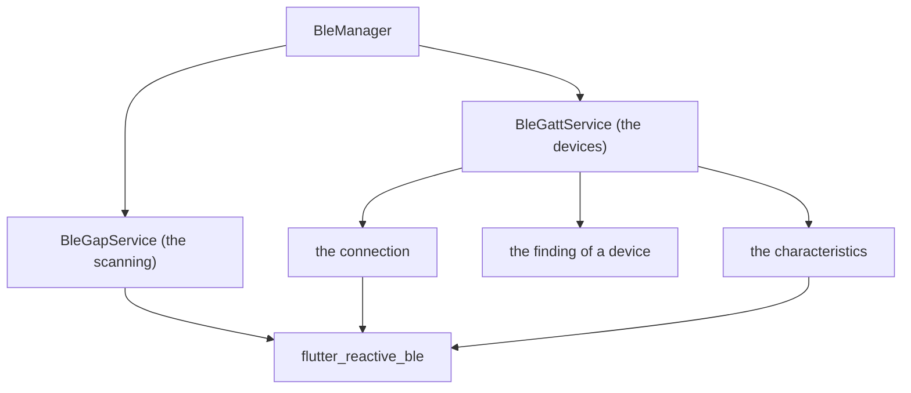

<!--
SPDX-FileCopyrightText: 2023 Anthony Loiseau <anthony.loiseau@allcircuits.com>
SPDX-FileCopyrightText: 2023 - 2024 Benoit Rolandeau <benoit.rolandeau@allcircuits.com>

SPDX-License-Identifier: LicenseRef-ALLCircuits-ACT-1.1
-->

# ACT BLE manager <!-- omit from toc -->

## Table of contents <!-- omit from toc -->

- [Presentation](#presentation)
- [Architecture](#architecture)
  - [What the manager is made of](#what-the-manager-is-made-of)
  - [Switching the Bluetooth on](#switching-the-bluetooth-on)
  - [Scanning](#scanning)
  - [Reaching a device](#reaching-a-device)
  - [The Bluetooth which is taken again](#the-bluetooth-which-is-taken-again)
- [How to use](#how-to-use)
  - [Installation](#installation)
  - [Register the manager](#register-the-manager)
  - [Scan for devices](#scan-for-devices)
  - [Reach a device](#reach-a-device)
- [Add permissions to the app](#add-permissions-to-the-app)

  - [Android](#android)
  - [iOS](#ios)
- [Config manager usage](#config-manager-usage)
- [Testing](#testing)

## Presentation

This package reaches the Bluetooth Low Energy devices around: it scans for them, connects to one,
and reads, writes and listens to its characteristics.

It is an `AbstractPeriphManager` over the
[flutter_reactive_ble](https://pub.dev/packages/flutter_reactive_ble) plugin, so the permissions of
the Bluetooth and the switching on of the service come with it. What it adds to the plugin is the
sharing: one scan however many pages ask for one, one device which is connected at a time, and the
errors of a device read as something an application can act on rather than as exceptions.

## Architecture

### What the manager is made of



The manager itself owns the state of the Bluetooth of the device and hands over the two services:
the GAP one, which is everything about scanning, and the GATT one, which is everything about a
device which is connected.

### Switching the Bluetooth on

The plugin answers one state, and the manager reads it as one thing: the Bluetooth is usable when
the plugin says `ready` and unusable in every other case. That state is followed for as long as the
manager lives, because a user may switch the Bluetooth off while the application is open.

Asking the user to switch it on is only worth it for some of those states. Missing permissions and a
device which has no Bluetooth at all are answered at once and nothing is displayed. A Bluetooth
which is off has the page of the application displayed and then the settings of the device opened; a
location which is off has the page of the location displayed instead, because that is what Android
asks for before it lets an application scan.

### Scanning

A page which wants to scan asks the GAP service for a handler and closes it when it is done. The
scanning is shared: it starts when the first handler asks for it and stops when the last one is
closed, and the mode which is used is the most demanding one any handler asked for. The devices
which are found are told on one stream, as a device which appeared, a device whose name changed, or
a device which is gone.

Nothing is scanned while the Bluetooth is unusable or the permissions are missing: the service
follows both and starts the scanning as soon as they are there.

### Reaching a device

One device is connected at a time, and the GATT service holds it. Reading, writing and listening to
a characteristic all go through the same three checks: the device is connected, the permissions and
the service are there, and the characteristic was discovered. Anything else is answered as an error
rather than raised.

Two errors of a device are read further than the others: the one which says that the device asks for
a stronger pairing, which has the pairing of the device marked as failed, and the one which says
that the permission of the characteristic is missing, which is answered as such so that a page can
tell the user. An Android device which raises anything at all has the Bluetooth taken again, because
the plugin cannot be used afterwards otherwise.

### The Bluetooth which is taken again

`reInitFlutterBle` gives the Bluetooth up and takes it again. It is what a device which raised is
answered with, and it is told on a stream so that the scanning starts again by itself.

## How to use

### Installation

Add the package to the `dependencies` of your package:

```yaml
dependencies:
  act_ble_manager:
    path: ../act_ble_manager
```

### Register the manager

```dart
class AppConfigManager extends AbstractConfigManager with MixinBleConf {}

class AppGlobalManager extends AbsGlobalManager {
  @override
  Future<void> registerManagers() async {
    registerManagerAsync(const PlatformBuilder());
    registerManagerAsync(AppLifeCycleBuilder());
    registerManagerAsync(PermissionsBuilder());
    registerManagerAsync(BleBuilder<AppConfigManager>());
  }
}
```

The view builder of the application registers the pages which ask the user to switch the Bluetooth
and the location on:

```dart
onEnablePage(route: AppRoutes.enableBle, element: EnableServiceElement.ble);
onEnablePage(route: AppRoutes.enableBleLocation, element: EnableServiceElement.bleLocation);
```

### Scan for devices

```dart
final gap = globalGetIt().get<BleManager>().bleGapService;

await gap.setDeviceAdvServiceUuidsToSearch({Uuid.parse("0000180a-0000-1000-8000-00805f9b34fb")});

final handler = gap.toGenerateScanHandler();
await handler.startScan(scanMode: ScanMode.lowLatency);

gap.scannedDevices.listen(_onScannedDevice);
```

A handler which is no longer needed has to be disposed, otherwise the scanning never stops:

```dart
await handler.dispose();
```

### Reach a device

```dart
final gatt = globalGetIt().get<BleManager>().bleGattService;

final device = await gatt.findDeviceByMac(aMacAddress);
if (device != null && await gatt.connect(device)) {
  final (error, value) = await gatt.readBleCharacteristic(device, aCharacteristicUuid);
  await gatt.writeBleCharacteristic(device, anotherCharacteristicUuid, [1, 2, 3]);

  final (subError, stream) = await gatt.subscribeBleNotification(device, aCharacteristicUuid);
  stream?.listen(_onNotification);
}
```

## Add permissions to the app

To use BLE in the app, we need to add some permissions. The needed permissions depend of the android
or iOS versions.

### Android

_Source: https://pub.dev/packages/flutter_reactive_ble#android_

You need to add the following permissions to your AndroidManifest.xml file:

```xml
<!-- We need to remove those permissions because the reactive flutter BLE have directly added
        the permission in its manifest file and this creates a conflict:
        https://github.com/PhilipsHue/flutter_reactive_ble/issues/560 -->
<uses-permission-sdk-23 android:name="android.permission.ACCESS_FINE_LOCATION"
    tools:node="remove"/>
<uses-permission-sdk-23 android:name="android.permission.ACCESS_COARSE_LOCATION"
    tools:node="remove"/>

<!-- We add the needed permissions -->
<uses-permission android:name="android.permission.BLUETOOTH_SCAN"
    android:usesPermissionFlags="neverForLocation" />
<uses-permission android:name="android.permission.BLUETOOTH_CONNECT" />
<uses-permission android:name="android.permission.ACCESS_FINE_LOCATION"
    android:maxSdkVersion="30" />
<uses-permission android:name="android.permission.ACCESS_COARSE_LOCATION"
    android:maxSdkVersion="30" />
```

If you use BLUETOOTH_SCAN to determine location, modify your AndroidManfiest.xml file to include the
following entry:

```xml
 <uses-permission android:name="android.permission.BLUETOOTH_SCAN"
                     tools:remove="android:usesPermissionFlags"
                     tools:targetApi="s" />
```

If you use location services in your app, remove android:maxSdkVersion="30" from the location
permission tags

### iOS

_Source: https://pub.dev/packages/flutter_reactive_ble#ios_

For iOS it is required you add the following entries to the `Info.plist` file of your app. It is not
allowed to access Core BLuetooth without this. For more indepth details: [Blog post on iOS bluetooth
permissions](https://betterprogramming.pub/handling-ios-13-bluetooth-permissions-26c6a8cbb816)

iOS13 and higher:

- NSBluetoothAlwaysUsageDescription

iOS12 and lower:

- NSBluetoothPeripheralUsageDescription

## Config manager usage

| Key                             | Type   | Description                                                |
| ------------------------------- | ------ | ---------------------------------------------------------- |
| `ble.logs.displayScannedDevice` | `bool` | True to display the scanned devices by BLE in the app logs |

## Testing

The tests drive the package over the Bluetooth of a device which answers what each test decided,
over the permissions of a device which answer the same way, over the pages of an application which
answer what the test lined up, and over a life cycle which leaves the application and comes back as
soon as it is waited for. The plugin of the Bluetooth is the boundary of this package, so it is what
is stood in for; the manager, its services and the models are the real ones.

The state of the Bluetooth is covered on the state which is read as usable and on the ones which are
not, and on both ways it changes. Asking the user is covered on the Bluetooth which is already on,
on the permissions which are missing, on the device which has no Bluetooth, on the user who is sent
to the settings and switches it on, on the user who leaves the page, and on the location which is
asked for instead of the Bluetooth. Taking the Bluetooth again is covered on the giving up, on what
is told to the application, and on the state which keeps being followed afterwards.

The devices are covered on the name and the identifier a device advertises, on the device which is
scanned again and the one which is not the same device, on the pairing which changes and the one
which did not, on the characteristics of the services which were discovered, on the connection which
is told and the one of another device which is not, on the connection which failed and is read as a
disconnection, and on the disconnection which happens before the streams are closed.

The characteristics are covered on the value which is read, on the value which is written with and
without waiting for the device, on the iOS device which is always waited for, on the device which is
not connected and the characteristic which was never discovered, on the device which raises and has
the Bluetooth taken again, on the pairing which is asked for again, and on the permission of a
characteristic which is missing.

What is out of reach is the scanning itself and the connecting: the plugin of the Bluetooth keeps
one instance for the whole application, and both are driven by the clock of the device rather than
by a timer a test can move.

```console
> flutter test
```
