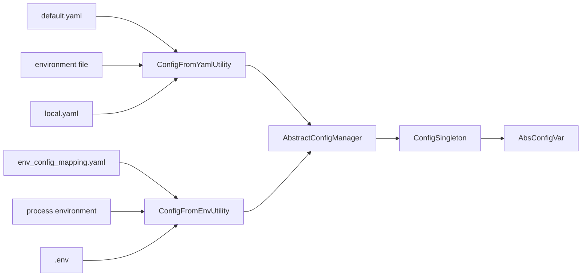

<!--
SPDX-FileCopyrightText: 2020 - 2023 Sami Kouatli <sami.kouatli@allcircuits.com>
SPDX-FileCopyrightText: 2023 Benoit Rolandeau <benoit.rolandeau@allcircuits.com>

SPDX-License-Identifier: LicenseRef-ALLCircuits-ACT-1.1
-->

# ACT Config manager <!-- omit from toc -->

## Table of contents

- [Table of contents](#table-of-contents)
- [Presentation](#presentation)
- [Architecture](#architecture)
  - [Where the values come from](#where-the-values-come-from)
  - [The manager and the singleton](#the-manager-and-the-singleton)
  - [The config variables](#the-config-variables)
- [How to use](#how-to-use)
  - [Installation](#installation)
  - [Declare the variables](#declare-the-variables)
  - [Register the manager](#register-the-manager)
  - [Read a variable](#read-a-variable)
- [Configuration](#configuration)
  - [Where the files live](#where-the-files-live)
  - [The default file](#the-default-file)
  - [The environment files](#the-environment-files)
  - [The local file](#the-local-file)
  - [The environment variables and their mapping](#the-environment-variables-and-their-mapping)
  - [The dot env file](#the-dot-env-file)
  - [Choosing the environment](#choosing-the-environment)
  - [The precedence](#the-precedence)
- [Testing](#testing)

## Presentation

This package reads the configuration of an application and gives it back as typed values.

A value may differ from one environment to another, and some values must not be committed at all.
The package therefore reads several files and the environment variables, in a fixed order, and
merges them into one configuration: the application declares the variables it needs and reads them
without knowing where each value came from.

The package only reads the configuration. It never writes a file, it does not watch for a change,
and it holds no value which the application computes at runtime.

## Architecture

### Where the values come from

The manager reads the files and the environment variables at initialization, merges them, and hands
the result to a singleton the config variables read from.



`ConfigFromYamlUtility` reads the configuration files, `EnvConfigMappingUtility` reads the file
which maps the environment variables to the configuration structure, and `ConfigFromEnvUtility`
builds a configuration out of the environment variables that mapping names. A value found on the
right of the flow overrides the one found on its left.

### The manager and the singleton

`AbstractConfigManager` is the manager an application derives from to declare its variables. It is
registered like any other manager, with an `AbstractConfigBuilder`, and it depends on none of them.

`ConfigSingleton` holds the merged configuration. The config variables read from it, rather than
from the manager, because a variable is declared as a field of the derived manager and cannot reach
that manager through the `GlobalManager` without knowing its concrete type. The singleton is created
when the manager is initialized and released when it is disposed, so a manager may be initialized
again afterwards.

### The config variables

A config variable wraps a key and reads it with the expected type. The key is the path in the
configuration, with a dot between the steps: `logs.level` reads the `level` value of the `logs`
object.

Six classes are available, and the choice between them depends on what the application does when the
value is missing:

| Class                      | Reads          | When the value is missing             |
| -------------------------- | -------------- | ------------------------------------- |
| `ConfigVar`                | One value      | Returns null                          |
| `ConfigVarList`            | A list         | Returns null                          |
| `NotNullableConfigVar`     | One value      | Returns the default value, or throws  |
| `NotNullableConfigVarList` | A list         | Returns the default values, or throws |
| `ParserConfigVar`          | A parsed value | Returns null                          |
| `NotNullParserConfigVar`   | A parsed value | Returns the default value, or throws  |

A parser variable reads a stored value of a simple type and turns it into the type the application
wants, which is how an enum, a duration or a url is read. Its parser returns null when the stored
value cannot be turned into that type, and the variable then behaves as if the value was missing.

The `crashIfNull` constructors of the not nullable variables have no default value: they throw an
`ActConfigNullValueError` when nothing is found. Use them for the values an application cannot start
without.

## How to use

### Installation

Add the package to the `dependencies` of your package:

```yaml
dependencies:
  act_config_manager:
    path: ../act_config_manager
```

### Declare the variables

Derive the manager and declare one field per variable:

```dart
class AppConfigManager extends AbstractConfigManager {
  final logLevel = const NotNullableConfigVar<String>("logs.level", defaultValue: "warning");
  final serverUrl = const NotNullParserConfigVar<Uri, String>.crashIfNull(
    "server.url",
    parser: Uri.tryParse,
  );
  final retryDelays = const ConfigVarList<int>("server.retryDelays");

  AppConfigManager({required super.logger});
}
```

A package which needs its own variables declares them in a mixin on `AbstractConfigManager`, and the
application mixes it into its manager. That way the package says what it reads without knowing the
manager of the application.

### Register the manager

```dart
class AppConfigBuilder extends AbstractConfigBuilder<AppConfigManager> {
  AppConfigBuilder() : super(() => AppConfigManager(logger: appLogger()));
}
```

```dart
GlobalManager.instance.register(AppConfigBuilder());
```

### Read a variable

```dart
final level = globalGetIt().get<AppConfigManager>().logLevel.load();
```

`load` reads the configuration which was merged at initialization, so calling it again costs no more
than keeping its result.

## Configuration

### Where the files live

Every file the package reads is an asset of the application, in the `assets/config/` folder by
default. Another folder can be given to the manager with its `configPath` parameter.

The folder has to be declared in the assets of the `pubspec.yaml` of the application, otherwise it
is absent from the build and the package finds nothing.

Every configuration file may be written in YAML or in JSON: the extension is guessed, `.yaml` first,
then `.yml` and `.json`. A file which is absent is not an error; a file which cannot be parsed, or
whose content is not an object, is.

### The default file

`default.*` holds the value of every variable, and is the only file which is always read. It is the
place to document what a variable is and what it defaults to:

```yaml
logs:
  level: warning
  enable: true
  logsNb: 3
```

### The environment files

One file per environment holds the values which differ from the default ones. Only the file of the
chosen environment is read:

- `development.*`,
- `qualification.*`,
- `production.*`.

### The local file

`local.*` holds the values a developer changes on their own machine. It overrides every other file
and is not meant to be committed.

### The environment variables and their mapping

`env_config_mapping.*` says which environment variable replaces which configuration value. It
repeats the structure of the configuration files, with the name of the environment variable in place
of the value:

```yaml
logs:
  level: LOGS_LEVEL
```

A variable which is not a string declares its format, so that the value is read as a boolean, a
number or a structure rather than as text:

```yaml
logs:
  level:
    __name: LOGS_LEVEL
    __format: string
  enable:
    __name: LOGS_ENABLE
    __format: boolean
  logsNb:
    __name: LOGS_NB
    __format: number
  appenders:
    __name: LOGS_APPENDERS
    __format: yaml
```

The formats are `string` (or `str`), `boolean` (or `bool`), `number` (or `num`, `int`, `integer`,
`decimal`, `float`) and `yaml` (or `yml`, `json`). A number is read as an integer, unless it has a
decimal separator. A format which is not one of these names is refused, and so is a value which
cannot be read with the format it declares.

The mapping file cannot contain a list, and the name of a variable has to be a string.

### The dot env file

`.env` holds the environment variables of a developer machine, as a property file, and is not meant
to be committed:

```ini
LOGS_LEVEL=warning
LOGS_ENABLE=true
LOGS_NB=4
```

### Choosing the environment

The environment is chosen at build time, with the `ENV` define:

```console
> flutter run --dart-define="ENV=PROD"
```

The values are `DEV`, `QUALIF` and `PROD`, whichever case. Any other value, and the absence of the
define, select the development environment.

`ENV` is the only value which can be set that way: reading a define requires its name to be written
in the code as a constant, which a variable named by the mapping file is not. The environment
variables come from the process and from the `.env` file.

### The precedence

From the least to the most important:

1. `default.*`
2. `production.*`, `qualification.*` or `development.*`
3. `local.*` (_not committed_)
4. the environment variables of the process
5. `.env` (_not committed_)

The `.env` file wins over the environment of the process, so that a developer may override a
variable which is shared with the other applications of their machine.

## Testing

The tests read the configuration through the asset bundle of the tests, so they cover the whole path
an application goes through, from the files to the value a variable returns.

They cover the merge order of the files, the ones which are missing, empty, unparsable or not an
object, the structure the mapping file builds out of the environment variables, every format a
mapped variable may declare and what happens when a value does not match it, the precedence of the
`.env` file over the environment of the process, the keys the singleton finds and the ones it
refuses, what each config variable returns when its value is missing or of another type, and the
release of the singleton when the manager is disposed.

The environment of a process cannot be changed from inside it, so the tests which need a variable
coming from the operating system use one which is already set.

```console
> flutter test
```
