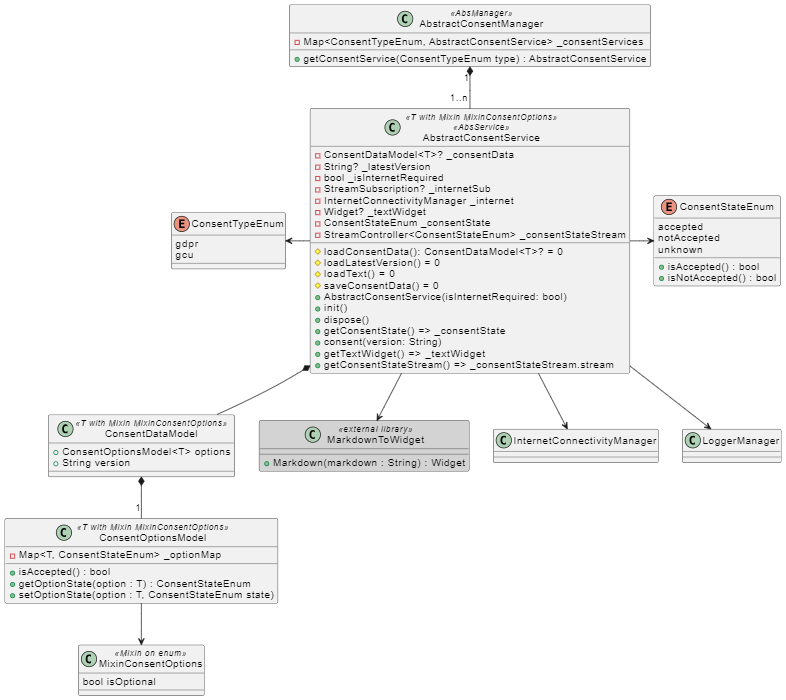

<!--
SPDX-FileCopyrightText: 2024 Théo Magne <theo.magne@allcircuits.com>

SPDX-License-Identifier: LicenseRef-ALLCircuits-ACT-1.1
-->

# Act Consent Manager <!-- omit from toc -->

This package facilitates the management of user consent (GDPR, GCU, etc.) in Flutter applications.

## Table of contents <!-- omit from toc -->

- [Features](#features)
- [Documentation](#documentation)

## Features

This packages allows you to:

- Manage a multitude of consent type, see
[ConsentTypeEnum](lib/src/types/consent_type_enum.dart).
- Each consent type is managed by an implementation of the generic
[AbstractConsentService](lib/src/services/abstract_consent_service.dart) which is specific
to your application.
- The [ConsentManager](lib/src/abstract_consent_manager.dart) implements the
`AbstractConsentManager` and is therefore usable as any other manager. This manager requires the
`InternetConnectivityManager` and the `LoggerManager` to work. The ConsentManager owns each
`AbstractConsentService` and is responsible for their initialization and management and provides
an access point to the services.

## Documentation

Here is a class diagram of the package:

