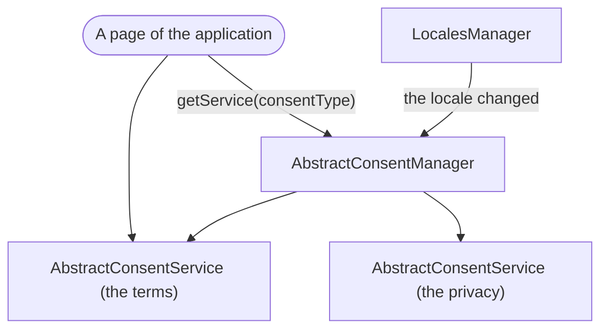
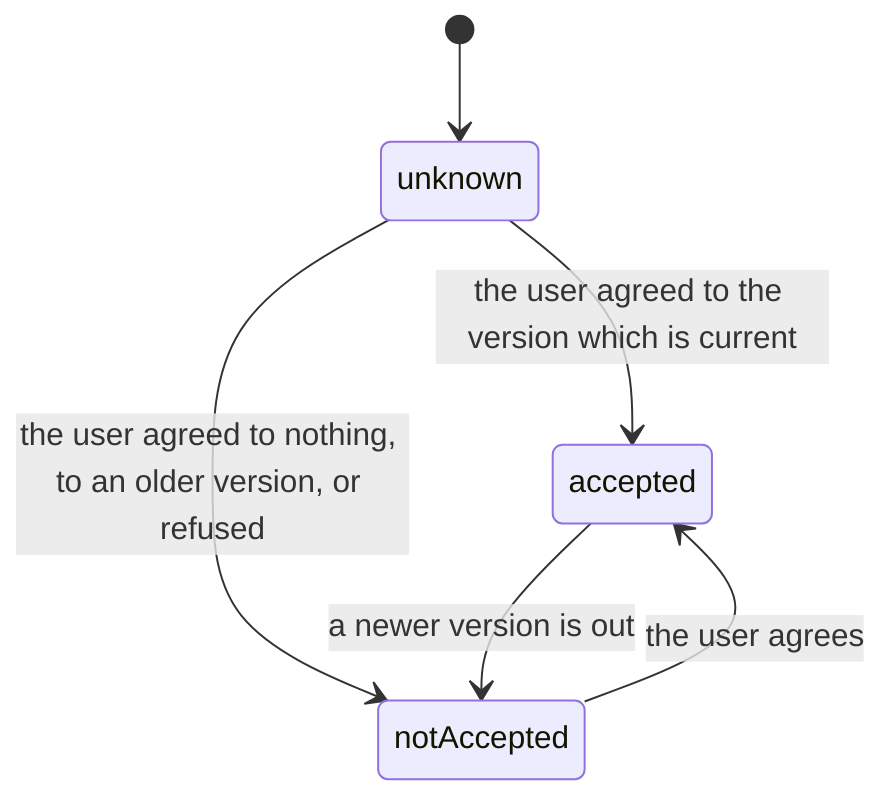
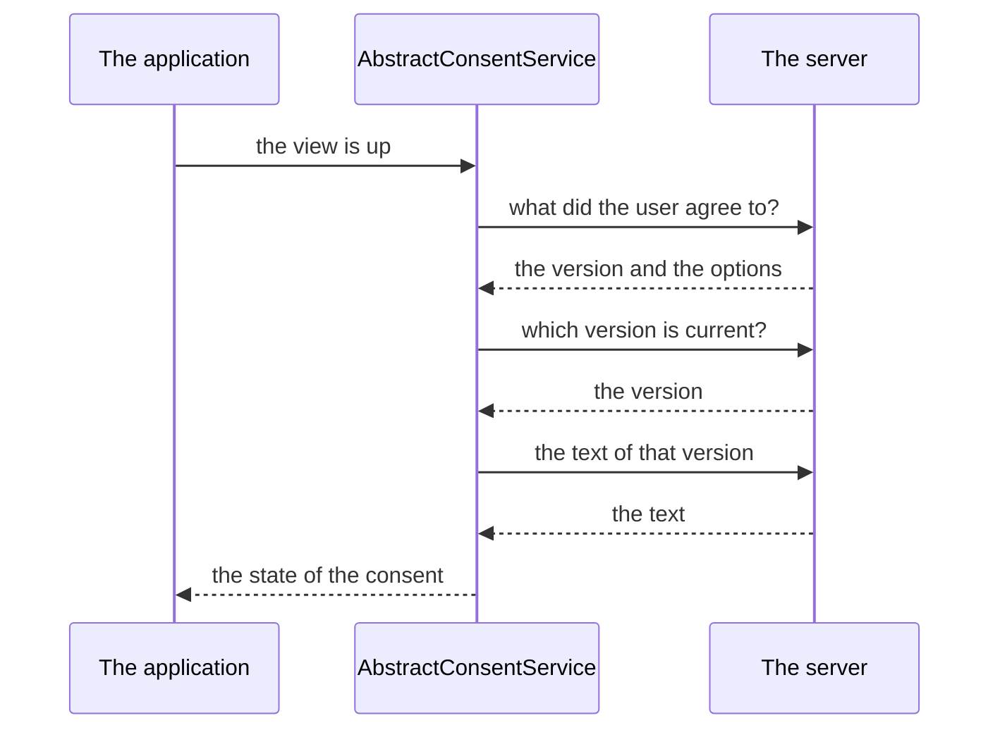

<!--
SPDX-FileCopyrightText: 2024 Théo Magne <theo.magne@allcircuits.com>

SPDX-License-Identifier: LicenseRef-ALLCircuits-ACT-1.1
-->

# Act Consent Manager <!-- omit from toc -->

## Table of contents <!-- omit from toc -->

- [Presentation](#presentation)
- [Architecture](#architecture)
  - [The manager and its services](#the-manager-and-its-services)
  - [Where a consent stands](#where-a-consent-stands)
  - [What a service loads, and when](#what-a-service-loads-and-when)
  - [What the user agrees to](#what-the-user-agrees-to)
  - [The text of a consent](#the-text-of-a-consent)
- [How to use](#how-to-use)
  - [Installation](#installation)
  - [Declare the options of a consent](#declare-the-options-of-a-consent)
  - [Write the service of a consent](#write-the-service-of-a-consent)
  - [Write the manager](#write-the-manager)
  - [Ask the user](#ask-the-user)
- [Testing](#testing)

## Presentation

This package holds the consents an application asks its users for: the terms of a service, the
privacy of their data, whatever else has to be agreed to. It answers one question at a time: does
this user still have to be asked?

It knows nothing of where a consent is written or read. Fetching the version which is current,
fetching its text, reading what the user already agreed to and saving what the user agrees to are
the four things an application writes, once per consent. What this package brings is the state which
comes out of them, the moment they are read, and the merging of what the user answers with what was
already known.

## Architecture

### The manager and its services


```mermaid
flowchart TD
    manager["AbstractConsentManager"]
    terms["AbstractConsentService (the terms)"]
    privacy["AbstractConsentService (the privacy)"]
    locales["LocalesManager"]
    page(["A page of the application"])

    manager --> terms
    manager --> privacy
    locales -- "the locale changed" --> manager
    page -- "getService(consentType)" --> manager
    page --> terms
```

The manager holds one service per consent, initializes them and closes them, and hands them over to
the pages which ask. It does one thing of its own: when the locale of the application changes, every
service is told to read its text and its version again, because both are translated.

A service is the one which knows a consent. It is initialized with the manager, and it loads what it
needs once the view of the application is up, because that is the earliest moment a text can be
built.

### Where a consent stands


```mermaid
stateDiagram-v2
    [*] --> unknown
    unknown --> accepted: the user agreed to the version which is current
    unknown --> notAccepted: the user agreed to nothing, to an older version, or refused
    notAccepted --> accepted: the user agrees
    accepted --> notAccepted: a newer version is out
```

The state of a consent is not stored, it is read from two answers: the version the server holds, and
what the user agreed to. As long as one of the two is missing, the state is `unknown`, which is the
state of an application which could not reach its server: nothing is claimed of the user.

A consent is accepted when the version the user agreed to is the one which is current and every
option which is mandatory was accepted. An option which is optional is left to the user, and a
refused one does not stand in the way.

Every change of that state is pushed on a stream, so a page can follow it without asking again.

### What a service loads, and when


```mermaid
sequenceDiagram
    participant app as The application
    participant service as AbstractConsentService
    participant server as The server

    app->>service: the view is up
    service->>server: what did the user agree to?
    server-->>service: the version and the options
    service->>server: which version is current?
    server-->>service: the version
    service->>server: the text of that version
    server-->>service: the text
    service-->>app: the state of the consent
```

What the user agreed to is read first: a consent which cannot be read at all is given up on, and
the version is not even asked for. Every load says whether it can be tried again: a load which can
is tried again after a delay, and a load which cannot stops everything until the application asks
again.

Some applications can only read a consent once something else has happened: the user is signed in,
the device is online. Those are the observers a service is given: as long as one of them is not
ready, nothing is loaded, and the service waits to be told that they are. Once everything is
loaded, the observers are let go.

The text of a consent is only loaded when it is going to be shown, which is when the version the
user agreed to is not the current one, or when an option was refused.

### What the user agrees to

The options of a consent are an enum of the application, one value per thing the user says yes or no
to, and each of them says whether it is mandatory. What the user answers travels as a
`ConsentOptionsModel`, which is a map from those values to `accepted`, `notAccepted` or `unknown`.

Agreeing is one call: the options the page hands over are merged with the ones which were already
known, so a page which only shows one of them leaves the others as they were, and the whole is saved
under the version which is current. Nothing is saved when what the user agrees to is what was
already saved.

### The text of a consent

The text of a consent is fetched as a string and turned into a widget once, and the same widget is
handed to every page which asks for it. Markdown is what a text is read as by default, and an
application whose texts are written otherwise overrides the one method which builds the widget.

## How to use

### Installation

Add the package to the `dependencies` of your package:

```yaml
dependencies:
  act_consent_manager:
    path: ../act_consent_manager
```

### Declare the options of a consent

```dart
enum AppConsentType { terms, privacy }

enum TermsOptions with MixinConsentOptions {
  terms(isOptional: false),
  newsletter(isOptional: true);

  @override
  final bool isOptional;

  const TermsOptions({required this.isOptional});
}
```

### Write the service of a consent

```dart
class TermsConsentService extends AbstractConsentService<TermsOptions> {
  TermsConsentService({required super.logsHelper, required super.observers})
      : super(optionsList: TermsOptions.values);

  @override
  Future<ResultWithRequiredValue<ConsentLoadStatus, String>> loadLatestVersion() =>
      _server.readCurrentVersion();

  @override
  Future<ResultWithRequiredValue<ConsentLoadStatus, String>> loadConsentText(String version) =>
      _server.readText(version);

  @override
  Future<ResultWithStatus<ConsentLoadStatus, ConsentDataModel<TermsOptions>>>
      loadUserConsentData() => _server.readWhatTheUserAgreedTo();

  @override
  Future<bool> saveConsentData(ConsentDataModel<TermsOptions> consentData) =>
      _server.save(consentData);
}
```

### Write the manager

```dart
class AppConsentManager extends AbstractConsentManager<AppConsentType> {
  @override
  Future<Map<AppConsentType, AbstractConsentService>> getConsentServices(
    LogsHelper logsHelper,
  ) async {
    final signedIn = SignedInObserver(...);
    onRegisterObserver(signedIn);

    return {
      AppConsentType.terms: TermsConsentService(
        logsHelper: logsHelper.createSubLogger(subCategory: "terms"),
        observers: [signedIn],
      ),
    };
  }
}

class AppConsentBuilder extends AbstractConsentBuilder<AppConsentManager> {
  AppConsentBuilder(super.factory);
}
```

### Ask the user

```dart
final service = globalGetIt().get<AppConsentManager>().getService<TermsOptions>(
  AppConsentType.terms,
)!;

if (service.consentState.isNotAccepted) {
  final text = await service.getConsentTextWidget();
  final options = await service.getConsentOptions()
    ..setOptionState(TermsOptions.terms, ConsentStateEnum.accepted);

  await service.consent(options);
}
```

Following the state is what a page which has to react to a new version listens to:

```dart
service.stateStream.listen(_onConsentStateChanged);
```

## Testing

The tests drive a service whose four ways of reading and writing a consent answer what each test
lined up, and which records what it was asked. The state, the merging and the moment each load
happens are the package itself, and only the server is stood in for.

The state is covered on the user who agreed to the version which is current, to an older one, or to
nothing, on the mandatory option which was refused and the optional one which was refused, and on
what is pushed on the stream. The loads are covered on the order they happen in, on the load which
is given up on, the one which is tried again later, and the text which is only read when it is
going to be shown. The observers are covered on the service which waits for them and on the one
which finds them ready.

Agreeing is covered on the options which are merged with the ones which were known, the version they
are saved under, the save which is refused, and the two cases where nothing is saved at all: the
user agreed to what was already saved, or the service does not yet know where the consent stands.

The manager is covered on the services it initializes and hands over, on the loads it starts once
the view is up, and on the locale which changes and has every service read its text again.

```console
> flutter test
```
