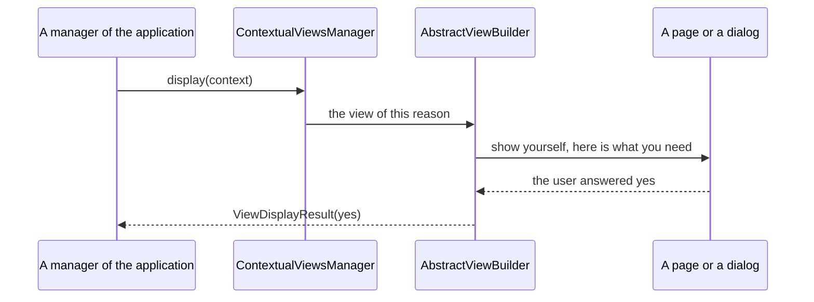

<!--
SPDX-FileCopyrightText: 2023 Anthony Loiseau <anthony.loiseau@allcircuits.com>
SPDX-FileCopyrightText: 2023 Benoit Rolandeau <benoit.rolandeau@allcircuits.com>

SPDX-License-Identifier: LicenseRef-ALLCircuits-ACT-1.1
-->

# ACT Contextual views manager <!-- omit from toc -->

## Table of contents

- [Table of contents](#table-of-contents)
- [Presentation](#presentation)
- [Architecture](#architecture)
  - [What a contextual view is](#what-a-contextual-view-is)
  - [The reason a view is displayed for](#the-reason-a-view-is-displayed-for)
  - [The three ways of answering a reason](#the-three-ways-of-answering-a-reason)
  - [What a view answers](#what-a-view-answers)
  - [The page which asks the user](#the-page-which-asks-the-user)
- [How to use](#how-to-use)
  - [Installation](#installation)
  - [Declare the reasons of an application](#declare-the-reasons-of-an-application)
  - [Write the view builder](#write-the-view-builder)
  - [Register the manager](#register-the-manager)
  - [Ask for a view](#ask-for-a-view)
- [Testing](#testing)

## Presentation

This package lets a part of an application which knows nothing of the interface ask the user
something, and wait for the answer. A manager which finds that the terms have changed, or that a
device has to be chosen, says why it needs the user rather than which page to show; the interface of
the application is what decides the how.

It draws nothing itself: every view is a page or a dialog of the application. What it brings is the
naming of the reasons, the waiting for the answer, and the closing of what was opened.

## Architecture

### What a contextual view is



The caller waits: asking for a view is one call which comes back once the view is over. That is what
lets a manager write what it does next in one place, instead of in a callback of the interface.

### The reason a view is displayed for

A reason is an `AbstractViewContext` of the application, and what makes it one is its key: two
reasons are the same reason when they carry the same key, and that key is what a view is registered
under. Anything else the reason carries is what the view needs to draw itself.

`MixinCompulsoryAcceptViewContext` is what a reason mixes in when the user has to answer rather than
being allowed to walk away, so the page which is shown knows that it has no way back.

### The three ways of answering a reason

The view builder of an application registers one of three things per reason:

- `onContextualPage` names a route: the page is pushed with what it needs, and it is popped once it
  answered, unless the user already left it,
- `onContextualDialog` names a way of showing a dialog, and nothing is pushed,
- `registerViewDisplay` names a callback which does whatever the application wants, and which
  answers by itself.

A reason which is registered twice is refused: the first view stays, an error is written in the logs
and, while an application is being written, the assertion says so straight away. A reason which is
asked for and which was never registered answers an error rather than doing nothing quietly.

The page and the dialog are both handed an `ExtraContextualViewConfig`: the reason itself, the way
of saying that the view is over, and, when the caller gave one, the action to ask the user for.

### What a view answers

Every view answers a `ViewDisplayResult`, which is a status and, when the application needs it, a
value of its own:

| Status   | What it says                                        |
| -------- | --------------------------------------------------- |
| `ok`     | The view did what it was displayed for              |
| `yes`    | The user said yes                                   |
| `no`     | The user said no                                    |
| `cancel` | The user walked away                                |
| `error`  | The view could not be displayed, or something failed |
| `custom` | Something the application reads itself              |

`ok` and `yes` are the two which say that things went further; every other one, `custom` included,
does not.

The value of a view is the one the action of the caller answered: the caller says what it does when
the user agrees, and what that call gives back travels next to the status.

### The page which asks the user

`RequestContextualActionBloc` is the bloc of a page which is displayed to ask the user for one thing
and which closes itself once it has it. It reads two answers: whether what is asked is already done,
and whether the caller gave something to ask for.

- what is asked is already done, and nothing has to be asked: the view is over before it is drawn,
- something has to be asked: the page waits for the user, whatever else answers in the meantime,
- the user answers yes: the action of the caller is called, and the view is over,
- the user answers no: the page stays open, so the user can try again,
- the user refuses to be asked: the view is over, as an error.

The view is only declared over once, whatever the page does afterwards.

## How to use

### Installation

Add the package to the `dependencies` of your package:

```yaml
dependencies:
  act_contextual_views_manager:
    path: ../act_contextual_views_manager
```

### Declare the reasons of an application

```dart
class AskForTermsContext extends AbstractViewContext with MixinCompulsoryAcceptViewContext {
  final String version;

  @override
  final bool isAcceptanceCompulsory;

  const AskForTermsContext({required this.version, this.isAcceptanceCompulsory = true})
      : super(uniqueKey: "askForTerms");

  @override
  List<Object?> get props => [...super.props, version, isAcceptanceCompulsory];
}
```

### Write the view builder

```dart
class AppViewBuilder extends AbstractViewBuilder {
  @override
  Future<void> initProcess() async {
    onContextualPage(
      context: const AskForTermsContext(version: ""),
      route: AppRoute.terms,
    );

    onContextualDialog<AskForDeviceContext>(
      context: const AskForDeviceContext(),
      displayDialog: (extra) => showDialog(
        context: routerManager.currentContext,
        builder: (context) => DeviceDialog(extra: extra),
      ),
    );
  }

  @override
  Future<void> dispose() async {}
}
```

A page which is registered with a route reads its reason from the extra it was pushed with:

```dart
class TermsPage extends StatelessWidget {
  final ExtraContextualViewConfig<AskForTermsContext> extra;

  const TermsPage({required this.extra, super.key});

  @override
  Widget build(BuildContext context) => BlocProvider(
        create: (context) => RequestContextualActionBloc<AskForTermsContext>(
          config: extra,
          isOkCallback: () => _termsAreAlreadyAgreedTo,
          isOkStream: _termsStream,
        ),
        child: const TermsView(),
      );
}
```

### Register the manager

```dart
GlobalManager.instance.register(
  ContextualViewsBuilder<AppRouterManager>(viewBuilder: AppViewBuilder()),
);
```

### Ask for a view

```dart
final manager = globalGetIt().get<ContextualViewsManager>();

final result = await manager.display<bool>(
  context: AskForTermsContext(version: version),
  doAction: () async {
    final isOk = await _agreeToTheTerms(version);

    return (isOk, isOk);
  },
);

if (result.status.isPositiveResult) {
  _goOn();
}
```

## Testing

The tests drive the view builder over a router which records the pages it was asked to push, and the
views themselves are the callbacks of the test: a page needs a view to be pushed into, and what is
covered here is what the builder does around it.

The registering is covered on the three ways of answering a reason, on the reason which is handed to
a view as the application wrote it, and on the reason which is registered twice and refused. The
displaying is covered on the reason no view was registered for, on the value the caller reads back
as the type it asked for, and on the action of the caller which reaches the view.

The page is covered on the extra it is pushed with, on the popping which happens once it answered
and which does not happen when the user already left it, and the dialog on the extra it is shown
with, which is pushed nowhere.

The bloc of the page which asks the user is covered on the page which is drawn and the one which is
over before being drawn, on what is answered elsewhere while the user is being waited for, on the
user who says yes, no, or refuses to be asked, and on the view which is only declared over once.

```console
> flutter test
```
