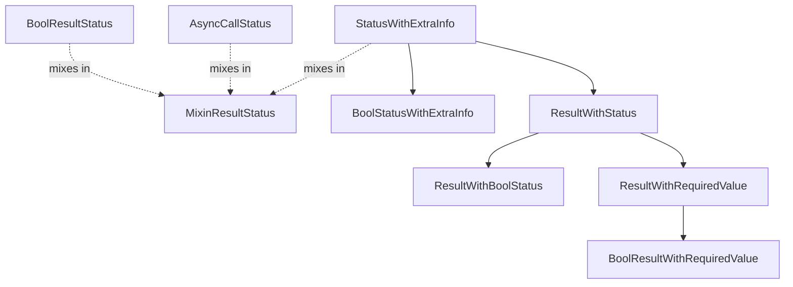

<!--
SPDX-FileCopyrightText: 2026 Benoit Rolandeau <benoit.rolandeau@allcircuits.com>

SPDX-License-Identifier: LicenseRef-ALLCircuits-ACT-1.1
-->

# ACT Dart result <!-- omit from toc -->

## Table of contents

- [Table of contents](#table-of-contents)
- [Presentation](#presentation)
- [Architecture](#architecture)
  - [Statuses](#statuses)
  - [Results](#results)
  - [Asynchronous calls](#asynchronous-calls)
- [How to use](#how-to-use)
  - [Installation](#installation)
  - [Return a result from a method](#return-a-result-from-a-method)
  - [Require a value for a success](#require-a-value-for-a-success)
  - [Define a richer status](#define-a-richer-status)
  - [Follow an asynchronous call](#follow-an-asynchronous-call)
- [Testing](#testing)

## Presentation

This package provides a way to represent the result of a request with a status and the actual value
of the request.

The main goal is to have a unified way to represent the result of a request in the codebase. This
allows us to have a consistent way to handle success and error cases in the codebase.

The package only carries the outcome of a call: it never runs one, never retries one and never logs
one. What a status means, and what to do when it says the call failed, is up to the caller.

## Architecture



### Statuses

`MixinResultStatus` is the contract every status answers: `isSuccess` says whether the call
succeeded, `canBeRetried` says whether calling again makes sense, and `isError`, the opposite of
`isSuccess`, comes for free.

`BoolResultStatus` is the simplest status which answers it, with a `success` and an `error` value,
and the two converters which turn a `bool` or a `Future<bool>` into one of them.

A package which needs to tell its failures apart declares its own enum with the mixin, which is
what makes the classes below generic over the status.

`StatusWithExtraInfo` adds an optional `extraInfo` to a status, which carries whatever describes the
outcome further: an error message, an exception, a stack trace. It delegates `isSuccess` and
`canBeRetried` to the status it wraps, so the extra information never changes the outcome of a call.
`BoolStatusWithExtraInfo` is its specialisation for `BoolResultStatus`.

### Results

`ResultWithStatus` adds the value the call produced to a status. The value is nullable and does not
take part in the outcome: a call can succeed and return nothing.

`ResultWithRequiredValue` is for the calls where a success without a value makes no sense. It only
narrows `isSuccess`, which becomes true when the status is a success **and** the value is not null.
`canBeRetried` keeps coming from the status alone.

`ResultWithBoolStatus` and `BoolResultWithRequiredValue` are the specialisations of those two for
`BoolResultStatus`. The second one adds the constructors which infer the status instead of taking
it: `fromValue` and `fromFuture` succeed when the value is not null, and `error` fails without any
value.

All those classes have a value equality, so a whole result can be compared at once.

### Asynchronous calls

`AsyncCallStatus` describes what a caller displays while a call is running: a `loading` flag and the
result, which is null until the call answers. It is the state of the call, not the call itself.

Because a call which has not answered yet is neither a success nor a failure, `isSuccess`, `isError`
and `canBeRetried` are all false as long as the result is null.

Its `copyWith` family covers the transitions of the call:

| Method             | Loading | Result                        |
| ------------------ | ------- | ----------------------------- |
| `copyWithLoading`  | `true`  | dropped                       |
| `copyWithResult`   | `false` | the given result              |
| `copyWithReset`    | given   | dropped                       |
| `copyWith`         | given   | kept unless `forceResultValue`|

The `AsyncCallResult`, `AsyncCallResultRequiredValue` and `AsyncCallBoolStatus` aliases name the
combinations used the most often.

## How to use

### Installation

Add the package to the `dependencies` of your package:

```yaml
dependencies:
  act_dart_result:
    path: ../act_dart_result
```

### Return a result from a method

```dart
Future<ResultWithBoolStatus<String>> readName() async {
  final name = await _storage.read("name");
  if (name == null) {
    return const ResultWithBoolStatus(
      status: BoolResultStatus.error,
      extraInfo: "the name has never been stored",
    );
  }

  return ResultWithBoolStatus(status: BoolResultStatus.success, value: name);
}
```

The caller only looks at the outcome, and reads the extra information when it needs to report it:

```dart
final result = await readName();
if (result.isError) {
  _logger.w("cannot read the name: ${result.extraInfo}");
  return;
}
```

### Require a value for a success

When a success without a value is meaningless, let the result infer the status:

```dart
Future<BoolResultWithRequiredValue<User>> findUser(String id) =>
    BoolResultWithRequiredValue.fromFuture(_api.getUser(id));
```

### Define a richer status

A boolean outcome is often not enough to decide what to do next. Declare an enum which says both
whether the call succeeded and whether it is worth trying again:

```dart
enum DownloadStatus with MixinResultStatus {
  success(isSuccess: true, canBeRetried: false),
  networkFailure(isSuccess: false, canBeRetried: true),
  notFound(isSuccess: false, canBeRetried: false);

  @override
  final bool isSuccess;

  @override
  final bool canBeRetried;

  const DownloadStatus({required this.isSuccess, required this.canBeRetried});
}
```

It then fits every class of the package:

```dart
ResultWithStatus<DownloadStatus, List<int>> download() { ... }
```

### Follow an asynchronous call

Start from the initial state, then move it as the call goes:

```dart
var state = const AsyncCallBoolStatus.init();

state = state.copyWithLoading();
state = state.copyWithResult(result: await BoolResultStatus.convertAsyncBoolReturn(_api.send()));
```

## Testing

The tests cover what the mixin derives from a status, the two converters of `BoolResultStatus`, the
way a status and a result delegate their outcome, the narrowed success of the results which require
a value, the constructors which infer the status, every transition of `AsyncCallStatus` including
the forced drop of the result, and the value equality of all of them.

```console
> flutter test
```
