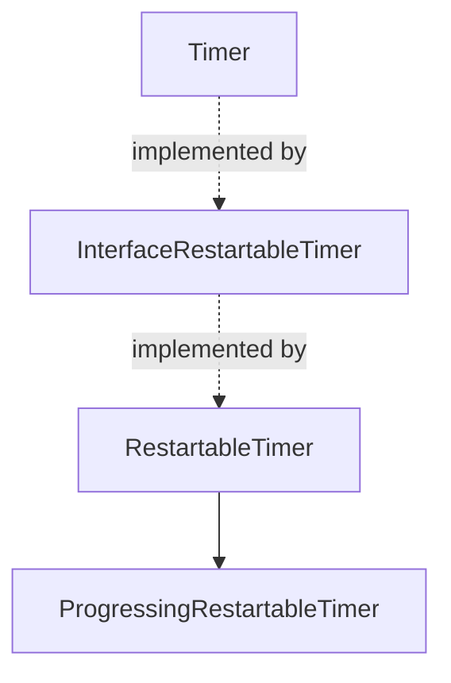

<!--
SPDX-FileCopyrightText: 2026 Benoit Rolandeau <benoit.rolandeau@allcircuits.com>

SPDX-License-Identifier: LicenseRef-ALLCircuits-ACT-1.1
-->

# ACT Dart Timer <!-- omit from toc -->

## Table of contents

- [Table of contents](#table-of-contents)
- [Presentation](#presentation)
- [Architecture](#architecture)
  - [Restartable timer](#restartable-timer)
  - [Progressing restartable timer](#progressing-restartable-timer)
  - [Asynchronous methods](#asynchronous-methods)
- [How to use](#how-to-use)
  - [Installation](#installation)
  - [Watch a timeout](#watch-a-timeout)
  - [Poll at a fixed period](#poll-at-a-fixed-period)
  - [Retry with a growing delay](#retry-with-a-growing-delay)
  - [Derive a timer](#derive-a-timer)
- [Testing](#testing)

## Presentation

This package provides a way to create timers that can be restarted and that can have a progressing
duration.

A `Timer` of the Dart core library is fired once and then forgotten: watching a timeout which is
armed again and again, or waiting longer and longer between two attempts, both mean cancelling and
building a new timer every time. The timers of this package keep their identity across those
restarts, which is what lets a caller hold one in a field.

The package only measures time. It knows nothing about what it triggers, never logs, and never
decides on its own that a callback failed: the callback says so by its return value.

## Architecture



`InterfaceRestartableTimer` extends the `Timer` interface of the Dart core library with `restart`
and `reset`, so a restartable timer can be used wherever a `Timer` is expected.

### Restartable timer

`RestartableTimer` is a non periodic timer which can be armed again any number of times:

| Method    | Pending timeout | Duration    | Tick counter |
| --------- | --------------- | ----------- | ------------ |
| `restart` | cancelled       | counts anew | kept         |
| `cancel`  | cancelled       | -           | kept         |
| `reset`   | cancelled       | counts anew | back to zero |

It starts counting as soon as it is built, unless `waitNextRestartToStart` says otherwise, in which
case the first `restart` starts it.

The callback returns a `bool` which only matters when the timer restarts by itself: `true` lets it
arm again, `false` stops it. `autoRestart`, which the `RestartableTimer.autoRestart` factory turns
on, is what makes a timer behave like a periodic one, except that the next period only starts once
the callback has answered. A slow callback therefore delays the next timeout instead of piling up
behind it.

`isActive` is true while a timeout is pending, and `tick` counts the timeouts which have already
been reached.

### Progressing restartable timer

`ProgressingRestartableTimer` waits a duration which grows with the number of times it has been
armed. The duration of the nth occurrence is `initDuration * factor(n)`, capped by `maxDuration`
when one is given.

The factor comes from a callback, and the package ships four of them, each with its own named
constructor:

| Constructor    | Factor       | First duration  | Growth                        |
| -------------- | ------------ | --------------- | ----------------------------- |
| `noneFactor`   | `1`          | `initDuration`  | none, the duration is fixed   |
| `simpleFactor` | `n`          | `initDuration`  | linear                        |
| `expFactor`    | `exp(n - 1)` | `initDuration`  | exponential                   |
| `logFactor`    | `log(n)`     | zero            | logarithmic, slower and slower|

The logarithm of one being zero, a timer built with `logFactor` fires at once the first time, and
only then starts waiting.

`reset` is what brings the duration back to `initDuration`: `restart` alone moves to the next
occurrence, and therefore to a longer duration. A caller which succeeded and wants to start over
from the shortest delay has to reset the timer.

### Asynchronous methods

`restart`, `cancel` and `reset` are protected by a mutex shared with the callback, so that a timeout
which is being handled is never cancelled halfway. They return before that protection is taken,
which means the timer is not stopped nor armed yet when they return. A caller which needs to observe
the effect has to let the pending microtasks run first.

## How to use

### Installation

Add the package to the `dependencies` of your package:

```yaml
dependencies:
  act_dart_timer:
    path: ../act_dart_timer
```

### Watch a timeout

```dart
final timer = RestartableTimer(const Duration(seconds: 30), () {
  _onAnswerMissing();
  return true;
}, waitNextRestartToStart: true);

void onRequestSent() => timer.restart();
void onAnswerReceived() => timer.cancel();
```

### Poll at a fixed period

```dart
final timer = RestartableTimer.autoRestart(const Duration(seconds: 5), () async {
  final result = await _readSensor();
  return result.isSuccess;
});
```

The timer stops by itself the first time the callback returns `false`.

### Retry with a growing delay

```dart
final timer = ProgressingRestartableTimer.expFactor(
  const Duration(seconds: 1),
  _tryToConnect,
  maxDuration: const Duration(minutes: 5),
  autoRestart: true,
);

void onConnected() => timer.reset();
```

### Derive a timer

A derived class overrides `restartWithoutMutex`, `cancelWithoutMutex` and `resetWithoutMutex`,
never `restart`, `cancel` and `reset`, which take the mutex before calling them:

```dart
@override
void resetWithoutMutex() {
  super.resetWithoutMutex();
  _attempts = 0;
}
```

## Testing

The tests run under a fake clock, so they never wait on a real delay. They cover the start of a
timer with and without its creation, the tick counter, what `restart`, `cancel` and `reset` do to a
pending timeout, the automatic restart and its stop when the callback reports a problem, the delay
an asynchronous callback adds, the four factors and the duration they lead to, the cap of the
maximum duration and the return to the initial duration on a reset.

```console
> flutter test
```
