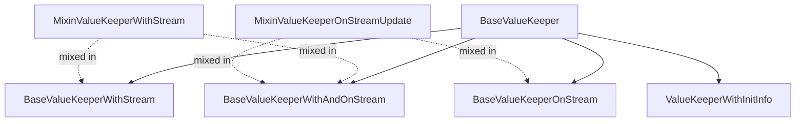

<!--
SPDX-FileCopyrightText: 2026 Benoit Rolandeau <benoit.rolandeau@allcircuits.com>

SPDX-License-Identifier: LicenseRef-ALLCircuits-ACT-1.1
-->

# ACT Dart Value keeper <!-- omit from toc -->

## Table of contents

- [Table of contents](#table-of-contents)
- [Presentation](#presentation)
- [Architecture](#architecture)
  - [The two type parameters](#the-two-type-parameters)
  - [The keepers](#the-keepers)
  - [Emitting the changes](#emitting-the-changes)
  - [Following another stream](#following-another-stream)
- [How to use](#how-to-use)
  - [Installation](#installation)
  - [Keep a value in a final field](#keep-a-value-in-a-final-field)
  - [Know whether the value has been set](#know-whether-the-value-has-been-set)
  - [Notify the listeners of a change](#notify-the-listeners-of-a-change)
  - [Follow a stream](#follow-a-stream)
  - [Give the stream later](#give-the-stream-later)
- [Good to know](#good-to-know)
- [Testing](#testing)

## Presentation

This package provides a way to keep a value and update it based on a stream or an initialization
function.

The main goal is to have a unified way to have an object to keep a value in the codebase.

Thanks to this package, we can have a value that is automatically updated based on a stream and
which emits an event when the value is updated.

The package keeps a value and says when it changed. It does not persist it, does not rebuild any
widget and does not merge several sources: a keeper follows at most one stream.

## Architecture



### The two type parameters

Every class of the package takes two type parameters, `S` and `T`: `T` is the type the getter
returns and `S` the type the setter takes, with `S` castable to `T`. Two type parameters are needed
because a keeper may start without any value and only ever be given non null ones.

The base classes are therefore not meant to be used directly. Each of them comes with the typedefs
which name the two useful combinations, and a package which needs another one declares its own:

| Setter and getter | Naming                                  |
| ----------------- | --------------------------------------- |
| Same type         | `ValueKeeper` and its `WithStream` kin  |
| Nullable getter   | The `WithNullInit` variants             |

### The keepers

`BaseValueKeeper` is the whole idea of the package: an object which holds a value, so that a final
field can point at something which changes. Its `fromSetterValue` constructor builds one from a
value of the setter type, which is what a caller has at hand in a setter callback.

`ValueKeeperWithInitInfo` adds the answer to a question a nullable value cannot give: has the value
been set, or is it still the one it started with? Its `noInit` constructor starts with `null` and
reports no initialisation; `withInit` reports one right away, even when the value it is given is
`null`.

### Emitting the changes

`MixinValueKeeperWithStream` adds a broadcast `valueStream` which emits at every change. By default
a value equal to the current one changes nothing and is not emitted; `emitUnchangedValue` says to
emit it anyway, which matters when the event itself is the signal rather than the value.

The mixin owns a stream controller, so a keeper which carries it has to be disposed:
`disposeLifeCycle` closes the stream.

### Following another stream

`MixinValueKeeperOnStreamUpdate` makes a keeper follow a stream of another type. Its
`parserCallback` turns each listened value into the value to keep, and returns `null` to say the
listened value brings nothing, either because it cannot be parsed or because it must not change what
is kept.

`initStreamListener` is what starts the listening. It accepts an `initListenedValueGetter`, which is
how a keeper takes the current value of a source which only emits its changes. Calling it again
moves the keeper to another stream and cancels the previous subscription. `disposeLifeCycle` cancels
it too.

The keepers which carry that mixin start listening from their constructor. Their `lateInitStream`
constructor is for the case where the stream is not known yet: the keeper holds its initial value
until `initStreamListener` is called.

`BaseValueKeeperWithAndOnStream` carries both mixins: it follows a stream and emits its own changes,
whether they come from that stream or from the setter.

## How to use

### Installation

Add the package to the `dependencies` of your package:

```yaml
dependencies:
  act_dart_value_keeper:
    path: ../act_dart_value_keeper
```

### Keep a value in a final field

```dart
class MyManager {
  final ValueKeeper<int> _counter = ValueKeeper(value: 0);

  void increment() => _counter.value = _counter.value + 1;
}
```

### Know whether the value has been set

```dart
final token = ValueKeeperWithInitInfo<String>.noInit();

if (!token.hasBeenInitialized) {
  await _readTokenFromStorage();
}
```

### Notify the listeners of a change

```dart
final level = ValueKeeperWithStream<int>(value: 0);

final subscription = level.valueStream.listen(_onLevelChanged);

// ...

await subscription.cancel();
await level.disposeLifeCycle();
```

### Follow a stream

```dart
final level = ValueKeeperOnStream<int, SensorFrame>(
  initialValue: 0,
  parserCallback: (frame) => frame.isValid ? frame.level : null,
  listenedStream: _sensor.frames,
  initListenedValueGetter: _sensor.readLastFrame,
);
```

### Give the stream later

```dart
final level = ValueKeeperOnStream<int, SensorFrame>.lateInitStream(
  initialValue: 0,
  parserCallback: (frame) => frame.isValid ? frame.level : null,
);

@override
Future<void> initLifeCycle() async {
  await super.initLifeCycle();
  await level.initStreamListener(listenedStream: _sensor.frames);
}
```

## Good to know

The base of value keeper is the `ValueKeeper` class. This class is based on a getter
which can be null but not the setter.

In old dart version, this will raise the following error: `The setter 'value' has no
corresponding getter.`, but in dart 3.11, this is not the case anymore and it is possible to have a
setter without a getter.

Therefore, to use this package, you need to have a dart version superior to 3.11.1.

## Testing

The tests cover what a keeper returns and accepts, the initialisation flag and the two constructors
which set it, the values the stream emits and the ones it drops, the effect of `emitUnchangedValue`,
the parser returning `null`, the initial listened value including an asynchronous one, the move from
a stream to another one, and what the dispose closes and cancels.

```console
> flutter test
```
