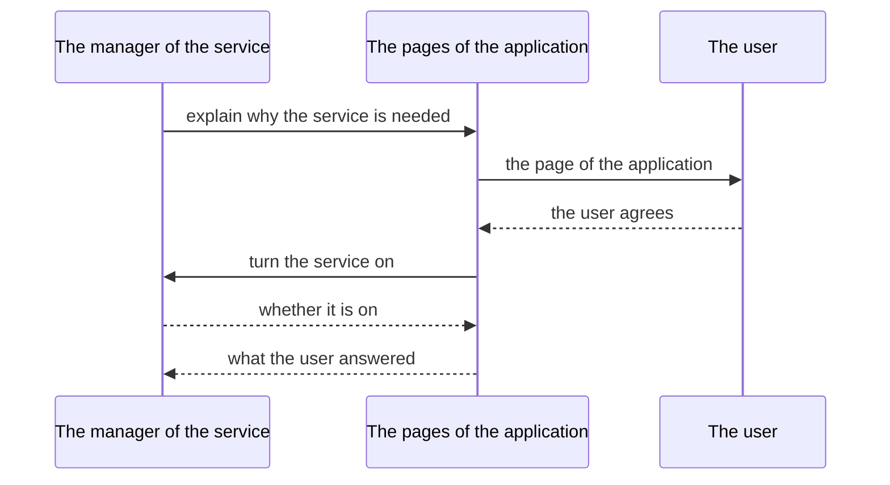

<!--
SPDX-FileCopyrightText: 2023 Anthony Loiseau <anthony.loiseau@allcircuits.com>
SPDX-FileCopyrightText: 2023 Benoit Rolandeau <benoit.rolandeau@allcircuits.com>

SPDX-License-Identifier: LicenseRef-ALLCircuits-ACT-1.1
-->

# ACT Enable service utility <!-- omit from toc -->

## Table of contents <!-- omit from toc -->

- [Presentation](#presentation)
- [Architecture](#architecture)
  - [What a service knows of itself](#what-a-service-knows-of-itself)
  - [Asking the user](#asking-the-user)
  - [Waiting for the settings of the device](#waiting-for-the-settings-of-the-device)
- [How to use](#how-to-use)
  - [Installation](#installation)
  - [Write the service](#write-the-service)
  - [Register the pages which ask](#register-the-pages-which-ask)
  - [Ask the user](#ask-the-user)
- [Testing](#testing)

## Presentation

A permission is granted by the user; a service is switched on by the user. This package is about
the second one: the Bluetooth which is off, the location which is off, the WiFi which is off.
Nothing can grant them, the user has to go and turn them on.

What it brings is the shape of that conversation, for a manager which owns such a service: the state
it keeps and pushes on a stream, the page of the application which explains why the service is
needed, and the trip to the settings of the device which is waited for. What "enabled" means, and
how a service is turned on, belongs to the manager: this package never reads a service and never
turns one on.

It displays nothing itself either. The pages are those of the application, registered with
`act_contextual_views_manager`.

## Architecture

### What a service knows of itself

A manager which mixes `MEnableService` in keeps one thing: whether its service is enabled. It is the
manager which says so, through `setEnabled`, because it is the only one which knows how to read it.
Every change is pushed on a stream, and a state which did not change is never pushed, so a page can
follow the stream without asking again.

`checkAndAskForEnabling` is the one call a feature makes. Asked not to bother the user, it answers
what is already known and reads nothing; otherwise it hands over to `askForEnabling`, which is the
method the manager writes.

### Asking the user



`requestUser` is what a manager calls inside its own `askForEnabling`. The page of the application
is displayed, and it is that page which turns the service on, through the action it is handed. A
user who leaves the page without agreeing leaves the service alone, and nothing is ever attempted.

A manager which wants no page says so, and then the action is run straight away; a manager which
has no action either is simply answered that everything is fine. And a manager which wants another
page than the one of its own service names it: that is how the Bluetooth which needs the location
asks for the location first.

### Waiting for the settings of the device

Some services can only be switched on in the settings of the device.
`openAppSettingAndWaitForUpdate` opens the page which is named and waits: leaving the application
and coming back is what tells that the user is done, and the state of the service is then read
again. The wait gives up after five seconds by default, and answers what is known at that point
rather than waiting forever.

## How to use

### Installation

Add the package to the `dependencies` of your package:

```yaml
dependencies:
  act_enable_service_utility:
    path: ../act_enable_service_utility
```

### Write the service

```dart
class BleManager extends AbsWithLifeCycle with MEnableService {
  @override
  EnableServiceElement getElement() => EnableServiceElement.ble;

  @override
  Future<bool> askForEnabling({
    bool isAcceptanceCompulsory = false,
    bool displayContextualIfNeeded = true,
  }) async {
    if (isEnabled) {
      return true;
    }

    final result = await requestUser<bool>(
      isAcceptanceCompulsory: isAcceptanceCompulsory,
      displayContextualIfNeeded: displayContextualIfNeeded,
      manageEnabling: () async {
        final enabled = await MEnableService.openAppSettingAndWaitForUpdate<bool>(
          isExpectedStatus: (status) => status,
          valueGetter: () => isEnabled,
          statusEmitter: enabledStream,
          settingsType: AppSettingsType.bluetooth,
        );

        return (enabled, enabled);
      },
    );

    return result.customResult ?? false;
  }
}
```

The manager tells the rest of the application what it reads of its service:

```dart
_adapterStateSub = _ble.adapterState.listen((state) => setEnabled(state.isOn));
```

### Register the pages which ask

The view builder of the application mixes `MixinEnableServiceViewBuilder` in and registers one page
or one dialog per service:

```dart
class AppViewBuilder extends AbstractViewBuilder with MixinEnableServiceViewBuilder {
  @override
  Future<void> initProcess() async {
    onEnablePage(route: AppRoutes.enableBle, element: EnableServiceElement.ble);
    onEnableDialog(
      element: EnableServiceElement.location,
      displayDialog: _showEnableLocationDialog,
    );
  }
}
```

A page which is displayed that way is handed the action to call, and `EnableServiceRequestUiBloc`
follows the manager which asked for it:

```dart
class EnableBleBloc extends EnableServiceRequestUiBloc<BleManager> {
  EnableBleBloc({required super.config}) : super(manager: globalGetIt().get<BleManager>());
}
```

### Ask the user

```dart
if (await globalGetIt().get<BleManager>().checkAndAskForEnabling()) {
  ...
}
```

Reading what is already known, without bothering the user:

```dart
final enabled = await manager.checkAndAskForEnabling(askToUser: false);
```

## Testing

The tests drive a service of an application over the pages which answer what each test decided,
over the settings of a device which record which page was asked for, and over a life cycle which
leaves the application and comes back as soon as it is waited for. The pages and the settings are
the boundary of this package, so they are what is stood in for.

The state of a service is covered on the service which was never read, the one which is switched
on, the one which is switched off again, and the state which did not change and is not pushed.
Asking the user is covered on the page which is displayed and hands the enabling back, on the page
the user leaves without agreeing, on the page of another service which is asked for instead, on the
enabling which happens without a page, on the enabling which fails, and on the caller which has
nothing to do at all.

The trip to the settings is covered on the page of the settings which is opened, on the application
which is waited for, on the service which is found switched on, and on the wait which gives up.

```console
> flutter test
```
