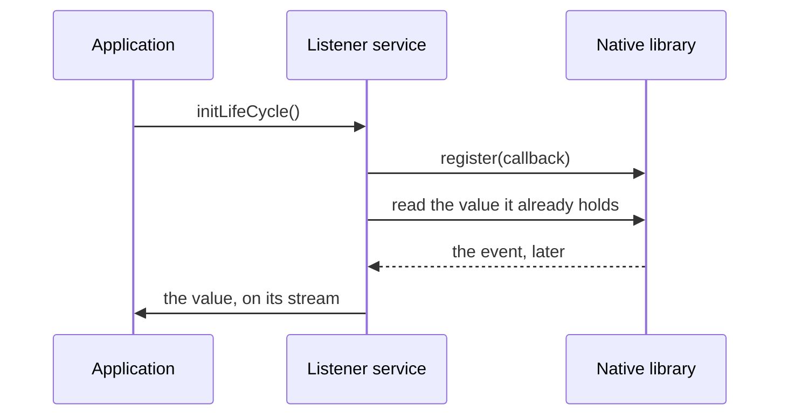

<!--
SPDX-FileCopyrightText: 2026 Benoit Rolandeau <benoit.rolandeau@allcircuits.com>

SPDX-License-Identifier: LicenseRef-ALLCircuits-ACT-1.1
-->

# ACT FFI Utility  <!-- omit from toc -->

## Table of contents

- [Table of contents](#table-of-contents)
- [Presentation](#presentation)
- [Architecture](#architecture)
  - [Surviving a call which goes wrong](#surviving-a-call-which-goes-wrong)
  - [Freeing what a call allocated](#freeing-what-a-call-allocated)
  - [Reading the strings of a library](#reading-the-strings-of-a-library)
  - [Listening to the events of a library](#listening-to-the-events-of-a-library)
  - [Converting the models](#converting-the-models)
- [How to use](#how-to-use)
  - [Installation](#installation)
  - [Generate the bindings](#generate-the-bindings)
  - [Call a command of the library](#call-a-command-of-the-library)
  - [Listen to an event of the library](#listen-to-an-event-of-the-library)
- [Testing](#testing)

## Presentation

This package holds what an application needs around the bindings it generates to talk to a native
library: how a call is protected, how the memory it needs is freed, how its strings are read, and
how the events it announces reach the application.

It binds to no library in particular and generates nothing: the bindings are generated by
[ffigen](https://pub.dev/packages/ffigen) from the header of the library, and this package is what
the application writes on top of them.

## Architecture

### Surviving a call which goes wrong

A call into a native library is a call out of everything dart guarantees: an argument the library
does not like ends the isolate rather than throwing where the caller can see it.
`RuntimeProtectCmd` wraps a call so that whatever it raises is caught, logged with the name the
caller gave it, and turned into a null answer or into a default value.

| Method                         | Answers when the call fails |
| ------------------------------ | --------------------------- |
| `protect`                      | Null                        |
| `protectWithDefault`           | The value the caller gives  |
| `protectWithCalloc`            | Null                        |
| `protectWithCallocAndDefault`  | The value the caller gives  |

### Freeing what a call allocated

A native library which answers through pointers needs those pointers to be allocated before the
call and freed after it, whether the call went well or not. `RuntimeCallocRegister` is where a
caller declares what it has allocated, and the two `...WithCalloc` methods free the whole register
once the call is over, including when it threw.

```dart
final measure = RuntimeProtectCmd.protectWithCalloc<double?>((register) {
  final value = register.add(calloc<ffi.Float>());
  if (bindings.readMeasure(value).isError) {
    return null;
  }

  return value.value;
}, description: "readMeasure");
```

### Reading the strings of a library

`RuntimeStringUtility` reads the two shapes a native library writes a string in: a fixed buffer
inside a structure, which the null character ends and whose size the caller knows, and a pointer to
a buffer the library owns, which may be null and which is read as UTF-8.

### Listening to the events of a library

A native library announces an event by calling back into the application. The three services of this
package hold what that takes, one per shape of callback:

| Service                            | The library announces          |
| ---------------------------------- | ------------------------------ |
| `NativeEvent1UintListenerService`  | One unsigned integer           |
| `NativeEvent2UintListenerService`  | Two unsigned integers          |
| `NativeEvent1FloatListenerService` | One float                      |



A service is a value keeper: it holds the last value the library announced, and pushes the new ones
on a stream. It reads the value the library already holds when it is initialized, so an application
does not have to wait for the first event to know where it stands, and it hands the callback back
to the library when it is disposed.

An event the application cannot read is dropped with a warning rather than pushed as a value, and
so is a registration the library refuses.

### Converting the models

`MixinFactoryFromFfiModel` and `MixinFactoryToFfiModel` are the two directions of a conversion
between a structure of the library and a model of the application. They hold no behaviour: they are
there so that every conversion of an application is named the same way.

## How to use

### Installation

Add the package to the `dependencies` of your package:

```yaml
dependencies:
  act_ffi_utility:
    path: ../act_ffi_utility
```

### Generate the bindings

The bindings themselves are generated by [ffigen](https://pub.dev/packages/ffigen), which reads the
header of the library. The application declares how in a `ffigen.dart` file of its `tool` folder,
and generates them with:

```shell
dart run tool/ffigen.dart
```

Generate them into `lib/generated/runtime`: the `generated` folder says that its content is not
written by hand, and it is not under version control. The pipeline which builds the application has
to generate them before it builds.

### Call a command of the library

```dart
final isOn = RuntimeProtectCmd.protectWithCallocAndDefault<bool>((register) {
  final state = register.add(calloc<ffi.UnsignedInt>());

  return bindings.readState(state).isSuccess && state.value != 0;
}, defaultValue: false, description: "readState");
```

### Listen to an event of the library

```dart
final temperature = NativeEvent1FloatListenerService<RuntimeResult, Temperature>(
  logsCategory: "temperature",
  registerNativeCallback: bindings.registerTemperatureCallback,
  parseParamToObject: Temperature.fromDegrees,
  valueGetter: bindings.readTemperature,
);

await temperature.initLifeCycle();

temperature.valueStream.listen(_onTemperature);
```

`registerNativeCallback` is the function of the library which takes a callback, and the service
calls it again with a null pointer when it is disposed, so the library stops calling into an
application which is gone.

## Testing

The tests run against a library the test stands in for, which records the callback it is given and
calls it on demand. They cover the callback which is registered, the event which reaches the stream
of the application, the event which is dropped because the application cannot read it, the value
the service reads before any event, the registration the library refuses, the library which throws
instead of registering, and the callback which is handed back when the service is disposed.

The protection of a call is covered on what it answers, on what it logs, and on the register which
is freed whether the call answered or threw. The reading of the strings is covered on a real
structure and on a real buffer, including the buffer which is not there at all.

```console
> flutter test
```
