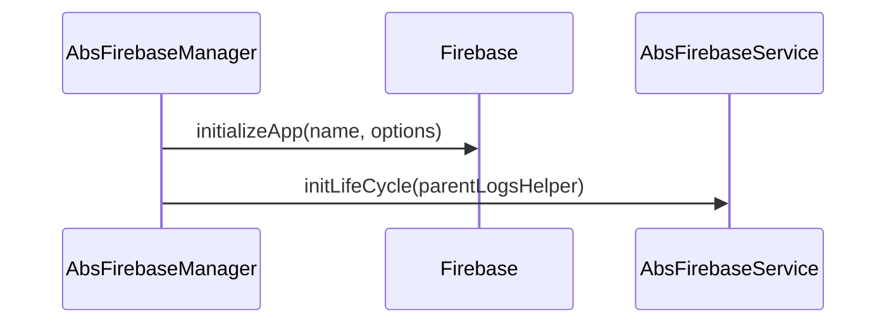

<!--
SPDX-FileCopyrightText: 2024 Benoit Rolandeau <benoit.rolandeau@allcircuits.com>

SPDX-License-Identifier: LicenseRef-ALLCircuits-ACT-1.1
-->

# ACT Firebase Core  <!-- omit from toc -->

## Table of contents

- [Table of contents](#table-of-contents)
- [Presentation](#presentation)
- [Architecture](#architecture)
  - [The manager and its services](#the-manager-and-its-services)
  - [Naming the application](#naming-the-application)
  - [The logs](#the-logs)
- [How to use](#how-to-use)
  - [Installation](#installation)
  - [Write a service](#write-a-service)
  - [Register the manager](#register-the-manager)
- [Install dependencies](#install-dependencies)
  - [Install Firebase CLI](#install-firebase-cli)
  - [Install FlutterFire CLI](#install-flutterfire-cli)
  - [FlutterFire configure](#flutterfire-configure)
- [Testing](#testing)

## Presentation

This package is where an application starts Firebase, once, for every feature it uses. It offers no
feature of its own: crash reporting, messaging and the rest come from the other `act_firebase_*`
packages, and this one is what they hang on.

Firebase has to be started before any of its features answers, and started only once. That is what
this package owns.

## Architecture

### The manager and its services

`AbsFirebaseManager` is the manager an application registers, and `AbsFirebaseService` is one
feature of Firebase. The manager starts Firebase and then initializes each service, so a service
never runs against a Firebase which is not started.



The services are disposed with the manager, in the order the application declared them.

### Naming the application

An application which uses the default project of the device names nothing and gives no options:
Firebase reads both from the files the tools of Firebase generated. An application which uses a
second project names it and gives its options; Firebase refuses a named project without them.

### The logs

The manager logs under its own category, and its configuration can turn those logs off for an
application which does not want the traces of Firebase. A service hangs its own category under the
one of the manager, through `createLogsHelper`, so every trace of Firebase is read as one.

## How to use

### Installation

Add the package to the `dependencies` of your package:

```yaml
dependencies:
  act_firebase_core:
    path: ../act_firebase_core
```

### Write a service

A service of an application is usually brought by one of the other `act_firebase_*` packages; an
application writes one when it needs a feature none of them covers:

```dart
class MyService extends AbsFirebaseService {
  late final LogsHelper _logsHelper;

  @override
  Future<void> initLifeCycle({LogsHelper? parentLogsHelper}) async {
    await super.initLifeCycle();
    _logsHelper = AbsFirebaseService.createLogsHelper(
      logCategory: "myService",
      parentLogsHelper: parentLogsHelper,
    );
  }
}
```

### Register the manager

```dart
class AppFirebaseManager extends AbsFirebaseManager {
  @override
  Future<FirebaseManagerConfig> getFirebaseConfig() async => FirebaseManagerConfig(
        loggerEnabled: globalGetIt().get<AppConfigManager>().firebaseLogsEnabled.load(),
        options: DefaultFirebaseOptions.currentPlatform,
        firebaseServices: [MyService()],
      );
}

class AppFirebaseBuilder extends AbsFirebaseBuilder<AppFirebaseManager, AppConfigManager> {
  AppFirebaseBuilder() : super(AppFirebaseManager.new);
}
```

```dart
GlobalManager.instance.register(AppFirebaseBuilder());
```

`DefaultFirebaseOptions` comes from the file the tools of Firebase generate, which the next section
explains how to produce.

## Install dependencies

### Install Firebase CLI

_Source: https://firebase.google.com/docs/cli#setup_update_cli_

_This part is only needed if you haven't done yet_

First, you need to have nodejs installed on your PC.

Open a bash prompt on the root of the project.

Then, call the following command to install Firebase cli:

> npm install -g firebase-tools

Call the next command to log to firebase.

> firebase login

Then log to the ACT developer account.

To verify that everything is alright call the command:

> firebase projects:list

### Install FlutterFire CLI

_Source: https://firebase.google.com/docs/flutter/setup?platform=android_

Install the FlutterFire CLI:

> dart pub global activate flutterfire_cli

### FlutterFire configure

_Source: https://firebase.google.com/docs/flutter/setup?platform=android_

Finally calls:

> flutterfire configure

You have to call it each time you add a new plugin or dependencies to a new firebase service.

## Testing

The tests start Firebase as a test answers for it, which covers the services which are initialized
once it is started, the logs of a service which hang under the ones of the manager, the application
which uses no service, and the services which are disposed with the manager.

Each test starts an application of its own name, because Firebase keeps the ones it has already
started and refuses to start one twice under the same name.

```console
> flutter test
```
