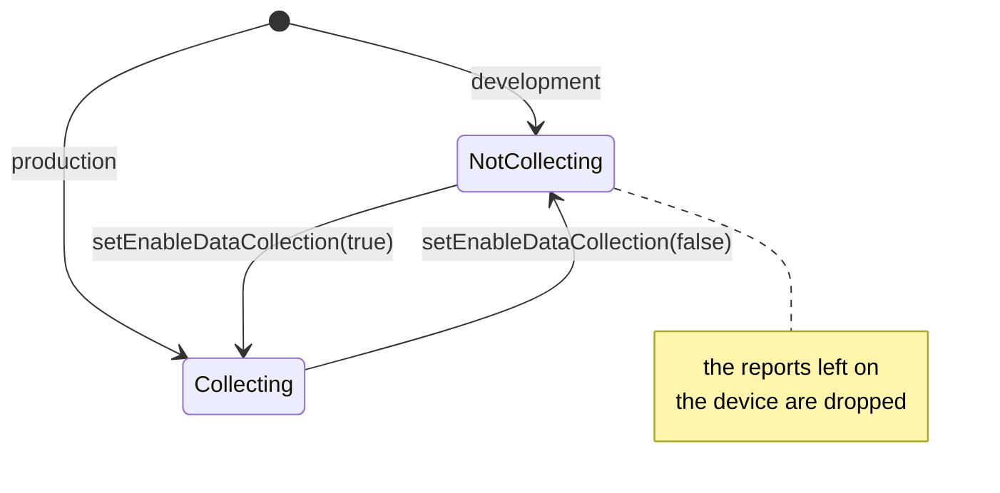

<!--
SPDX-FileCopyrightText: 2024 Benoit Rolandeau <benoit.rolandeau@allcircuits.com>

SPDX-License-Identifier: LicenseRef-ALLCircuits-ACT-1.1
-->

# ACT Firebase Crash  <!-- omit from toc -->

## Table of contents

- [Table of contents](#table-of-contents)
- [Presentation](#presentation)
- [Architecture](#architecture)
  - [Collecting and sending](#collecting-and-sending)
  - [What is reported](#what-is-reported)
  - [The debug session](#the-debug-session)
  - [Google Analytics](#google-analytics)
- [How to use](#how-to-use)
  - [Installation](#installation)
  - [Register the service](#register-the-service)
  - [Open a debug session](#open-a-debug-session)
  - [Send the reports by hand](#send-the-reports-by-hand)
- [Install dependencies](#install-dependencies)
- [Configuration](#configuration)
- [Testing](#testing)

## Presentation

This package is the service which reports the crashes of an application to Firebase Crashlytics. It
is one service of `act_firebase_core`, so an application registers it among the services of its
Firebase manager rather than as a manager of its own.

It reports what nothing else caught: the errors of Flutter and the errors of the platform, which it
takes from the logger of the application. It also opens a session which sends the logs of the
application to Crashlytics, for the times when a device cannot be reached any other way.

## Architecture

### Collecting and sending

Two switches are told apart, and an application can hold one without the other:

- collecting, which decides whether the errors of the application become reports on the device;
- sending, which decides whether the device sends those reports on its own.

Turning collecting off drops the reports the device kept, since nothing is going to send them.
Turning sending on sends the ones which are waiting. An application which keeps sending off holds
the reports on the device and decides when they leave, which is what asking the user before sending
anything looks like.

Both start from the environment the application runs in: a production application collects and
sends, any other one does neither. The configuration overrides that, so an application which wants
the reports of its development builds asks for them by key.



### What is reported

The service hangs on the logger manager rather than on the framework: it registers a handler for
the errors of Flutter and a callback for the errors of the platform, and the logger manager is what
calls them. Both are reported as fatal ones. An error an application caught and logged itself is
not reported: it went through the logger, not through the handlers.

### The debug session

A debug session names a user and sends the logs of the application along with the reports. The
identifier names the logs in the console of Crashlytics; it can be drawn at random and shown to the
user, so nothing of the user is needed to read their logs.

The session registers a logger of its own with the logger manager, which writes the messages of the
level it was given and worse. The logs only leave the device with the next report, which is why the
session ends with `sendCrashDebugReport`: it records an error carrying the identifier of the
session, and the logs which were gathered travel with it. The reports of a crash are sent when the
application starts again, so a device which is being watched live has to be restarted before its
logs show up.

Closing the session removes its logger and clears the identifier of the user.

### Google Analytics

The package installs Crashlytics alone, without Google Analytics, because an application does not
always want it. Crashlytics offers less than it does next to Analytics; the documentation of
Firebase says which features are which.

## How to use

### Installation

Add the package to the `dependencies` of the application:

```yaml
dependencies:
  act_firebase_crash:
    path: ../act_firebase_crash
```

### Register the service

The service is one of the services of the Firebase manager of the application, and the configuration
manager of the application carries the keys it reads:

```dart
class AppConfigManager extends AbstractConfigManager with MixinFirebaseCrashConf {}

class AppFirebaseManager extends AbsFirebaseManager {
  @override
  Future<FirebaseManagerConfig> getFirebaseConfig() async => FirebaseManagerConfig(
        options: DefaultFirebaseOptions.currentPlatform,
        firebaseServices: [
          FirebaseCrashService(confManager: globalGetIt().get<AppConfigManager>()),
        ],
      );
}
```

The service reads the logger manager of the application out of the global manager, so it needs one
registered.

### Open a debug session

```dart
final crash = ...; // the service the Firebase manager of the application holds

await crash.setCrashDebugConfig(
  const FirebaseCrashDebugConfig(identifier: "a4f19c", level: LogsLevel.info),
);

// ... let the application run, then send what was gathered
await crash.sendCrashDebugReport();

// ... and close the session
await crash.setCrashDebugConfig(null);
```

The session can also be given to the service when it is built, for an application which gathers the
logs from the start.

### Send the reports by hand

An application which turned the automatic sending off asks the user and then sends, or drops what is
waiting:

```dart
if (await crash.checkForUnsentReports()) {
  // ask the user, then
  await crash.sendUnsentReports();
  // or
  await crash.deleteUnsentReports();
}
```

`didCrashOnPreviousExecution` tells whether the application crashed the last time it ran, which is
what asking the user about a crash they have just seen needs.

## Install dependencies

The tools of Firebase have to be installed and the application configured, which
[the core package](../act_firebase_core/README.md#install-dependencies) explains.

Once that is done, Crashlytics is added to the files of the application with:

```console
> flutterfire configure
```

## Configuration

| Key                            | Type   | Default                                 | Description                                                              |
| ------------------------------ | ------ | --------------------------------------- | ------------------------------------------------------------------------ |
| `firebase.crash.enable`        | `bool` | `true` in production, `false` elsewhere | Whether the errors of the application become reports on the device.      |
| `firebase.crash.autoLogEnable` | `bool` | `true` in production, `false` elsewhere | Whether the device sends the reports on its own, without being asked to. |

## Testing

The tests answer for the Crashlytics of a device and read back what it was told, which covers the
switches read from the environment and from the configuration, the errors of Flutter and of the
platform recorded as fatal ones, the reports dropped when collecting stops and sent when sending
starts, the reports which are asked for by hand, and the debug session: the user it names, the logs
it writes, the level it applies, and what is left once it is closed.

Crashlytics only answers under the default application of Firebase, and the plugin keeps both that
application and the Crashlytics which serves it for the whole test file. So one Crashlytics is
installed for the file and each test puts it back in the state it starts from, rather than
installing another one.

```console
> flutter test
```
