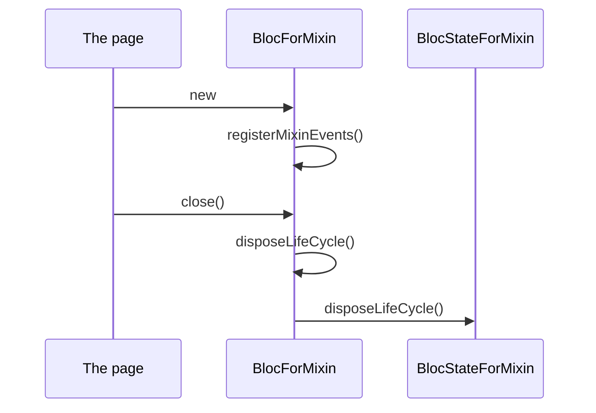

<!--
SPDX-FileCopyrightText: 2020 - 2023 Sami Kouatli <sami.kouatli@allcircuits.com>
SPDX-FileCopyrightText: 2023 Benoit Rolandeau <benoit.rolandeau@allcircuits.com>

SPDX-License-Identifier: LicenseRef-ALLCircuits-ACT-1.1
-->

# ACT Flutter utility <!-- omit from toc -->

## Table of contents

- [Table of contents](#table-of-contents)
- [Presentation](#presentation)
- [Architecture](#architecture)
  - [Blocs written as mixins](#blocs-written-as-mixins)
  - [Graphical assets](#graphical-assets)
  - [The banners of a page](#the-banners-of-a-page)
  - [The banner of the environment](#the-banner-of-the-environment)
  - [Scrolling a page](#scrolling-a-page)
  - [Lists the user reorders](#lists-the-user-reorders)
  - [Tab bars](#tab-bars)
  - [The utilities](#the-utilities)
- [How to use](#how-to-use)
  - [Installation](#installation)
  - [Write a bloc from mixins](#write-a-bloc-from-mixins)
  - [Show the banners of a page](#show-the-banners-of-a-page)
  - [Highlight a part of a text](#highlight-a-part-of-a-text)
- [Testing](#testing)

## Presentation

This package holds the widgets and the helpers every application writes again: the base classes of
a bloc, the assets it draws, the banners it shows above a page, the scroll views it wraps a page
in, the lists the user reorders, the tab bars, and the utilities around colors, texts, sizes and
urls.

It is a toolbox, not a manager: it registers nothing in the global manager and owns no state of
its own. Two of its widgets read a manager the application registered, and only those two: the
banners of a page follow the internet connection, and the banner of the environment reads the
configuration.

## Architecture

### Blocs written as mixins

A feature which several pages share is written as a mixin over a bloc rather than as a base class,
so a page can take several of them. `BlocForMixin`, `BlocStateForMixin` and `BlocEventForMixin`
are what makes that possible: a mixin adds its events in `registerMixinEvents`, and the bloc calls
it once, from its constructor.

Closing a bloc disposes the life cycle of the bloc and then the one of the state it holds, in that
order, so a bloc still reads a valid state while it lets go of what it owns.



`MixinAsyncInitBloc` is the mixin for a bloc which has something to read before it can show
anything: it adds an `AsyncInitEvent` to itself as soon as it is built and calls `initAsyncBloc`
when the event comes back. A bloc which has to read again, because the first read failed or
because the page asks for it, adds the event a second time.

`MixinGenericLoadingState` is the mixin for a state which tells a page that something is loading:
the page reads `loading` to show a progress, `interactionsDisabled` to hold the user back and
`anErrorOccurred` to show an error. A state which disables the interactions for a reason of its
own adds it to the one of the mixin instead of replacing it.

### Graphical assets

`GraphicalAsset` is what a widget asks for when it draws a picture whose kind it does not care
about. `IconAsset` draws a material icon, `PngAsset` a bitmap and `SvgAsset` a drawing. All three
take a width, a height and a color, and each honours them the way its kind allows: an icon is
square and refuses a width and a height which differ, a bitmap is decoded at the resolution of the
screen, and a drawing takes the color as a filter over its own colors.

### The banners of a page

`BannerInformationDisplay` shows a stack of banners above the page it wraps. Every banner carries
a weight, which comes from its type and from the offset the application adds to it, and the
banners are shown from the heaviest to the lightest. The page says how many of them it has room
for; the others wait.

| Type      | Weight |
| --------- | ------ |
| `error`   | 500    |
| `warning` | 400    |
| `success` | 300    |
| `info`    | 200    |
| `debug`   | 100    |

A hundred points separate two types, which is the room an application has to weigh one of its
banners between them.

The widget also shows a banner of its own when the device loses its internet connection, if the
page gave it one to show. That banner is weighed against the others like any of them.

### The banner of the environment

`EnvBanner` marks a page which does not run against production, so nobody mistakes one build for
another. It reads the environment from the configuration manager of the application and paints the
banner after it: red for development, blue for qualification and green for production. A page
built for production and released wears nothing, and so does an environment which has no short
name.

### Scrolling a page

A page says how it scrolls with `SingleChildScrollViewType`, and `OptionalSingleChildScrollView`
gives it what it asked for:

- `noScroll` shows the page as it is;
- `scroll` wraps it in a plain scroll view;
- `expandedScroll` wraps it in a `SingleExpandableChildScrollView`.

The last one is for a page which both expands and scrolls: a form whose submit button sits at the
bottom of the screen while the form is short, and just under the form once it is long. It measures
the page to do so, which costs more than the other two, so it is the answer only when the other
two are not.

### Lists the user reorders

`DraggableAndScrollableListView` shows a plain list, or a list the user reorders once the page
gives it a reorder callback. It holds the drag handles back while the page is loading.

`ScrollableReorderableListView` is the list underneath. A list which scrolls by itself needs
nothing more. A list which is expanded inside a scrolling page does: the page scrolls, not the
list, and dragging an item to the edge of the screen would otherwise stop there. Given the scroll
controller of the page, the widget follows the finger and scrolls the page while the item is held
near an edge.

### Tab bars

`AbsSimpleTabBar` and `MixinSimpleTabBarState` are the tab bar of a page, described by one
`ActTabBarConfig` per tab. The state keeps the index of the tab the user is on and hands it to the
page. Following the tabs costs a listener, so it is only installed when the page asked for the
index or asked to be built again when it changes.

### The utilities

- `ColorsUtility` lightens and darkens a color while keeping its shade: a channel which overflows
  pours into the other ones, and a color which overflows all of them turns white. It also picks a
  color out of a gradient, interpolated in HSV.
- `TextUtility` builds the text span of a text whose parts are styled apart, or replaced by a
  widget. The parts are named by the words they hold; a word inside another one is named after it
  in the list, and wins over it.
- `WidgetUtility` computes the size of a widget out of the size of its parent, marks the label of
  a required input, and tells whether a touch fell over a widget.
- `OverlayUtility` shows a widget above the current page, fading in and out, and hands it the way
  to close itself.
- `UrlLauncherUtility` opens a url in the browser of the device, and says so when the device knows
  no way to open it.

## How to use

### Installation

Add the package to the `dependencies` of the application:

```yaml
dependencies:
  act_flutter_utility:
    path: ../act_flutter_utility
```

### Write a bloc from mixins

```dart
class CounterState extends BlocStateForMixin<CounterState> {
  final int value;

  const CounterState({this.value = 0});

  @override
  CounterState copyWith({int? value}) => CounterState(value: value ?? this.value);

  @override
  List<Object?> get props => [...super.props, value];
}

class CounterBloc extends BlocForMixin<CounterState> with MixinAsyncInitBloc<CounterState> {
  CounterBloc() : super(const CounterState());

  @override
  void registerMixinEvents() {
    super.registerMixinEvents();

    on<CounterIncremented>((event, emit) => emit(state.copyWith(value: state.value + 1)));
  }

  @override
  Future<void> initAsyncBloc({required Emitter<CounterState> emit}) async {
    await super.initAsyncBloc(emit: emit);

    emit(state.copyWith(value: await _readTheLastValue()));
  }
}
```

### Show the banners of a page

```dart
BannerInformationDisplay(
  bannerNbToDisplay: 2,
  banners: [
    BannerInformationModel(
      type: BannerInformationType.warning,
      text: "The battery is low",
      foregroundColor: theme.colorScheme.onError,
      backgroundColor: theme.colorScheme.error,
    ),
  ],
  internetBannerInfoModel: BannerInformationModel(
    type: BannerInformationType.error,
    text: "No internet connection",
    foregroundColor: theme.colorScheme.onError,
    backgroundColor: theme.colorScheme.error,
  ),
  child: page,
);
```

### Highlight a part of a text

```dart
Text.rich(
  TextUtility.highlightText(
    text: "Hello world!",
    wordToHighlight: "world",
    mainTextStyle: theme.textTheme.bodyMedium,
    highLightTextStyle: theme.textTheme.bodyMedium?.copyWith(fontWeight: FontWeight.bold),
  ),
);
```

## Testing

The tests drive the widgets in a page rather than reading their fields: the overlay is shown and
hidden, the tabs are tapped, the items of a list are dragged to the edge of the screen, and the
banners are counted. The connection of the device, the environment of the application and the
platform side of the url launcher are answered by the tests.

They cover the life cycle of a bloc and of the state it holds, the asynchronous initialization,
the three kinds of graphical assets, the weighing of the banners, the three ways of scrolling a
page, and every branch of the utilities, including the colors which overflow a channel and the
words which contain one another.

```console
> flutter test
```
