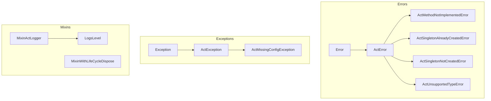

<!--
SPDX-FileCopyrightText: 2026 Benoit Rolandeau <benoit.rolandeau@allcircuits.com>

SPDX-License-Identifier: LicenseRef-ALLCircuits-ACT-1.1
-->

# ACT Foundation <!-- omit from toc -->

## Table of contents

- [Table of contents](#table-of-contents)
- [Presentation](#presentation)
- [Architecture](#architecture)
  - [Errors and exceptions](#errors-and-exceptions)
  - [Logger interface](#logger-interface)
  - [Life cycle](#life-cycle)
- [How to use](#how-to-use)
  - [Installation](#installation)
  - [Raise an ACT error or exception](#raise-an-act-error-or-exception)
  - [Log through the interface](#log-through-the-interface)
  - [Parse a log level from a configuration value](#parse-a-log-level-from-a-configuration-value)
- [Testing](#testing)

## Presentation

This package provides the foundational classes and interfaces shared by the ACT packages: the
logger interface, the base classes of the errors and of the exceptions, and the log levels.

It sits at the base of all the ACT packages and should not have any dependency on other ACT
packages, not even a development one.

It has to only contain simple classes and interfaces that can be used by all the other ACT packages.
Before adding a new class or interface to this package, you should ask yourself if it is really
useful for all the other ACT packages, and if it is not better to put it in a more specific package
but still generic (_such as `act_dart_utility` or `act_flutter_utility`_).

The package defines contracts and the behaviour which comes with them; it implements no service. A
logger which writes somewhere, a life cycle which orchestrates services, or a configuration which is
read from a file all live in other packages.

## Architecture



### Errors and exceptions

The package splits the failures in two families, and the choice between them says how the caller is
expected to react:

| Base class     | Meaning                                    | Expected reaction            |
| -------------- | ------------------------------------------ | ---------------------------- |
| `ActError`     | A programming error, such as a misused API | None, it must not be caught  |
| `ActException` | A recoverable runtime condition            | Catch it and handle the case |

Both carry a human readable `message` and return it from `toString`.

The derived classes build their message from what they are given, so that the message of a failure
never has to be written twice:

- `ActMethodNotImplementedError` reports a method a class was expected to override. Its `crash`
  static method is a trap for the code paths which must never be reached: it fires an assertion in
  debug and throws the error otherwise, and its return type tells the analyzer that the code after
  it is unreachable.
- `ActSingletonAlreadyCreatedError` and `ActSingletonNotCreatedError` report the two ways of
  misusing a singleton, and take the type of the singleton as a type parameter.
- `ActUnsupportedTypeError` reports a type a generic API cannot handle, with an optional context to
  say where it was met.
- `ActMissingConfigException` reports a configuration value which is missing or empty.

### Logger interface

`MixinActLogger` is the interface every ACT package logs through. A package never depends on a
logger implementation, only on this mixin, so that the application decides where the logs go.

The mixin leaves five members to its implementations: `log`, `logMessages`, `createAbsSubLogger`,
`createAbsSubLoggerMinLevel` and `wouldBeLogged`. Everything else it provides is built on `log`: the
`t`, `d`, `i`, `w`, `e` and `f` shortcuts only forward the message, the optional error and the
optional stack trace with the matching `LogsLevel`.

`wouldBeLogged` exists so that a caller can skip building an expensive message which would be
dropped anyway. The sub loggers let a class narrow the category of its logs without knowing how the
categories are rendered.

`LogsLevel` orders the levels from the most verbose to the least verbose, from `all` to `off`. Each
level knows the strings which name it, and `parseFromString` turns a configuration value into a
level, accepting the full name, the single letter shortcut and the usual aliases, whatever the case.
It returns `null` when the value names no level, which leaves the caller free to decide what a wrong
value means.

### Life cycle

`MixinWithLifeCycleDispose` gives a default `disposeLifeCycle` to the classes which have nothing to
initialise but still take part in the life cycle of the application. A derived class which overrides
it has to call `super.disposeLifeCycle()`, which `@mustCallSuper` enforces.

## How to use

### Installation

Add the package to the `dependencies` of your package:

```yaml
dependencies:
  act_foundation:
    path: ../act_foundation
```

### Raise an ACT error or exception

Derive from the base class which matches the kind of failure, and build the message in the
constructor:

```dart
class MyPortAlreadyOpenedError extends ActError {
  MyPortAlreadyOpenedError(String portName) : super("The port: $portName, is already opened");
}
```

Use the trap of `ActMethodNotImplementedError` in the branches which must never be reached:

```dart
@override
Future<void> connect() => ActMethodNotImplementedError.crash(caller: this, method: "connect");
```

### Log through the interface

Take the interface as a dependency instead of a logger implementation:

```dart
class MyManager {
  final MixinActLogger _logger;

  MyManager({required MixinActLogger logger})
    : _logger = logger.createAbsSubLogger(subCategory: "MyManager");

  void doSomething() {
    _logger.i("doing something");
  }
}
```

Guard the messages which are expensive to build:

```dart
if (_logger.wouldBeLogged(LogsLevel.debug)) {
  _logger.d(_buildDetailedReport());
}
```

### Parse a log level from a configuration value

```dart
final level = LogsLevel.parseFromString(rawValue) ?? LogsLevel.info;
```

## Testing

The tests cover the message each error and exception builds, the family each one belongs to, the
level the shortcuts of the logger interface forward to `log`, the default `disposeLifeCycle` and its
behaviour once a derived class overrides it, and the values `LogsLevel.parseFromString` accepts and
rejects.

The package cannot use the shared test utilities, because they depend on it, so its tests define
their own fakes. To run them:

```console
> flutter test
```
