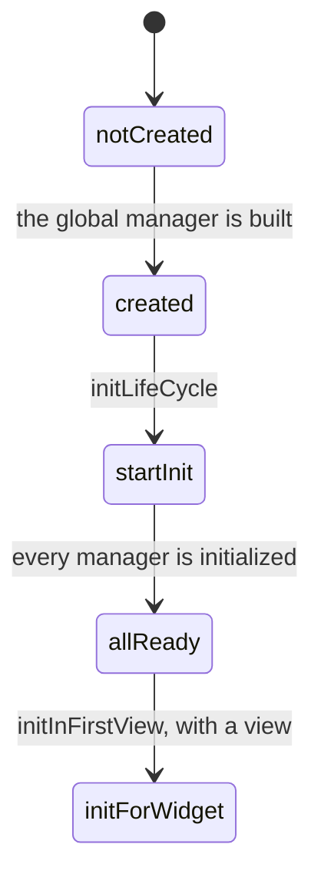

<!--
SPDX-FileCopyrightText: 2020 - 2023 Sami Kouatli <sami.kouatli@allcircuits.com>
SPDX-FileCopyrightText: 2023 Benoit Rolandeau <benoit.rolandeau@allcircuits.com>

SPDX-License-Identifier: LicenseRef-ALLCircuits-ACT-1.1
-->

# ACT Global manager <!-- omit from toc -->

## Table of contents

- [Table of contents](#table-of-contents)
- [Presentation](#presentation)
- [Architecture](#architecture)
  - [The states of an application](#the-states-of-an-application)
  - [The order the managers are initialized in](#the-order-the-managers-are-initialized-in)
  - [The shortcuts](#the-shortcuts)
  - [The application with a view](#the-application-with-a-view)
  - [The config manager of the usual application](#the-config-manager-of-the-usual-application)
- [How to use](#how-to-use)
  - [Installation](#installation)
  - [Write the global manager of the application](#write-the-global-manager-of-the-application)
  - [Start the application](#start-the-application)
  - [Reach a manager](#reach-a-manager)
- [Testing](#testing)

## Presentation

This package holds the global manager of an application: the one object which knows every manager,
initializes them in the right order, and hands them out to whoever needs one.

An application derives it, registers its managers, and stops thinking about their order: a manager
declares what it depends on, and the global manager initializes it once those are ready.

The package holds no business logic and knows nothing about the managers it initializes. It does not
build a widget either, apart from running the one the application gives it and, if the
initialization fails, the page that application wants to display instead.

## Architecture

### The states of an application

An application goes forward through the states of `GlobalManagerState`, and never back:



A step which has already been reached is refused rather than run again, which is what makes a second
initialization, or a second first view, harmless. `initForWidget` only exists in an application with
a view, which `GlobalManagerUiState` adds to the states above.

### The order the managers are initialized in

A manager is registered with its builder, which lists the managers it depends on. The global manager
registers them in `GetIt` as asynchronous singletons and waits for all of them to be ready; `GetIt`
initializes a manager only once the ones it depends on are.

A manager has to be registered after the ones it depends on: `GetIt` refuses a dependency which is
not registered yet.

The managers are kept in the order they finished their initialization, and they are disposed
together when the global manager is.

### The shortcuts

`globalGetIt()` gives the `GetIt` instance of the application and `appLogger()` its logger. Both go
through the global manager instance, which the derived class sets when it is built, so that a class
which needs a manager does not have to be given one.

The logger exists before any manager: it is the safe logger of `act_logger_manager`, which writes to
the console until the logger manager replaces it.

### The application with a view

`MixinUiGlobalManager`, and `AbsUiGlobalManager` which merges it with the global manager, add what
an application with a view needs:

- `initAfterManagersAndBeforeViews` is called on every registered manager which depends on the UI,
  once they are all initialized and before the first view is built,
- `initInFirstView` gives them the context of the first view, without waiting for them: the first
  view is displayed rather than held back,
- `runActApp` initializes the managers and then runs the application,
- `buildFatalErrorPage` gives the page to display when that initialization fails. Without one, the
  error is rethrown and the application crashes with it in the console.

Only the managers which derive `AbsWithLifeCycleAndUi` take part in those two steps; the others are
left alone.

### The config manager of the usual application

`AbsUsualConfigManager` is a config manager which already carries the variables the logger manager
reads, and `ExtDefaultLoggerBuilder` builds the default logger manager from the config manager
registered in the application. Together they are the shortest way to a working pair of config and
logger managers; an application which needs more derives `AbstractConfigManager` itself.

## How to use

### Installation

Add the package to the `dependencies` of your package:

```yaml
dependencies:
  act_global_manager:
    path: ../act_global_manager
```

### Write the global manager of the application

```dart
class AppGlobalManager extends AbsUiGlobalManager {
  AppGlobalManager.create() : super.create();

  static void createInstance() => AbsGlobalManager.setInstance = AppGlobalManager.create();

  @override
  Future<void> registerManagers() async {
    registerManagerAsync(AppConfigBuilder());
    registerManagerAsync(ExtDefaultLoggerBuilder<AppConfigManager>());
    registerManagerAsync(TicBuilder());
  }
}
```

The managers are registered in the order of their dependencies: the config manager first, then the
logger manager which reads it, then the ones which log.

### Start the application

```dart
Future<void> main() async {
  AppGlobalManager.createInstance();

  await (AbsGlobalManager.instance! as AppGlobalManager).runActApp(const MyApp());
}
```

The first view calls `initInFirstView`, which is what gives the context to the managers which asked
for one:

```dart
MaterialApp(
  builder: (context, child) {
    globalGetIt().get<AppGlobalManager>().initInFirstView(context);

    return child!;
  },
);
```

### Reach a manager

```dart
final ticManager = globalGetIt().get<TicManager>();
```

## Testing

The tests drive a global manager which registers the managers a test asks for, and fake managers
which record the steps of their life cycle they have been through.

They cover the initialization of the registered managers and the order it follows, the registration
which is refused when a dependency is missing, the second initialization which does nothing, the
information of the package the manager reads, the states which are refused because they have been
reached or because they are not the ones of the application, and the disposal of the managers.

For an application with a view, they run the widgets of the test binding to cover the two
initializations which need the managers and the context, the first view which only counts once, the
application which is run once the managers are ready, and the page which is displayed, or the error
which is rethrown, when that initialization fails.

The instance of the global manager and the `GetIt` it registers into are shared by the whole
process: each test builds its own manager, which becomes the instance, and the `GetIt` instance is
reset between two tests.

```console
> flutter test
```
