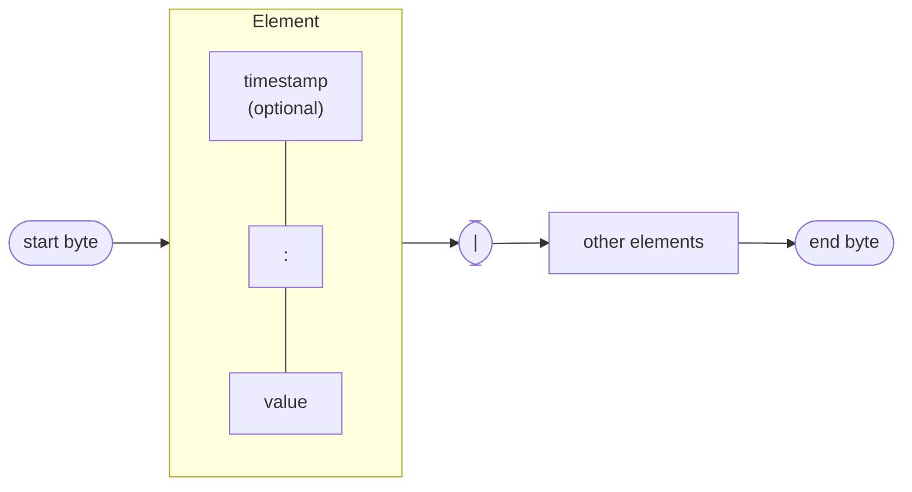
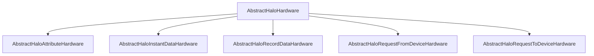

<!--
SPDX-FileCopyrightText: 2023 Benoit Rolandeau <benoit.rolandeau@allcircuits.com>

SPDX-License-Identifier: LicenseRef-ALLCircuits-ACT-1.1
-->

# ACT Halo abstract <!-- omit from toc -->

## Table of contents

- [Table of contents](#table-of-contents)
- [Presentation](#presentation)
- [Architecture](#architecture)
  - [What travels on the wire](#what-travels-on-the-wire)
  - [The services and what they exchange](#the-services-and-what-they-exchange)
  - [The hardware layer](#the-hardware-layer)
  - [Naming the data and the requests](#naming-the-data-and-the-requests)
- [How to use](#how-to-use)
  - [Installation](#installation)
  - [Declare the data and the requests of a device](#declare-the-data-and-the-requests-of-a-device)
  - [Build a payload and read one](#build-a-payload-and-read-one)
  - [Write a hardware layer](#write-a-hardware-layer)
- [Testing](#testing)

## Presentation

HALO is the protocol an application speaks to talk to a device. This package holds the parts of it
which do not depend on how the two are connected: the format of the packets, the services the
device offers, and the abstract classes a transport has to implement.

It carries no transport of its own and opens no connection. A package such as a BLE layer
implements the classes defined here, and a manager drives them; both are out of the scope of this
one.

## Architecture

### What travels on the wire

A payload is a list of elements. `HaloPayloadPacket` is the value a class of the application
builds, one `add` call per element, and reads back, one `get` call per element. `HaloPacketUtility`
turns those elements into the bytes exchanged with the device, and back.

An element carries a value and, when the sender attaches one, the instant that value was produced.
The protocol reserves five bytes: two frame the packet, one separates two elements, one separates
the timestamp of an element from its value, and the last one marks a byte as escaped. Any of those
five bytes inside a value is escaped, which is what allows a value to hold a byte the protocol
would otherwise read as a marker.



A timestamp is exchanged as a number of seconds on four bytes, so the milliseconds of the instant
given to an `add` call are not carried, and the format runs out in 2106.

A packet is cut in parts when the transport has a maximum size, and the parts are joined back
before being read. `isLastElementPacket` tells the transport whether the part it just received
closes the packet, and `tryToCleanLastElementPacket` removes the padding a transport which sends
fixed size parts adds after the end byte.

The numbers are exchanged with the least significant byte first, on one, two, four or eight bytes,
signed or not. A value which does not fit in the size asked for is refused rather than truncated:
the `add` methods return false and add nothing. The `addDoubleVia...` methods send a number with
decimals as an integer multiplied by a power of ten which the device knows.

### The services and what they exchange

| Service      | What it holds                    | Exchanged as        |
| ------------ | -------------------------------- | ------------------- |
| Attribute    | A value the device keeps         | `HaloPacket`        |
| Instant data | A value the device measures      | `HaloPacket`        |
| Record data  | The values the device has stored | `HaloRecordPacket`  |
| Request      | An action the device runs        | `HaloRequestResult` |

A request is of one of three kinds, and the kind says what the caller gets back:

| Kind      | Acknowledged | Returns a value |
| --------- | ------------ | --------------- |
| Function  | Yes          | Yes             |
| Procedure | Yes          | No              |
| Order     | No           | No              |

`HaloErrorType` is what a device answers with. Three of its errors are transient, and
`isMakingSensToRetry` is how a caller knows it is worth sending the request again rather than
giving up.

### The hardware layer

`AbstractHaloHardware` is what a transport implements. It is made of one component per service,
plus one for the requests the device sends to the application, and closing it closes them all.



The three data components each expose the values the device pushes as a broadcast stream, and the
record one exposes a second stream for the keys of the records, which a device sends instead of the
whole record when it has been asked to only notify the keys.

`AbstractHaloRequestToDeviceHardware` is the one component which holds behaviour rather than only a
contract. It checks that the request the caller asks for is of the kind of the method called, and
refuses it with a format error otherwise; it turns a function which succeeds without returning
anything into a generic error, because a function always returns a value; and it applies the
default execution timeout when the caller gives none. What is left to the transport are the three
`impl` methods, which are only reached once those checks have passed.

`AbstractHaloHwTypeHelper` holds the layers of an application which talks to its device over
several transports, and closes them all at once.

### Naming the data and the requests

An application names its data and its requests with its own enums, and this package maps those
names onto what travels on the wire:

- `HaloDataId` binds a value of the application to the byte the device knows it as,
- `HaloRecordKey` adds the index of one record among the ones stored for a data id, the index zero
  standing for all of them,
- `MixinHaloRequestId` is mixed into the enum of the requests, and gives each of them a unique id
  built from its kind and its raw value. The raw values of the functions, of the procedures and of
  the orders are numbered apart, so two requests of different kinds can share one; the unique id is
  what tells them apart,
- `AbstractHaloRequestIdHelper` gathers the requests of an application, keyed by that unique id,
  and holds the execution timeouts which differ from the default one. `mergeRequestElement` builds
  that map from the requests of several elements, and warns about a request which is lost because
  two elements declared the same unique id.

## How to use

### Installation

Add the package to the `dependencies` of your package:

```yaml
dependencies:
  act_halo_abstract:
    path: ../act_halo_abstract
```

### Declare the data and the requests of a device

```dart
enum DeviceData { temperature, alarms }

class DeviceDataIds extends AbstractHaloDataIdHelper<DeviceData> {
  DeviceDataIds()
      : super(dataIds: const {
          DeviceData.temperature: HaloDataId(id: 0x10, value: DeviceData.temperature),
          DeviceData.alarms: HaloDataId(id: 0x11, value: DeviceData.alarms),
        });
}

enum DeviceRequest with MixinHaloType, MixinHaloRequestId {
  readSerialNumber(rawValue: 0x01, type: HaloRequestType.function),
  reboot(rawValue: 0x01, type: HaloRequestType.order);

  @override
  final int rawValue;

  @override
  final HaloRequestType type;

  const DeviceRequest({required this.rawValue, required this.type});
}
```

### Build a payload and read one

The `add` methods return false when the value does not fit in the size asked for, and the `get`
methods return null when the element is missing or does not hold what the caller expects:

```dart
final payload = HaloPayloadPacket()..addString("setpoint");
if (!payload.addUInt16(setpoint)) {
  // The setpoint does not fit in two bytes
}

final parts = payload.getDataToSend(maxPacketSize: mtu);
```

```dart
final received = HaloPayloadPacket.fromDevice(parts);
final value = received?.getInt(0);
if (value != null) {
  final (temperature, measuredAt) = value;
}
```

### Write a hardware layer

Implement one component per service, then gather them:

```dart
class BleHaloHardware extends AbstractHaloHardware {
  BleHaloHardware(BleDevice device)
      : super(
          attributeHardware: BleAttributeHardware(device),
          instantDataHardware: BleInstantDataHardware(device),
          recordDataHardware: BleRecordDataHardware(device),
          requestFromDeviceHardware: BleRequestFromDeviceHardware(device),
          requestToDeviceHardware: BleRequestToDeviceHardware(device),
        );
}
```

A component pushes what the device sends on the controller its base class exposes:

```dart
class BleAttributeHardware extends AbstractHaloAttributeHardware {
  void _onDeviceNotification(HaloPacket packet) => attributeNewValueCtrl.add(packet);
}
```

The owner of a layer closes it once it is done with the device, which closes every stream:

```dart
await hardware.close();
```

## Testing

The tests build packets, read them back, and check what the device would receive in between. They
cover the framing of a packet and its cutting in parts, the escaping of the five bytes the protocol
reserves, the values of every size and sign the payload accepts, the ones it refuses because they
would not fit, the timestamps and the second they are rounded to, and the packets which are refused
because they are incomplete, padded or truncated.

They also cover what the abstract classes decide before a transport is reached: the requests which
are refused because their kind does not match the method called, the function which succeeds
without a value, the default execution timeout, the streams of the components, and the closing of a
whole layer.

```console
> flutter test
```
