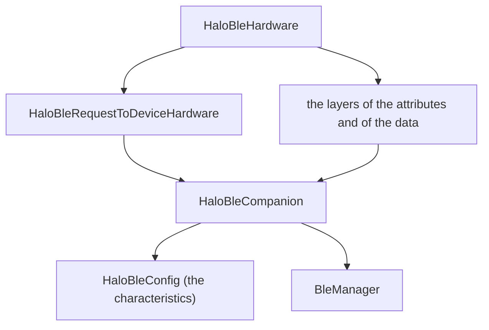
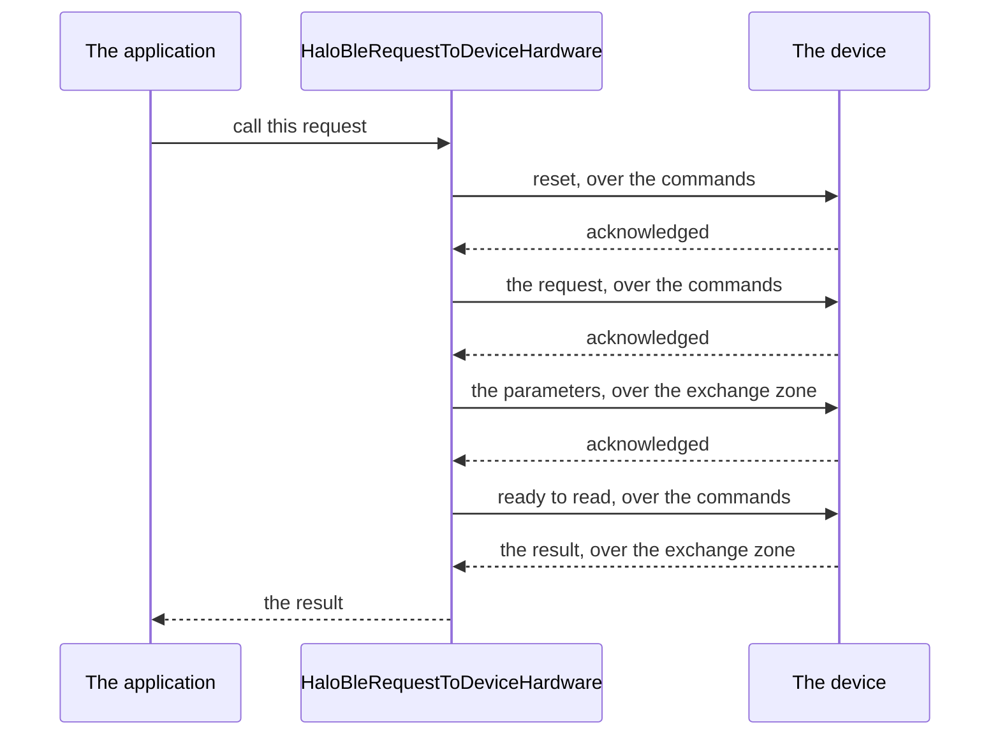

<!--
SPDX-FileCopyrightText: 2023 Benoit Rolandeau <benoit.rolandeau@allcircuits.com>
SPDX-FileCopyrightText: 2026 Benoit Rolandeau <benoit.rolandeau@allcircuits.com>

SPDX-License-Identifier: LicenseRef-ALLCircuits-ACT-1.1
-->

# ACT Halo BLE layer <!-- omit from toc -->

## Table of contents <!-- omit from toc -->

- [Presentation](#presentation)
- [Architecture](#architecture)
  - [What the layer is made of](#what-the-layer-is-made-of)
  - [The thirteen characteristics](#the-thirteen-characteristics)
  - [The device which is reached](#the-device-which-is-reached)
  - [Waiting for a device](#waiting-for-a-device)
  - [Calling a request](#calling-a-request)
  - [Reading the result of a request](#reading-the-result-of-a-request)
- [How to use](#how-to-use)
  - [Installation](#installation)
  - [Name the characteristics of the device](#name-the-characteristics-of-the-device)
  - [Hand a device over](#hand-a-device-over)
  - [Ask the device for a request](#ask-the-device-for-a-request)
- [What is not carried yet](#what-is-not-carried-yet)
- [Testing](#testing)

## Presentation

This package carries the HALO protocol over Bluetooth Low Energy. It is the hardware layer the
abstract HALO package asks for: what an application calls a request, this package turns into
writings and readings on the characteristics of a device.

It reaches one device at a time, the one which is handed over to it, and it goes through the
[ACT BLE manager package](../act_ble_manager/README.md) to do so. The Bluetooth itself, the
permissions it needs and the connection to a device are none of its business.

## Architecture

### What the layer is made of



`HaloBleHardware` is what an application hands to the abstract HALO package: one layer per part of
the protocol. Every layer goes through the same companion, which is the only place where a
characteristic is written to or read from, and the companion reads the configuration to know which
characteristic is which.

### The thirteen characteristics

The protocol names thirteen characteristics, and the configuration is what says which identifier
each of them carries on a given device. They come in threes, one three per part of the protocol: the
one the device notifies over, the one the commands are written to, and the exchange zone the values
themselves travel over.

| Characteristic | What it carries                          | Notified |
| -------------- | ---------------------------------------- | -------- |
| A              | the attributes which changed             | yes      |
| B              | the commands about the attributes        | yes      |
| C              | the values of the attributes             | no       |
| D              | the instant data which changed           | yes      |
| E              | the commands about the instant data      | yes      |
| F              | the values of the instant data           | no       |
| G              | the records which appeared               | yes      |
| H              | the commands about the records           | yes      |
| I              | the values of the records                | no       |
| J              | the requests asked of the device         | yes      |
| K              | the values of those requests             | yes      |
| L              | the requests the device asks for         | yes      |
| M              | the values of the requests of the device | yes      |

The three exchange zones which are only read are the ones the device never notifies over; every
other characteristic is subscribed to as soon as a device is handed over.

### The device which is reached

The companion holds one device. Handing one over subscribes to every characteristic the device
notifies over and follows the state of the connection; handing nothing over, or losing the device,
gives those subscriptions up and leaves the companion with nothing to write to. A device which
disconnects by itself is the same thing as a device which is taken away.

Nothing is written while there is no device: the writing is answered as a communication error rather
than raised.

### Waiting for a device

A characteristic which is notified over hands out waiters. A waiter is asked for before the writing
which is expected to be answered, so that an answer which comes back at once is not missed, and it
is freed by the first value the device notifies.

Three other things free a waiter, all of them with nothing: the device which disconnects, the
application which stops listening to the characteristic, and the timeout the caller allows. Every
waiter of a characteristic is freed by the same value, and a value which was notified before a
waiter was asked for is not kept for it.

### Calling a request



Every request starts the exchange over, so that whatever the device was left in the middle of does
not answer for this one. The request itself follows, then its parameters, cut in as many packets as
the device takes in one go.

What is waited for depends on what the request is. An order is answered by nothing, so nothing is
waited for unless it carries parameters, whose acknowledgment tells the layer to keep going. A
procedure is acknowledged and stops there. A function is acknowledged and then answers a value,
which is the only case where the layer reads the exchange zone.

An answer which is not of the size the protocol says, or which is about another request, is read as
a failure of the request rather than as the answer of another one.

### Reading the result of a request

The result of a function is asked for packet by packet: the layer says that it is ready to read, the
device answers a packet, and it goes on until a packet ends with the byte which ends a payload. A
packet whose end byte is followed by zeroes is cleaned rather than dropped, because that is a device
which padded its answer; a packet which holds anything else after that byte is a failure.

## How to use

### Installation

Add the package to the `dependencies` of your package:

```yaml
dependencies:
  act_halo_ble_layer:
    path: ../act_halo_ble_layer
```

### Name the characteristics of the device

```dart
final haloConfig = HaloBleConfig(
  charAAttrNotifyUuid: UuidValue.fromString("0000ff01-0000-1000-8000-00805f9b34fb"),
  charBAttrCmdUuid: UuidValue.fromString("0000ff02-0000-1000-8000-00805f9b34fb"),
  // ... one per characteristic of the protocol
  maxCharacteristicByteSize: 20,
);
```

### Hand a device over

```dart
final companion = HaloBleCompanion(
  haloBleConfig: haloConfig,
  bleManager: globalGetIt().get<BleManager>(),
);
final hardware = HaloBleHardware(bleCompanion: companion);

await companion.onNewHaloBleDevice(aConnectedDevice);
```

The device which is gone is told about, so that the characteristics are given up:

```dart
await companion.onDisconnection();
```

### Ask the device for a request

```dart
final result = await hardware.requestToDeviceHardware.callFunction(
  request: HaloRequestParamsPacket(
    requestId: AppRequestId.readSerialNumber,
    nbValues: const [],
    parameters: HaloPayloadPacket(),
  ),
);

if (result.error == HaloErrorType.noError) {
  final (serialNumber, _) = result.result!.getString(0)!;
}
```

An order and a procedure are called the same way, and answer an error rather than a value:

```dart
final error = await hardware.requestToDeviceHardware.callOrder(
  request: HaloRequestParamsPacket.voidParams(requestId: AppRequestId.reboot),
);
```

## What is not carried yet

Only the requests which are asked of the device are carried. The attributes, the instant data, the
records and the requests a device asks for have their layers in place but every one of their methods
raises: the characteristics are named and subscribed to, and the writing and the reading are there,
so what is left is the packets of each of those parts.

## Testing

The tests drive the package over the Bluetooth of a device which answers what each test decided: the
manager of the Bluetooth, its GATT service, the companion, the characteristics and the packets are
the real ones, and the plugin of the Bluetooth is what is stood in for. The layer of the requests is
driven over a companion which answers what the test lined up, so that the order of the writings and
of the waitings is what is read rather than the Bluetooth.

The characteristics are covered on the thirteen the protocol names, on the identifier, the name and
the way each of them is read and written, and on the three exchange zones the device notifies
nothing over.

The device is covered on the characteristics which are subscribed to as soon as it is handed over,
on the device which is taken away and the one which disconnects by itself, on the writing which goes
into the characteristic it is asked, on the writing while there is no device, and on the device
which cannot be written to.

Waiting for a device is covered on the value which is notified, on the waiters which are all freed
by it, on the value which was notified before the waiting, on the device which answers nothing, on
the caller which waits for as long as it takes, on the device which disconnects, on the application
which stops listening, and on the waiting which is given up while another one is kept.

The requests are covered on the exchange which is started over first, on the order which is answered
by nothing, on the procedure which is acknowledged, on the function which answers a value, on the
parameters which are handed over after the request and cut in several packets, on the result which
is read in several packets, on the result which carries several values, on the answer which cannot
be read, on the answer about another request, on the request the device turns down, on the writing
which fails at each step, and on the request whose kind is not the one which was called.

What is out of reach is the scanning and the connecting of a device, which belong to the manager of
the Bluetooth, and the equality of a configuration, whose characteristics are told apart by instance
rather than by the identifier they carry.

```console
> flutter test
```
