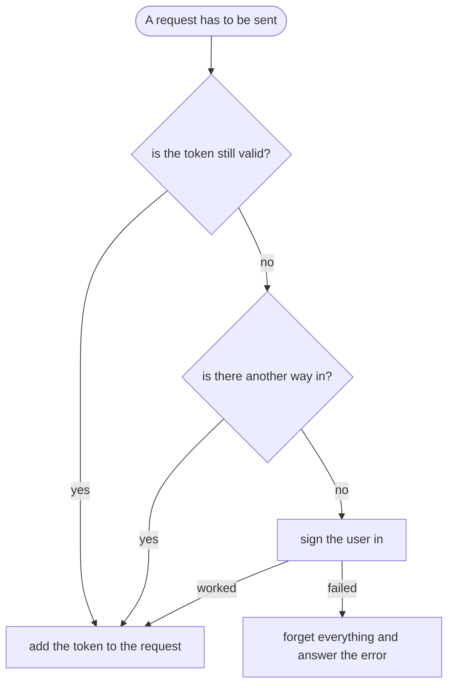

<!--
SPDX-FileCopyrightText: 2023 Benoit Rolandeau <benoit.rolandeau@allcircuits.com>

SPDX-License-Identifier: LicenseRef-ALLCircuits-ACT-1.1
-->

# ACT HTTP Client JWT Authentication <!-- omit from toc -->

## Table of contents <!-- omit from toc -->

- [Presentation](#presentation)
- [Architecture](#architecture)
  - [Which token is used for a request](#which-token-is-used-for-a-request)
  - [Where the token goes](#where-the-token-goes)
  - [Refreshing rather than signing in again](#refreshing-rather-than-signing-in-again)
  - [Keeping the tokens between two starts](#keeping-the-tokens-between-two-starts)
- [How to use](#how-to-use)
  - [Installation](#installation)
  - [Write the login](#write-the-login)
  - [Refresh the token](#refresh-the-token)
  - [Keep the tokens](#keep-the-tokens)
- [Testing](#testing)

## Presentation

This package is the login of a server which hands out a token: the application signs in with one
request, and every request which follows carries the token it was given.

It is an implementation of `AbsHttpClientLogin` of `act_http_client_manager`, so the manager of an
application which uses it never asks for a token itself. What this package brings is the deciding:
whether the token which is held can still be used, whether it can be refreshed, and whether the user
has to be signed in again. Which request signs the user in, and how a token is read out of the
answer of the server, belong to the application.

Only the reading of a token is done here. Nothing is verified: the signature of a token is never
checked, because the server is the one which checks it.

## Architecture

### Which token is used for a request



Every request goes through that. A token which is still valid is used as it is, which is what keeps
the application from signing in on each request. The other way in is what `AbsRefreshJwtLogin`
fills; the base class has none.

A token which cannot be used any more and a sign in which failed have everything forgotten: the
tokens are dropped and `null` is pushed on the stream of the tokens, so the application knows that
nobody is signed in any more.

The expiration of a token is read by default, and an application whose server hands out tokens
without one can say that it should not be: then a token is used until the server refuses it.

### Where the token goes

The token is written in a header of the request. `Authorization: Bearer <token>` is what is used
unless the application says otherwise: the key of the header and the shape of its value are both
given, and `{token}` in that shape is where the token lands.

### Refreshing rather than signing in again

`AbsRefreshJwtLogin` adds the second token most servers hand out: the one which asks for a new token
without the identifiers of the user. It is tried before the sign in, and only when it can work; a
refresh token which expired, a request which cannot be built, a server which refuses and an answer
which holds no token all fall back to the sign in.

### Keeping the tokens between two starts

`MixinAuthStorageJwtLogin` keeps the tokens where the application keeps them, through the storage of
`act_shared_auth`. It reads them when the login is initialized, so an application which starts finds
its user signed in, and it writes them every time the server hands out new ones.

It also reads them before every request. That is what lets two views of the same application share a
single session: a token another view got from the server is found rather than asked for again. The
tokens which are read that way are not written back, since they come from the storage in the first
place.

## How to use

### Installation

Add the package to the `dependencies` of your package:

```yaml
dependencies:
  act_http_client_jwt_auth:
    path: ../act_http_client_jwt_auth
```

### Write the login

```dart
class AppLogin extends AbsJwtLogin {
  AppLogin({required super.serverRequester, required super.logsHelper});

  @override
  Future<RequestParam?> getLoginRequestFromMemory() async {
    final identifiers = await _readIdentifiers();
    if (identifiers == null) {
      return null;
    }

    return RequestParam(
      httpMethod: HttpMethods.post,
      relativeRoute: "/auth/login",
      body: jsonEncode(identifiers),
    );
  }

  @override
  Future<AuthTokens?> parseLoginResponse(RequestResponse response) async {
    final token = AuthToken.fromJwtToken(_tokenOf(response));

    return token == null ? null : AuthTokens(accessToken: token);
  }
}
```

The manager of the application hands that login to the requester:

```dart
class AppHttpManager extends AbsHttpClientManager {
  @override
  Future<AbsHttpClientLogin> createServerLogin({
    required ServerRequester serverRequester,
    required LogsHelper parentLogsHelper,
  }) async => AppLogin(
    serverRequester: serverRequester,
    logsHelper: parentLogsHelper.createSubLogger(subCategory: "login"),
  );
}
```

Following the tokens, for instance to tell the rest of the application that the session is over:

```dart
_tokensSub = login.newTokensStream.listen((tokens) => _onTokens(tokens));
```

### Refresh the token

```dart
class AppLogin extends AbsRefreshJwtLogin {
  ...

  @override
  Future<RequestParam?> getRefreshRequest() async => RequestParam(
    httpMethod: HttpMethods.post,
    relativeRoute: "/auth/refresh",
    body: jsonEncode({"refreshToken": tokensInfo?.refreshToken?.raw}),
  );

  @override
  Future<AuthTokens?> parseRefreshResponse(RequestResponse response) =>
      parseLoginResponse(response);
}
```

### Keep the tokens

```dart
class AppLogin extends AbsRefreshJwtLogin with MixinAuthStorageJwtLogin {
  @override
  final MixinAuthStorageService? storageService;

  AppLogin({
    required super.serverRequester,
    required super.logsHelper,
    required this.storageService,
  });

  ...
}
```

## Testing

The tests drive a login over a server which answers the status each test lined up and records the
requests it received, and over a storage of the tokens kept in memory. The server and the storage
are the boundary of this package, so they are what is stood in for.

Choosing a token is covered on the user who holds none and is signed in, on the token which is used
as it is by the next requests, on the token which expired and has the user signed in again, on the
expiration which is not read at all, on the request which cannot be built, on the server which
refuses the sign in, on the answer which holds no token, and on the token which is answered but
cannot be used. Where the token goes is covered on the header of the shape which is used by default
and on the one an application names itself.

The refresh is covered on the token which is refreshed rather than signed in again, and on the four
ways a refresh falls back to the sign in: the refresh token which expired, the request which cannot
be built, the server which refuses and the answer which holds no token.

The storage is covered on the tokens which are read when the login starts, on the ones read again
before a request and used as they are, on the ones which are written when the server hands out new
ones, and on the forgetting which reaches the storage too.

```console
> flutter test
```
