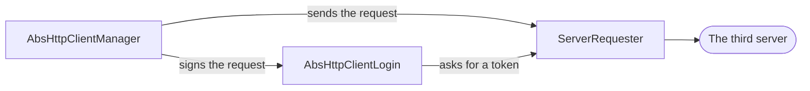
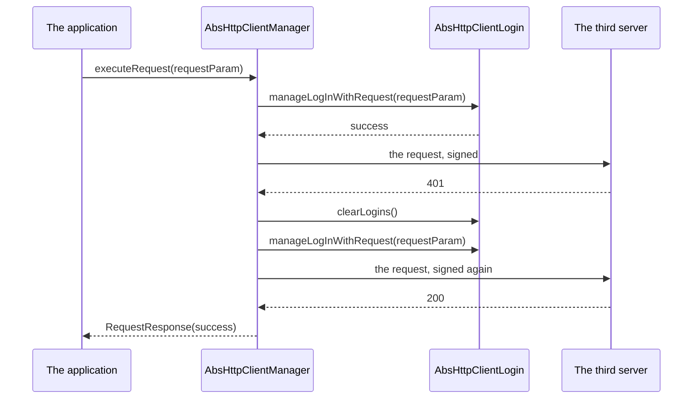

<!--
SPDX-FileCopyrightText: 2023 Benoit Rolandeau <benoit.rolandeau@allcircuits.com>

SPDX-License-Identifier: LicenseRef-ALLCircuits-ACT-1.1
-->

# ACT HTTP client manager <!-- omit from toc -->

## Table of contents

- [Table of contents](#table-of-contents)
- [Presentation](#presentation)
- [Architecture](#architecture)
  - [The manager, the requester and the login](#the-manager-the-requester-and-the-login)
  - [The life of a request](#the-life-of-a-request)
  - [The body of a request and of an answer](#the-body-of-a-request-and-of-an-answer)
  - [The URLs of the server](#the-urls-of-the-server)
  - [The loaders](#the-loaders)
- [How to use](#how-to-use)
  - [Installation](#installation)
  - [Write the manager of a server](#write-the-manager-of-a-server)
  - [Register the manager](#register-the-manager)
  - [Request the server](#request-the-server)
  - [Log in to the server](#log-in-to-the-server)
  - [Page through a list](#page-through-a-list)
- [Testing](#testing)

## Presentation

This package requests third HTTP servers. An application derives one manager per server it talks
to, says where the server is and how it authenticates, and then asks for routes: the package builds
the URL, encodes the body, sends the request, reads the answer back and says what happened with one
status.

It decides nothing about the API of a server: the routes, the bodies and the way the credentials
are carried belong to the application. It does not serve requests either.

The requests themselves are sent by [http](https://pub.dev/packages/http).

## Architecture

### The manager, the requester and the login



- `AbsHttpClientManager` is the manager an application derives and registers. It reads its
  configuration once, when it is initialized, and it is the one which sends a request again and
  which decides what a failed login means.
- `ServerRequester` sends one request and gives back what the server answered. It knows nothing
  about the credentials: a request it sends is a request which is ready to be sent.
- `AbsHttpClientLogin` is what an application derives when the server asks for authentication. It
  adds to a request what the server expects, and it is given the requester so that it can ask for a
  token through the same client.

A manager whose login type is nullable and which builds none talks to a server which asks for
nothing.

The requester opens its client on the first request and closes it once it has been idle for a few
seconds, so that a burst of requests shares one connection instead of opening one each. It is
closed again as soon as a request fails, because a client which failed is rarely worth keeping.

When the configuration names a maximum number of parallel requests, the requester holds the ones
which are over that number until a request is over.

### The life of a request



A request is sent again in two cases, which are counted apart:

- the caller asked for it, with `retryRequestIfErrorNb` and, if it wants to wait between two tries,
  `retryTimeout`,
- the server refused the credentials and the policy of the login is `retryOnceIfLoginFails`. The
  logins are cleared and the request is signed again, once.

A login which fails because the credentials are wrong stops everything: nothing is sent, and the
answer is a `loginError`. A login which fails for any other reason is tried again as long as the
caller allows it.

The status of the answer is the one thing every call gives back:

| Status               | What happened                                                    |
| -------------------- | ---------------------------------------------------------------- |
| `success`            | The server answered between 200 and 299                          |
| `loginError`         | The server answered 401, or the credentials were refused         |
| `timeoutError`       | The server did not answer in time                                |
| `failedToFetchError` | The browser refused the request, which only happens on the web   |
| `globalError`        | Anything else: another status, no answer, a body which is refused |

### The body of a request and of an answer

The MIME type of a request is either the one the caller named or the one which is guessed from the
type of the body:

| Body                                | MIME type                           |
| ----------------------------------- | ----------------------------------- |
| `null`                              | none, nothing is sent               |
| `String`                            | `text/plain`                        |
| `Uint8List`, `List<int>`            | `application/octet-stream`          |
| `Map<String, String>`               | `application/x-www-form-urlencoded` |
| `Map<String, dynamic>`, `List`      | `application/json`                  |
| `MultipartFile`, `List` of the same | `multipart/form-data`               |

A body which does not match the MIME type which was named is refused before anything is sent, and
the request comes back as a `globalError`.

The answer is only read when the request said which MIME type it expects and when the server
announced one. Otherwise the body is left alone and the call still succeeds: a route which answers
nothing is not an error.

The ways of asking say what is expected of the answer:

- `executeRequest` reads the body as the MIME type of the request says, and hands it to the parser
  it was given,
- `executeRequestWithMimeRespBody` is the same call for an answer which needs no parser,
- `executeRequestWithJsonObjRespBody` and `executeRequestWithJsonArrayRespBody` expect json, and
  build one value out of the object or the array,
- `executeRequestWithJsonObjArrayRespBody` expects a json array of objects and builds one value per
  object.

### The URLs of the server

The URL of a request is built from three parts: the base of the server, the relative route, and the
parameters:

```text
https://a.server:8443/v1  /items/{id}          ?page=2
[--- the base ----]       [- relative route -] [- query -]
```

The base comes from the configuration of the manager. An application which talks to a server made
of several services names one base per relative route, and every other route goes to the default
one. A route names its server as it is written, parameters included, and the parameters are
replaced afterwards.

### The loaders

The loaders are what a page which shows a long list uses. `ElementLoader` asks a callback for the
elements it does not have yet and keeps them, so that scrolling back reads from memory.

`ElementLoadersCompanion` merges several loaders into one list: it asks each source for a page,
sorts what came back, keeps what the filters of the configuration accept, and remembers how many
elements of each source it really used, so that the next page starts where the list stopped and not
where the sources stopped.

## How to use

### Installation

Add the package to the `dependencies` of your package:

```yaml
dependencies:
  act_http_client_manager:
    path: ../act_http_client_manager
```

### Write the manager of a server

```dart
class WeatherManager extends AbsHttpClientManager<WeatherLogin> {
  @override
  Future<RequesterConfig> getRequesterConfig() async => const RequesterConfig(
        loggerEnabled: true,
        loggerCategory: "weather",
        defaultTimeout: Duration(seconds: 30),
        defaultServerInfo: RequesterServerUrlConfig(
          isUsingSsl: true,
          hostname: "api.weather.example",
          baseUrl: "/v1",
        ),
      );

  @override
  Future<WeatherLogin> createServerLogin({
    required ServerRequester serverRequester,
    required LogsHelper parentLogsHelper,
  }) async =>
      WeatherLogin(serverRequester: serverRequester, logsHelper: parentLogsHelper);
}

class WeatherBuilder extends AbsHttpClientBuilder<WeatherManager> {
  const WeatherBuilder(super.factory);
}
```

A server which asks for no authentication is declared with a nullable login:

```dart
class WeatherManager extends AbsHttpClientManager<AbsHttpClientLogin?> {
  @override
  Future<AbsHttpClientLogin?> createServerLogin({
    required ServerRequester serverRequester,
    required LogsHelper parentLogsHelper,
  }) async => null;
}
```

### Register the manager

```dart
GlobalManager.instance.register(WeatherBuilder(WeatherManager.new));
```

### Request the server

```dart
final manager = globalGetIt().get<WeatherManager>();

final response = await manager.executeRequestWithJsonObjRespBody<Forecast>(
  requestParam: RequestParam(
    httpMethod: HttpMethods.get,
    relativeRoute: "cities/{cityId}/forecast",
    routeParams: {"{cityId}": cityId},
    queryParameters: {"days": "5"},
  ),
  parseRespBody: Forecast.fromJson,
  retryRequestIfErrorNb: 2,
  retryTimeout: const Duration(seconds: 1),
);

if (response.status.isOk) {
  _display(response.castedBody);
}
```

### Log in to the server

```dart
class WeatherLogin extends AbsHttpClientLogin {
  String? _token;

  WeatherLogin({required super.serverRequester, required super.logsHelper})
      : super(loginFailPolicy: LoginFailPolicy.retryOnceIfLoginFails);

  @override
  Future<RequestStatus> manageLogInWithRequest(RequestParam requestParam) async {
    if (_token == null) {
      final response = await serverRequester
          .executeRequestWithoutAuth<Map<String, dynamic>, Map<String, dynamic>>(
        requestParam: RequestParam(
          httpMethod: HttpMethods.post,
          relativeRoute: "token",
          body: {"key": _apiKey},
          expectedMimeType: HttpMimeTypes.json,
        ),
      );

      if (!response.status.isOk) {
        return response.status;
      }

      _token = response.castedBody?["token"] as String?;
    }

    requestParam.headers[HeaderConstants.authorizationHeaderKey] = "Bearer $_token";

    return RequestStatus.success;
  }

  @override
  Future<void> clearLogins() async => _token = null;
}
```

### Page through a list

```dart
final companion = ElementLoadersCompanion<Message>(
  ElementLoaderConfig(
    callbacks: [_askTheServer, _askTheDatabase],
    sortItems: (first, second) => second.date.compareTo(first.date),
    extraAppFilters: [(message) => !message.isHidden],
  ),
);

final firstPage = await companion.load(offset: 0, limit: 20);
final secondPage = await companion.load(offset: 20, limit: 20);
```

## Testing

The tests drive the requester and the manager against a real server on the loopback, which answers
what each test lined up: the boundary of this package is a socket, and a fake client would only
say how the package calls a library.

The requester is covered on the request it builds and sends, the answer it gives back, the server
which refuses the request or does not answer in time, and the requests it holds when only one is
allowed at a time. The manager is covered on the URLs it builds when it is initialized, the login
it signs its requests with, the number of times it sends a request again, the logins it clears, and
the ways of reading a body.

The formatting of a body is covered on its own, on every MIME type of a request and of an answer,
on the type which is guessed and on the bodies which are refused. The loaders are covered on the
paging they do, on the gap they fill, on the sources they merge and sort, and on the elements which
are updated or deleted while a list is being read.

Two things are left out. The error of a browser which refuses a request is only raised by the web
client, which a test running on the desktop has no way to reach. The closing of the client which
has been idle happens after a delay a test would have to wait for, and it is not observable from
outside the requester: what is covered is that a request which follows finds a client again.

The parser a call is given is the one which knows whether the value it could not build is an error:
a parser which answers null leaves the request a success and the body null.

```console
> flutter test
```
