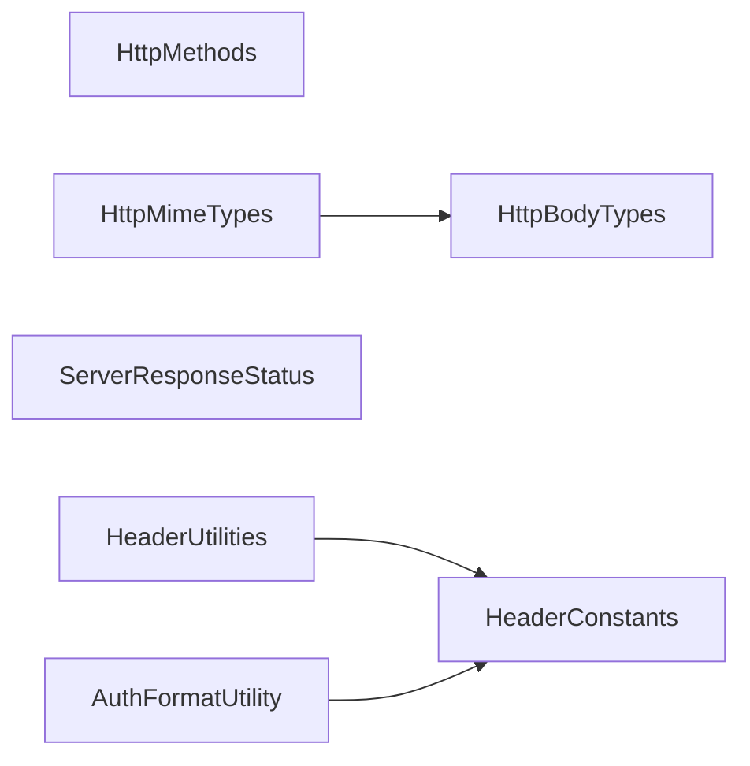

<!--
SPDX-FileCopyrightText: 2025 Benoit Rolandeau <benoit.rolandeau@allcircuits.com>

SPDX-License-Identifier: LicenseRef-ALLCircuits-ACT-1.1
-->

# ACT HTTP core <!-- omit from toc -->

## Table of contents

- [Table of contents](#table-of-contents)
- [Presentation](#presentation)
- [Architecture](#architecture)
  - [Methods](#methods)
  - [Bodies and mime types](#bodies-and-mime-types)
  - [Response statuses](#response-statuses)
  - [Headers](#headers)
- [How to use](#how-to-use)
  - [Installation](#installation)
  - [Decide what to do with a response](#decide-what-to-do-with-a-response)
  - [Build and read a header value](#build-and-read-a-header-value)
  - [Authenticate a request](#authenticate-a-request)
- [Testing](#testing)

## Presentation

This package holds the vocabulary of HTTP: the methods, the mime types, the shapes a body can take,
the response statuses and the helpers which build and read the header values.

It is the package the HTTP client and the HTTP server both depend on, so that a request built on one
side and read on the other names the same things. It performs no request and opens no connection:
it defines types and formats, nothing which talks to a network.

## Architecture



### Methods

`HttpMethods` names the HTTP methods and writes each of them in upper case, as a request line does.
`isSafe` says whether a method leaves the server as it is, which is what lets a caller decide
whether replaying a request is harmless.

### Bodies and mime types

`HttpBodyTypes` names the shapes a body can take in Dart: nothing, a string, bytes, a map of
strings, JSON, or a list of files. `HttpMimeTypes` names the mime types and says which of those
shapes each of them carries, so a client can tell how to encode a body from the mime type alone.

`getDefaultValueByBodyType` goes the other way, and gives the mime type to announce when a caller
only knows the shape of what it sends.

Both enums are parsed from a string through `parseFromValue`, which ignores the case and returns
`null` for a value the package does not know.

### Response statuses

`ServerResponseStatus` mixes two kinds of values: the statuses linked to a HTTP code, and the
generic ones which stand for a whole family. Every status linked to a code points at its family, and
takes from it the answer to `isOk`, so the caller which only wants to know whether it can go on asks
one question and the caller which wants the detail keeps it.

`parseFromHttpStatus` first looks for a status which carries the exact code, then for the family the
code falls in, and returns `genericError` when it finds neither. Only the codes from 100 to 299 are
read as a family success, so a redirection other than 300, which the enum names, ends up on
`genericError`.

`nonGenericValues` is the list of the statuses which carry a code, which is what a caller iterates
over to build a table of the known statuses.

### Headers

`HeaderConstants` holds the header keys and the pieces of their values, including the placeholders
`{token}` and `{creds}` the authentication values are built around.

`HeaderUtilities` builds and reads the values which carry several parts, such as
`attachment; filename=a.jpg`: `formatHeaderValue` joins the parts, `parseHeaderValue` splits them
back and removes the quotes around a value, `getHeaderValue` reads them from a map of headers, and
`getFileNameFromHeaders` is the shortcut for the case which needs it the most.

`getHeaderValue` also looks for the key in lower case, because several Dart HTTP packages return
their headers that way.

`AuthFormatUtility` builds the header of a basic authentication from a username and a password.

## How to use

### Installation

Add the package to the `dependencies` of your package:

```yaml
dependencies:
  act_http_core:
    path: ../act_http_core
```

### Decide what to do with a response

```dart
final status = ServerResponseStatus.parseFromHttpStatus(response.statusCode);

if (status.isOk) {
  return _parseBody(response.body);
}

if (status == ServerResponseStatus.unauthorized) {
  return _refreshTokenAndRetry();
}

if (status.linkedGeneric == ServerResponseStatus.genericServerError) {
  return _retryLater();
}
```

### Build and read a header value

```dart
final value = HeaderUtilities.formatHeaderValue(
  values: [
    (value: HeaderConstants.contentDispositionAttachmentValue, key: null),
    (value: fileName, key: HeaderConstants.contentDispositionFilenameKey),
  ],
);
```

```dart
final fileName = HeaderUtilities.getFileNameFromHeaders(headers: response.headers);
```

### Authenticate a request

```dart
final header = AuthFormatUtility.formatBasicAuthentication(
  username: username,
  password: password,
);

headers[header.key] = header.value;
```

## Testing

The tests cover the value and the safety of every method, the mime type each body shape is announced
with, the parsing of the two enums from a string, the exact code and the family
`parseFromHttpStatus` answers with including the codes it knows nothing about, the formatting and
the reading of a header value with its quotes and its separators, and the header a basic
authentication produces.

```console
> flutter test
```
