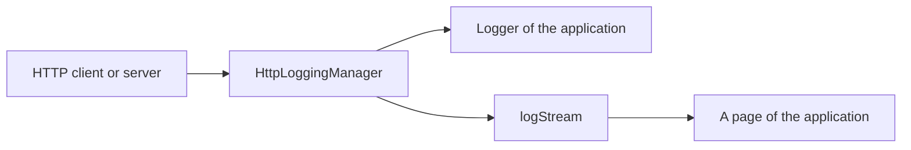

<!--
SPDX-FileCopyrightText: 2025 Benoit Rolandeau <benoit.rolandeau@allcircuits.com>

SPDX-License-Identifier: LicenseRef-ALLCircuits-ACT-1.1
-->

# ACT HTTP logging manager  <!-- omit from toc -->

## Table of contents

- [Table of contents](#table-of-contents)
- [Presentation](#presentation)
- [Architecture](#architecture)
  - [What a log carries](#what-a-log-carries)
  - [Where a log goes](#where-a-log-goes)
  - [Naming the source](#naming-the-source)
- [How to use](#how-to-use)
  - [Installation](#installation)
  - [Register the manager](#register-the-manager)
  - [Log a request](#log-a-request)
  - [Display the logs](#display-the-logs)
- [Testing](#testing)

## Presentation

This package gathers what an application logs about the HTTP requests it makes or answers, so that
those logs can be displayed inside the application and not only written where the other logs go.

It makes no request and intercepts none: what is worth logging about a request is decided by the
client or by the server which handles it, and handed over here.

## Architecture

### What a log carries

An `HttpLog` is one line about one request: when it happened, which request it is about, the route
and the method, the level it deserves, and what is worth saying.

The request is named by an identifier the caller gives, which is what ties the several lines of the
same request together: the one written when it leaves, and the one written when its answer comes
back.

`HttpLog.now` stamps the log with the instant it is built, in UTC, so the logs of a device and the
logs of a server can be read side by side whatever their time zones.

### Where a log goes



Every log goes to both: to the logger of the application, at the level the log carries, and to the
stream, which is where a page of the application reads the logs it displays. The stream is a
broadcast one, so several pages may read it at once, and it is closed when the manager is disposed.

### Naming the source

An application which logs the requests of several ends, a client and a server for instance, names
each of them, and that name is written before the identifier of the request:

```text
[server/req-1] - /devices - GET - the request went well
```

The name is read once, when the manager is initialized, by the derived manager an application
writes. A manager which names no source writes the identifier alone.

## How to use

### Installation

Add the package to the `dependencies` of your package:

```yaml
dependencies:
  act_http_logging_manager:
    path: ../act_http_logging_manager
```

### Register the manager

For an application which logs one end only, the manager needs no derived class:

```dart
GlobalManager.instance.register(const HttpLoggingBuilder());
```

For an application which logs several ends, each of them brings its own manager and its own builder:

```dart
class ServerLoggingManager extends HttpLoggingManager {
  @override
  Future<String?> getSourceInfo() async => "server";
}

class ServerLoggingBuilder extends AbsHttpLoggingBuilder<ServerLoggingManager> {
  const ServerLoggingBuilder() : super(ServerLoggingManager.new);
}
```

### Log a request

```dart
final manager = globalGetIt().get<HttpLoggingManager>();

manager.addLog(HttpLog.now(
  requestId: requestId,
  route: "/devices",
  method: "GET",
  logLevel: LogsLevel.info,
  message: "request sent",
));
```

### Display the logs

```dart
StreamBuilder<HttpLog>(
  stream: globalGetIt().get<HttpLoggingManager>().logStream,
  builder: (context, snapshot) => ...,
)
```

## Testing

The tests read both ends of a log: what reaches the stream of the application and what reaches its
logger. They cover the message which is formatted from the parts of a log, the level it is written
at, the source which is added to a log which carries none and written before the identifier of the
request, and the stream which is closed when the manager is disposed.

The log itself is covered on the message it formats with and without a source, on the instant it
stamps itself with, and on the copy which replaces only what it is given.

```console
> flutter test
```
