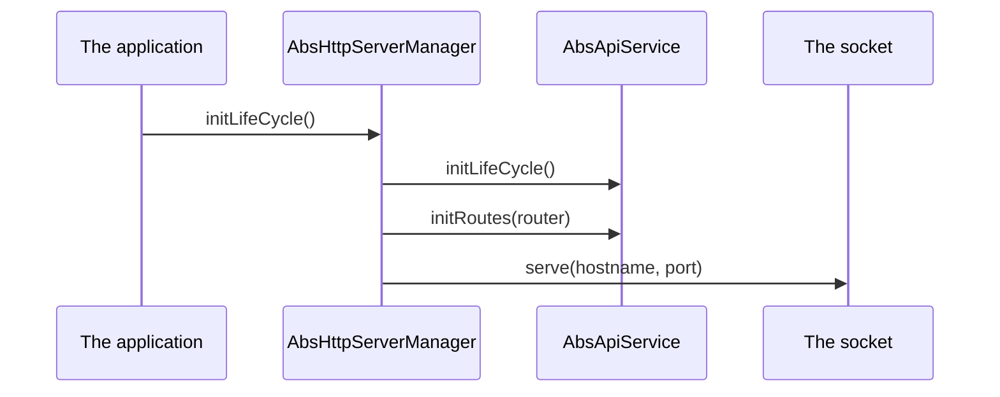

<!--
SPDX-FileCopyrightText: 2025 Benoit Rolandeau <benoit.rolandeau@allcircuits.com>

SPDX-License-Identifier: LicenseRef-ALLCircuits-ACT-1.1
-->

# ACT HTTP Server manager <!-- omit from toc -->

## Table of contents

- [Table of contents](#table-of-contents)
- [Presentation](#presentation)
- [Architecture](#architecture)
  - [The manager, the services and the routes](#the-manager-the-services-and-the-routes)
  - [Where a route answers](#where-a-route-answers)
  - [The handlers around a route](#the-handlers-around-a-route)
  - [The handlers the package ships](#the-handlers-the-package-ships)
  - [Reading the body of a request](#reading-the-body-of-a-request)
- [How to use](#how-to-use)
  - [Installation](#installation)
  - [Write a service](#write-a-service)
  - [Register the manager](#register-the-manager)
- [Configuration](#configuration)
- [Testing](#testing)

## Presentation

This package runs the HTTP server of an application: it binds the socket, gathers the routes of
the services the application wrote, calls them, and writes what went through.

It is built on [shelf](https://pub.dev/packages/shelf) and re-exports what an application needs of
it, so a service is written against this package alone.

## Architecture

### The manager, the services and the routes

`AbsHttpServerManager` is the manager an application registers. It asks the application for the
configuration of the server, for the services which answer on its routes, and for the handlers
which run on every request, then it binds the socket.

An `AbsApiService` is one group of routes. It registers them on the router when the server starts,
one call per method: `onGet`, `onPost`, `onPut` and the rest. Every route it registers is also
remembered, which is what lets the CORS handler know whether the server answers on a path.



A request for a path no service registered is answered with a not found, and the server writes
that it did not find it.

### Where a route answers

The path a route answers on is made of three pieces: the base path of the server, the path of the
service, and the path of the route. The two first are joined once, when the service is built, and
the separators between them are added or dropped so a path never carries two of them in a row nor
misses one.

A server which has no base path answers on the root of its host.

### The handlers around a route

An `AbsServerHandler` runs around a route: `beforeHandler` sees the request on its way in and
`afterHandler` sees the response on its way out. They are called in order on the way in and in the
reverse order on the way out, so a handler which added something to the request is also the last
one to see the response.

A handler can do two things on the way in:

- change the request, and every handler after it and the route itself see the changed one;
- answer instead of the route, which stops the request there: neither the route nor the handlers
  after it are called, and no `afterHandler` runs.

The manager gives its handlers to every route of the server; a service can also give handlers to
one route of its own.

### The handlers the package ships

- `RequestIdServerHandler` marks every request with an identifier of its own and writes that the
  request arrived and what the server answered. It is the handler the manager installs when the
  application asks for none. The other handlers read the identifier it wrote, so it goes first.
- `VerifyJwtAuthServerHandler` reads the token of the authorization header, verifies it, and hands
  it to the route. A request which carries no token, no bearer or a token the server did not sign
  is turned away with an unauthorized, and the route is never called.
- `CorsServerHandler` answers what a browser asks before a request it considers unsafe. It answers
  the preflight of a path the server has a route for, unless a service answers that preflight
  itself, and it adds the accepted origin, methods and headers to every response.

### Reading the body of a request

A service reads the body of a request as one json object or as a list of them, and builds its own
values out of it with a parser it gives. Whatever fails on the way - a body which is not json, a
shape which is not the one asked for, an element the parser refuses - reads as nothing, and the
reason is written under the identifier of the request. A route which reads nothing answers what it
sees fit; the package decides nothing for it.

## How to use

### Installation

Add the package to the `dependencies` of the application:

```yaml
dependencies:
  act_http_server_manager:
    path: ../act_http_server_manager
```

### Write a service

```dart
class ItemApiService extends AbsApiService {
  ItemApiService({required super.httpLoggingManager, required super.config})
    : super(serviceRelativePath: "item");

  @override
  Future<void> initRoutes(Router app) async {
    onGet(app: app, relativeRoute: "<itemId>", innerHandler: _readItem);
    onPost(app: app, relativeRoute: "", innerHandler: _createItem);
  }

  Future<Response> _createItem(Request request) async {
    final requestId = RequestIdServerHandler.tryToExtractRequestIdWithDefaultValue(request);
    final item = await getParsedJsonObjectBody(
      requestId: requestId,
      request: request,
      parser: Item.fromJson,
    );

    if (item == null) {
      return Response.badRequest();
    }

    ...
  }
}
```

### Register the manager

```dart
class MyServerManager extends AbsHttpServerManager with MixinFromConfigHttpServerManager {
  @override
  MixinHttpServerConfig Function() get configGetter => globalGetIt().get<AppConfigManager>;

  @override
  Future<List<AbsApiService>> getApiServices({
    required HttpServerConfig config,
    required HttpLoggingManager httpLoggingManager,
  }) async => [ItemApiService(httpLoggingManager: httpLoggingManager, config: config)];

  @override
  Future<List<AbsServerHandler>> getGlobalHandlers({
    required HttpServerConfig config,
    required HttpLoggingManager httpLoggingManager,
    required List<AbsApiService> apiServices,
  }) async => [
    RequestIdServerHandler(httpLoggingManager: httpLoggingManager),
    CorsServerHandler(httpLoggingManager: httpLoggingManager, apiServices: apiServices),
  ];
}

globalManager.registerManagerAsync<MyServerManager>(MyServerBuilder(MyServerManager.new));
```

## Configuration

These keys are read by `MixinFromConfigHttpServerManager`; a manager which builds its
configuration itself reads none of them.

| Key                    | Type   | Default       | What it does                          |
| ---------------------- | ------ | ------------- | ------------------------------------- |
| `http.server.name`     | string | `Http server` | Names the server in what it writes    |
| `http.server.hostname` | string | `0.0.0.0`     | The address the server binds to       |
| `http.server.port`     | int    | `80`          | The port the server binds to          |
| `http.server.basePath` | string | none          | The path every route of the server is under |

## Testing

The tests start a real server, on a port the machine chooses, and reach it over the loopback with
a real client: the routes of its services, the base path they answer under, the not found of a
path nobody registered, and the server no longer answering once it is closed.

Everything which happens around a route is driven without a socket: the order the handlers are
called in and unwound in, the request one of them changed reaching the next, the response one of
them forced skipping the route, and each shipped handler on its own. The bodies are read through
the routes which read them, in every shape which fails.

The server writes what it does rather than answering questions about itself, so the tests read its
logs, including the address it bound to.

```console
> flutter test
```
