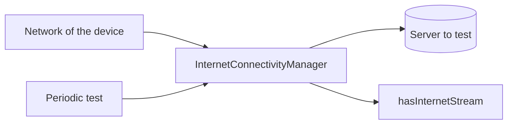

<!--
SPDX-FileCopyrightText: 2023 Anthony Loiseau <anthony.loiseau@allcircuits.com>
SPDX-FileCopyrightText: 2023, 2025 Benoit Rolandeau <benoit.rolandeau@allcircuits.com>

SPDX-License-Identifier: LicenseRef-ALLCircuits-ACT-1.1
-->

# ACT internet connectivity manager <!-- omit from toc -->

## Table of contents

- [Table of contents](#table-of-contents)
- [Presentation](#presentation)
- [Architecture](#architecture)
  - [What the manager watches](#what-the-manager-watches)
  - [Waiting for answers which agree](#waiting-for-answers-which-agree)
  - [Testing again on a period](#testing-again-on-a-period)
  - [Following the connection from a widget](#following-the-connection-from-a-widget)
- [How to use](#how-to-use)
  - [Installation](#installation)
  - [Register the manager](#register-the-manager)
  - [Read the connection](#read-the-connection)
  - [Watch another server](#watch-another-server)
- [Configuration](#configuration)
- [Testing](#testing)

## Presentation

This package answers one question: does the application reach the internet right now, and when does
that change.

Knowing which network the device is on is not the same question, and is not enough: a device can be
on a network which leads nowhere. This manager therefore asks a server, and the network is only what
tells it when to ask again.

## Architecture

### What the manager watches

`InternetConnectivityManager` reads the connection twice over: it listens to the network of the
device, through [connectivity_plus](https://pub.dev/packages/connectivity_plus), and it asks a
server whether it answers.



A change of network only triggers a test, except when the device says it has no network at all,
which is answer enough. `hasConnection` is what the manager last found, and `hasInternetStream`
pushes only when that answer changes, so a listener is not woken up by every test.

The way the server is asked depends on where the application runs: a name is resolved where the
platform has sockets, and a HEAD request is sent on the web, where it does not.

While a test is running, another one is not started: a caller which asks at that moment waits for
the answer of the test which is already going.

The manager assumes there is a connection until its first test answers, so that an application
which starts offline does not flash a message before it knows.

### Waiting for answers which agree

The device announces a change of network before that change is applied, so a single answer right
after such an announcement says nothing. The manager therefore asks several times, waiting a short
while between two answers, and keeps the answer only once the last few agree.

How many answers have to agree and how long to wait between them are two configuration variables.

### Testing again on a period

The device says nothing when the network stays the same but stops leading anywhere. When the
periodic test is turned on, the manager tests again on its own, waiting longer and longer between
two tests, from a minimum up to a maximum, and starting over from the minimum whenever a test has
just run.

### Following the connection from a widget

`InternetStreamObserver` is the connection as a widget reads it: `isValid` is the answer now, and
its stream pushes when that answer changes.

## How to use

### Installation

Add the package to the `dependencies` of your package:

```yaml
dependencies:
  act_internet_connectivity_manager:
    path: ../act_internet_connectivity_manager
```

### Register the manager

The configuration manager of the application has to carry the variables this package reads:

```dart
class AppConfigManager extends AbstractConfigManager with MixinInternetTestConfig {
  AppConfigManager({required super.logger});
}
```

```dart
GlobalManager.instance.register(InternetConnectivityBuilder<AppConfigManager>());
```

### Read the connection

```dart
final manager = globalGetIt().get<InternetConnectivityManager>();

if (!manager.hasConnection) {
  // Nothing can be downloaded right now
}

manager.hasInternetStream.listen((hasConnection) => setState(() => _isOnline = hasConnection));
```

### Watch another server

An application which cares about its own server rather than about the internet gives the address of
that server in the configuration, and the manager watches it instead.

An application which cares about both registers a second manager, derived from this one, with
`AbstractInternetDerivedBuilder` and a configuration of its own; the two are then registered under
their own types.

## Configuration

| Key                                      | Default          | What it does                    |
| ---------------------------------------- | ---------------- | ------------------------------- |
| `serverUriToTest`                        | `www.google.com` | The server which is asked       |
| `testPeriodInMs`                         | `300`            | Wait between two answers        |
| `constantValueNb`                        | `3`              | Answers which have to agree     |
| `periodicVerification.enable`            | `false`          | Tests again on its own          |
| `periodicVerification.minDurationInS`    | `2`              | Shortest wait between two tests |
| `periodicVerification.maxDurationInS`    | `20`             | Longest wait between two tests  |

Every key above hangs under `internetConnectivity`.

## Testing

The tests point the manager at a host which always answers without any network, and at one which
never answers, so a test needs neither the internet nor a server of its own. They cover the
connection the manager finds, the one it does not, the connection it assumes before its first
test, the stream which pushes a change and stays quiet when the answer is the one it already knew,
and the stream which is closed when the manager is disposed.

The configuration is covered on every default and on every value an application may override, and
the observer on the answer it reads from the manager.

The periodic test is not covered: it waits on durations a test would have to wait on too.

```console
> flutter test
```
