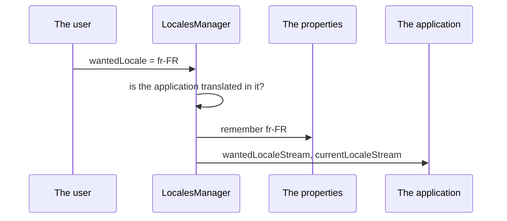

<!--
SPDX-FileCopyrightText: 2020 - 2023 Sami Kouatli <sami.kouatli@allcircuits.com>
SPDX-FileCopyrightText: 2023 Benoit Rolandeau <benoit.rolandeau@allcircuits.com>

SPDX-License-Identifier: LicenseRef-ALLCircuits-ACT-1.1
-->

# ACT Intl <!-- omit from toc -->

## Table of contents

- [Table of contents](#table-of-contents)
- [Presentation](#presentation)
- [Architecture](#architecture)
  - [The two locales](#the-two-locales)
  - [Which locale the application starts in](#which-locale-the-application-starts-in)
  - [Watching the locale of the device](#watching-the-locale-of-the-device)
  - [The utilities](#the-utilities)
- [How to use](#how-to-use)
  - [Installation](#installation)
  - [Register the manager](#register-the-manager)
  - [Let the user choose a locale](#let-the-user-choose-a-locale)
- [Configuration](#configuration)
- [Testing](#testing)

## Presentation

This package owns the locale of an application: the one it shows, the one the user chose, and the
way one becomes the other. It also holds the helpers around locales and translations which belong
to no widget.

It translates nothing by itself: the translated texts of an application are generated from its own
files, and this package only says which locale to read them in.

## Architecture

### The two locales

`LocalesManager` keeps two locales apart.

The wanted locale is the one the user chose, or nothing when the user never chose one. Setting it
is how an application changes its language: the manager checks that the application is translated
in it, remembers it for the next start, and tells the application about it.

The current locale is the one the application actually shows. It follows the wanted locale, and it
follows the device when the user chose nothing.



A locale the application is not translated in is refused: the manager keeps the locale it had and
says why in its logs. That is what tells an application which offers a language it does not ship.

### Which locale the application starts in

At the start, the manager reads the locale the user chose the last time and the one the
configuration names, and keeps one of the two:

- the stored locale wins, because it is what the user chose;
- the configured locale wins in development, and only there, when the configuration asks for it.
  That is how a developer runs the application in a language without clearing the storage of the
  device;
- a locale the application is not translated in is dropped, whichever of the two it came from.

The current locale is only settled once the view is up: until then the manager knows what the user
wants, not what the device reads. An application which waits for a locale waits for
`initAfterView`.

### Watching the locale of the device

`LocalesObserverWidget` is what tells the manager that the user changed the language of the device
while the application was running. It has to be in the root of the tree of the application: the
manager looks for it when the view comes up and says so in its logs when it is missing, because
without it nothing follows the device.

### The utilities

- `LocaleUtility` writes a locale as a string and reads one back, with the separator of a language
  tag or the underscore some libraries expect. It also expands a locale into the language it
  belongs to, which is how a resource is looked up from the most precise locale to the least.
- `IntlUtility` reads a translation by its key and gives back nothing when the key is not
  translated, where `Intl` gives the key back.
- `IntlFileUtility` reads a text asset translated in the locale of the page, and falls back on the
  locale of the device.

## How to use

### Installation

Add the package to the `dependencies` of the application:

```yaml
dependencies:
  act_intl:
    path: ../act_intl
```

### Register the manager

The configuration of the application takes `MixinLocaleConfig` and its properties take
`MixinLocaleProperties`, then the manager is registered with both:

```dart
globalManager.registerManagerAsync<LocalesManager>(
  LocalesManagerBuilder<AppConfigManager, AppPropertiesManager>(
    getSupportedLocales: () => AppLocalizations.supportedLocales,
  ),
);
```

The root of the tree of the application holds the observer, and its `MaterialApp` reads the wanted
locale:

```dart
LocalesObserverWidget(
  child: MaterialApp(
    locale: globalGetIt().get<LocalesManager>().wantedLocale,
    supportedLocales: AppLocalizations.supportedLocales,
    home: const HomePage(),
  ),
);
```

### Let the user choose a locale

```dart
globalGetIt().get<LocalesManager>().wantedLocale = const Locale("fr", "FR");
```

The application is told through `wantedLocaleStream` and `currentLocaleStream`, and the choice is
remembered for the next start.

## Configuration

| Key                      | Type   | Default | What it does                                    |
| ------------------------ | ------ | ------- | ----------------------------------------------- |
| `locale.defaultWanted`   | string | none    | The locale the application starts in, as `fr-FR` |
| `locale.dev.forceWanted` | bool   | `false` | Uses that locale over the stored one, in dev only |

## Testing

The tests drive the manager over a configuration served as an asset and a storage kept in memory,
so every way of choosing the locale of the start is covered: the stored one, the configured one,
the one development forces, and the ones the application is not translated in.

The view is shown in a page which holds the observer, and in one which forgot it, and the locale
of the device is changed under the page to check that the manager follows it. The translations the
`Intl` package answers with are installed by the tests, so both a key which is translated and one
which is not are read.

The messages the manager logs are not read: it writes to the logger of the application, which the
tests have no hold on.

```console
> flutter test
```
