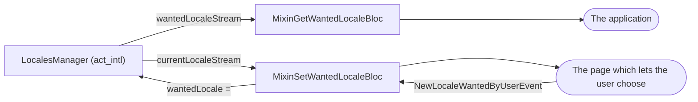

<!--
SPDX-FileCopyrightText: 2020 - 2023 Sami Kouatli <sami.kouatli@allcircuits.com>
SPDX-FileCopyrightText: 2023 Benoit Rolandeau <benoit.rolandeau@allcircuits.com>

SPDX-License-Identifier: LicenseRef-ALLCircuits-ACT-1.1
-->

# ACT Intl UI <!-- omit from toc -->

## Table of contents

- [Table of contents](#table-of-contents)
- [Presentation](#presentation)
- [Architecture](#architecture)
  - [The two blocs](#the-two-blocs)
  - [The two locales of a page](#the-two-locales-of-a-page)
  - [A text which is translated in a file](#a-text-which-is-translated-in-a-file)
- [How to use](#how-to-use)
  - [Installation](#installation)
  - [Follow the locale of the application](#follow-the-locale-of-the-application)
  - [Let the user choose the locale](#let-the-user-choose-the-locale)
  - [Display a translated text](#display-a-translated-text)
- [Testing](#testing)

## Presentation

This package is the interface side of `act_intl`: the two blocs a page mixes in to follow or to
change the locale of an application, and the widget which displays a text which is translated in a
file rather than in the strings of the application.

It holds no locale of its own: everything it reads and writes goes through the locales manager.

## Architecture

### The two blocs



- `MixinGetWantedLocaleBloc` is for the bloc of the application itself, the one which builds the
  `MaterialApp`: it follows the locale the user chose, so that the whole application is drawn again
  when it changes,
- `MixinSetWantedLocaleBloc` is for the bloc of a page which lets the user choose: it writes the
  choice of the user to the manager, and it follows the locale the application ended up in.

Both push the value the manager already holds when the page is built, so a page never starts empty.
Both stop following the manager when the bloc is closed.

### The two locales of a page

The two are not the same, which is why the second bloc carries both:

- the locale the user chose is null when the user chose nothing, which means that the application
  follows the device,
- the locale the application is in is never null: it is the one which was chosen, or the one of the
  device, or the one the application falls back to when it is translated in neither.

A page which shows a list of locales therefore ticks the one which was chosen, and shows which one
is really used when nothing was chosen.

### A text which is translated in a file

`TranslatedHtmlText` displays a text which lives in the assets of an application, one file per
locale, which is what the terms of a service or a licence usually look like: too long for the
strings of an application, and written in HTML.

The path a page gives is the one without the locale: the widget inserts the locale of the page
before the extension, so `assets/texts/terms.html` is read as `assets/texts/terms_fr_FR.html`. A
text which is translated in no locale of the application is replaced by a message which says so
rather than leaving the page empty.

The text is read once, when the widget is first built: a spinner is shown until it is there, and the
text is then shown in a view the user can scroll.

## How to use

### Installation

Add the package to the `dependencies` of your package:

```yaml
dependencies:
  act_intl_ui:
    path: ../act_intl_ui
```

### Follow the locale of the application

```dart
class AppState extends BlocStateForMixin<AppState> with MixinGetWantedLocaleState<AppState> {
  @override
  final Locale? wantedLocale;

  const AppState({this.wantedLocale});

  @override
  AppState copyGetWantedLocaleState({Locale? wantedLocale, bool forceWantedLocaleValue = false}) =>
      AppState(wantedLocale: wantedLocale ?? (forceWantedLocaleValue ? null : this.wantedLocale));
}

class AppBloc extends BlocForMixin<AppState> with MixinGetWantedLocaleBloc<AppState> {
  AppBloc() : super(const AppState());
}

MaterialApp(
  locale: state.wantedLocale,
  supportedLocales: AppLocales.values,
  home: const HomePage(),
);
```

### Let the user choose the locale

```dart
class LocalePageBloc extends BlocForMixin<LocalePageState>
    with MixinSetWantedLocaleBloc<LocalePageState> {
  LocalePageBloc() : super(const LocalePageState());
}

context.read<LocalePageBloc>().add(
  const NewLocaleWantedByUserEvent(wantedLocale: Locale("fr", "FR")),
);

// Follow the device again
context.read<LocalePageBloc>().add(const NewLocaleWantedByUserEvent(wantedLocale: null));
```

### Display a translated text

```dart
const TranslatedHtmlText(
  textPath: "assets/texts/terms.html",
  horizontalPadding: 16,
  bodyFontSize: FontSize(14),
);
```

The files of every locale are declared in the assets of the application:

```yaml
flutter:
  assets:
    - assets/texts/terms_fr_FR.html
    - assets/texts/terms_en_GB.html
```

## Testing

The tests drive the two blocs over a real locales manager, on a configuration and a storage of their
own: what a bloc reads is what an application reads, and only the file and the device are stood in
for.

The bloc of the application is covered on the locale the user chose the last time, on the user who
chose nothing, on the choice which is made while the page is open, and on the choice which is given
up so that the device is followed again. The bloc of the page which lets the user choose is covered
on the choice it writes to the manager, on the locale the application ends up in, and on the same
giving up. Both are covered on the closing which stops them from following the manager.

The widget is driven in a page which is shown in one locale and then in another, over the assets the
test serves: the text which is read, the spinner which is shown until it is there, the message which
replaces a text which is translated in no locale, and the view a long text can be scrolled in.

```console
> flutter test
```
