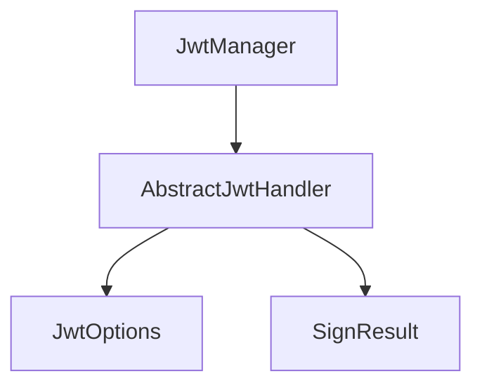

<!--
SPDX-FileCopyrightText: 2023 Benoit Rolandeau <benoit.rolandeau@allcircuits.com>

SPDX-License-Identifier: LicenseRef-ALLCircuits-ACT-1.1
-->

# ACT JWT utilities <!-- omit from toc -->

## Table of contents

- [Table of contents](#table-of-contents)
- [Presentation](#presentation)
- [Architecture](#architecture)
  - [Reading a token](#reading-a-token)
  - [Signing and verifying a token](#signing-and-verifying-a-token)
  - [The manager](#the-manager)
- [How to use](#how-to-use)
  - [Installation](#installation)
  - [Read a token received from a server](#read-a-token-received-from-a-server)
  - [Write a handler](#write-a-handler)
  - [Register the manager and its handlers](#register-the-manager-and-its-handlers)
- [Testing](#testing)

## Presentation

This package works with the JSON web tokens of an application. It does two separate things: it
reads the tokens the application receives, and it creates and verifies the tokens the application
owns the keys of.

It holds no key of its own and stores no token. Where the keys come from is the business of the
handler an application writes, and where a token is kept is the business of its caller.

The cryptography is the one of [dart_jsonwebtoken](https://pub.dev/packages/dart_jsonwebtoken),
which this package only drives.

## Architecture

### Reading a token

`JwtParserUtility` reads a token without owning any key. Decoding a token is not verifying it: the
methods of this class never check a signature, they only read what a token carries, so they answer
about tokens signed by someone else.

| Method                      | Answers                                          |
| --------------------------- | ------------------------------------------------ |
| `tryToParseToken`           | The decoded token, or null when it is not one    |
| `getExpiration`             | The instant a token expires at                   |
| `isTokenValid`              | Whether that instant is still ahead              |
| `getExpirationFromString`   | The same, from the token as a string             |
| `isTokenFromStringValid`    | The same, from the token as a string             |
| `extractJwtFromHeaderValue` | The token which follows a bearer key in a header |

A token which carries no expiration is held as valid: the claim is optional, even though a server
is strongly advised to set it. A token whose expiration is not a number is refused instead, because
the application cannot tell whether it is still valid.

The expiration claim is a number of seconds in the standard, which is what these methods expect;
`isTsInSeconds` is there for the servers which write milliseconds instead.

### Signing and verifying a token

`AbstractJwtHandler` is one kind of token: one key pair, one set of claims. An application derives
it once per kind, and the base class holds what does not depend on the kind:

- `initHandler` reads the options of the derived class, then hands over to its implementation,
  which is where the keys are loaded from,
- `canSignAndVerify` says whether both keys were loaded; without the private one the handler only
  reads tokens, and without the public one it only writes them,
- `signImpl` builds a token from a payload and the claims of the options. It answers null rather
  than an unusable token when the private key is missing, or when the options carry no issuer, no
  audience or no expiration time,
- `verify` checks the signature and the claims of a received token,
- `decode` reads a token without checking anything,
- `testSignAndVerifyImpl` signs a token and verifies it right away, which is how a handler proves
  its key pair works before the application relies on it.

`JwtOptions` carries the algorithm and the claims of a kind of token, and `SignResult` carries a
signed token together with the duration it stays valid for, so that the caller knows when to ask
for a new one without decoding what it just received.

### The manager

`JwtManager` owns the handlers of an application, keyed by name. Adding one initializes it and,
when it owns both keys, tests it; a handler which fails either step is refused and not kept.



The manager depends on the logger manager, and on nothing else.

## How to use

### Installation

Add the package to the `dependencies` of your package:

```yaml
dependencies:
  act_jwt_utilities:
    path: ../act_jwt_utilities
```

### Read a token received from a server

Nothing has to be registered to read a token:

```dart
final token = JwtParserUtility.extractJwtFromHeaderValue(
  headerValue: response.headers["authorization"]!,
  bearerKey: "Bearer",
);

if (token != null && JwtParserUtility.isTokenFromStringValid(token)) {
  // The token is one, and it has not expired
}
```

The expiration is what tells a caller when to refresh:

```dart
final (:isOk, :exp) = JwtParserUtility.getExpirationFromString(token);
if (isOk && exp != null) {
  _scheduleRefreshAt(exp);
}
```

### Write a handler

A handler declares its claims and loads its keys:

```dart
class DeviceTokenHandler extends AbstractJwtHandler {
  DeviceTokenHandler({required super.logsHelper}) : super(name: "deviceToken");

  @override
  Future<JwtOptions> getJwtOptions() async => JwtOptions(
        algorithm: JWTAlgorithm.RS256,
        audience: Audience.one("the-device"),
        issuer: "the-application",
        expirationTime: const Duration(hours: 1),
      );

  @override
  Future<bool> initHandlerImpl() async {
    await initKeys(
      publicKey: RSAPublicKey(await _readAsset("assets/keys/public.pem")),
      privateKey: RSAPrivateKey(await _readAsset("assets/keys/private.pem")),
    );

    return true;
  }

  @override
  Future<bool> testSignAndVerify() => testSignAndVerifyImpl(const {"test": true});
}
```

`JWTAlgorithm`, `Audience` and the key classes come from `dart_jsonwebtoken`, which a package
writing a handler has to depend on: this package only re-exports `JWT`.

### Register the manager and its handlers

```dart
GlobalManager.instance.register(JwtBuilder());
```

```dart
final manager = globalGetIt().get<JwtManager>();
if (!await manager.addAndInitJwtHandler(DeviceTokenHandler(logsHelper: logsHelper))) {
  // The keys could not be loaded, or the pair does not work
}
```

## Testing

The tests read tokens signed for the test, and cover the tokens which are decoded, the ones which
are refused because they are not tokens, the expiration read in seconds and in milliseconds, the
tokens which carry no expiration and are held as valid, the ones whose expiration cannot be read,
and the header values a token is extracted from.

The handler is tested through a derived class which owns the keys the test gives it: the payload
and the claims which end up in a signed token, the refusals when a key or a claim of the options is
missing, the token which is verified only when it was signed with the matching key, the decoding
which checks nothing, and the test of the key pair which the manager runs before accepting a
handler.

The manager keeps its handlers in a map it does not expose, so a test asserts on what adding a
handler answers and on the handler being initialized, not on the map.

```console
> flutter test
```
