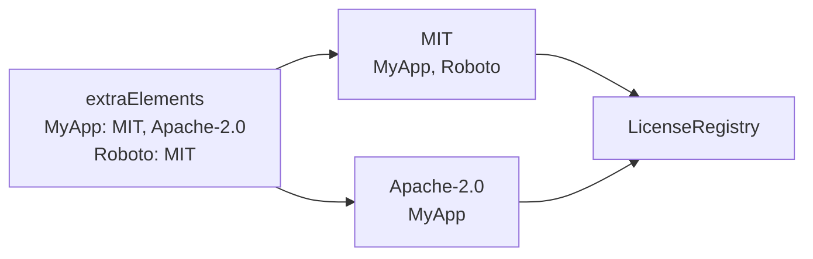

<!--
SPDX-FileCopyrightText: 2026 Benoit Rolandeau <benoit.rolandeau@allcircuits.com>

SPDX-License-Identifier: LicenseRef-ALLCircuits-ACT-1.1
-->

# ACT Licenses Manager <!-- omit from toc -->

## Table of contents

- [Table of contents](#table-of-contents)
- [Presentation](#presentation)
- [Architecture](#architecture)
  - [From the configuration to a license entry](#from-the-configuration-to-a-license-entry)
  - [Where a license text comes from](#where-a-license-text-comes-from)
  - [When the licenses are read](#when-the-licenses-are-read)
- [How to use](#how-to-use)
  - [Installation](#installation)
  - [Declare the licenses of an application](#declare-the-licenses-of-an-application)
  - [Register the manager](#register-the-manager)
- [Configuration](#configuration)
- [Testing](#testing)

## Presentation

This package adds to the licences page of an application the licenses flutter does not find on its
own.

Flutter collects the licenses of the packages an application depends on from their `LICENSE` file.
The ACT packages carry their licenses as SPDX headers, following
[reuse](https://reuse.software/), so flutter finds nothing for them. The same goes for what an
application ships without depending on a package: its own license, the one of a font, the one of an
image.

This package adds those licenses to the same page, from the configuration of the application. It
draws nothing: the page is the one flutter offers.

## Architecture

### From the configuration to a license entry

The configuration declares which elements exist and which licenses each of them uses. The manager
turns that around: one entry per license, listing every element which uses it, which is what the
licenses page of flutter displays.



An element is anything an application wants to credit: a group of packages, the application itself,
a font.

### Where a license text comes from

A license needs a text, and there are two places to write one:

| Source                    | Declared in                | Wins |
| ------------------------- | -------------------------- | ---- |
| `licenses.texts`          | The configuration file     | Yes  |
| A file of the assets      | `licenses.assetsFolders`   | No   |

A license which is declared in both is taken from the configuration. A file is looked for as
`<folder>/<license key>.txt` in each folder of the list, in order, and the first folder which has
it wins. A license whose text is nowhere to be found is skipped, and the manager warns about it
rather than displaying an entry with nothing in it.

### When the licenses are read

Reading the license files takes time, and the licenses page is rarely the first one an application
displays. The manager therefore starts reading them when it is initialized, without waiting for
them, and its collector waits for that reading to be over before it hands any license over. An
application is displayed without waiting, and its licenses page never shows a half read list.

## How to use

### Installation

Add the package to the `dependencies` of your package:

```yaml
dependencies:
  act_licenses_manager:
    path: ../act_licenses_manager
```

### Declare the licenses of an application

The configuration manager of the application has to carry the variables this package reads:

```dart
class AppConfigManager extends AbstractConfigManager with MixinLicensesConfig {
  AppConfigManager({required super.logger});
}
```

Then the configuration file declares the elements, the folders and the texts:

```yaml
# The licenses configuration
licenses:
  # The extra elements and their licenses
  extraElements:
    ACT packages:
      - CC0-1.0
      - MIT
      - LicenseRef-ALLCircuits-ACT-1.1
      - LicenseRef-DartProjectAuthors
    MyApp:
      - Apache-2.0
      - LicenseRef-ALLCircuits-ACT-1.1
      - CC0-1.0
      - MIT
      - MyLicense
    Roboto:
      - OFL-1.1

  # The assets folders to look for licenses files
  assetsFolders:
    - LICENSES
    - actlibs/LICENSES

  # The license texts, the key is the license name, and the value is the license text
  texts:
    MyLicense: |
      This is my license text.
```

The folders of `assetsFolders` have to be declared as assets in the `pubspec.yaml` of the
application, otherwise their files are not shipped and no license is found in them.

### Register the manager

```dart
GlobalManager.instance.register(ActLicensesBuilder<AppConfigManager>());
```

Nothing else is needed: the licenses page of the application is the one of flutter, and the manager
has already added to it what it found.

## Configuration

| Key                        | Default | What it holds                                    |
| -------------------------- | ------- | ------------------------------------------------ |
| `licenses.extraElements`   | Empty   | The licenses of each element, keyed by its name  |
| `licenses.assetsFolders`   | Empty   | The folders the license files are looked for in  |
| `licenses.texts`           | Empty   | The text of a license, keyed by the license name |

With no element declared, the manager adds nothing and the licenses page only shows what flutter
found on its own.

## Testing

The tests serve the configuration of an application and its license files the way an asset bundle
does, and read what the manager adds to the registry of the application.

They cover the elements which are gathered under the license they share, the license whose text is
written in the configuration, the one whose text is a file of the assets, the folder which is
picked among several, the configuration which wins over a file, and the license which is skipped,
with a warning, because it has no text anywhere.

The models are covered on what they read from the configuration and on what they refuse: an element
whose licenses are not a list of names, and a text which is not one, both of which are skipped
without taking the valid ones down with them.

```console
> flutter test
```
