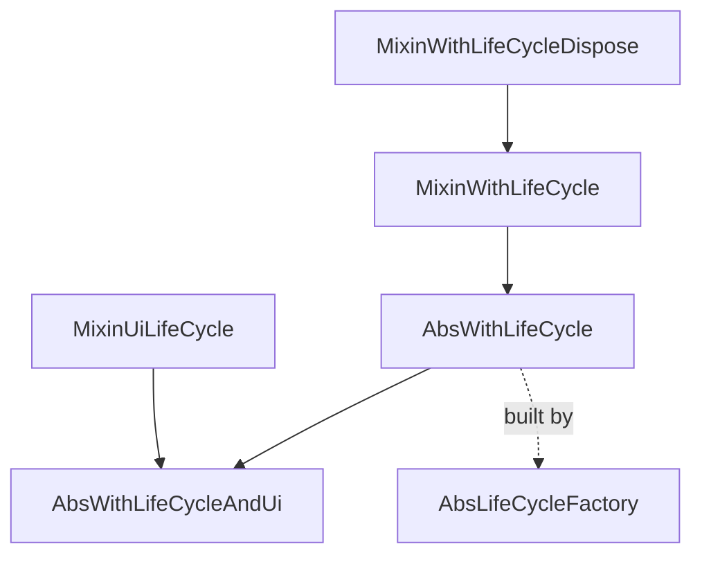

<!--
SPDX-FileCopyrightText: 2020 - 2023 Sami Kouatli <sami.kouatli@allcircuits.com>
SPDX-FileCopyrightText: 2023 Benoit Rolandeau <benoit.rolandeau@allcircuits.com>

SPDX-License-Identifier: LicenseRef-ALLCircuits-ACT-1.1
-->

# ACT Life cycle <!-- omit from toc -->

## Table of contents

- [Table of contents](#table-of-contents)
- [Presentation](#presentation)
- [Architecture](#architecture)
  - [The steps](#the-steps)
  - [Base classes](#base-classes)
  - [Factories](#factories)
- [How to use](#how-to-use)
  - [Installation](#installation)
  - [Write a manager](#write-a-manager)
  - [Write a manager which needs the UI](#write-a-manager-which-needs-the-ui)
  - [Write the factory of a manager](#write-the-factory-of-a-manager)
- [Testing](#testing)

## Presentation

This package contains a life cycle pattern implementation to manage the life cycle of classes and
their dependencies.

A manager rarely has everything it needs the moment it is built: it may have to read a file, to wait
for another manager, or to reach the widget tree. The package splits that start up in named steps,
so that a manager says what it does at each of them instead of guessing when it is safe to act.

The package only defines the steps and the contract which comes with them. It runs nothing: it does
not build the managers, does not order them and does not call their steps. That orchestration
belongs to `act_global_manager`.

## Architecture



### The steps

| Step                             | Comes from                  | Meaning                                 |
| -------------------------------- | --------------------------- | --------------------------------------- |
| `initLifeCycle`                  | `MixinWithLifeCycle`        | Asynchronous initialisation             |
| `initAfterManagersAndBeforeViews`| `MixinUiLifeCycle`          | Every manager is up, no view exists yet |
| `initAfterView`                  | `MixinUiLifeCycle`          | The first view is built                 |
| `disposeLifeCycle`               | `MixinWithLifeCycleDispose` | Clean up                                |

Every step has an empty implementation, so a manager only writes the ones it needs. They are all
marked `@mustCallSuper`, which is what keeps the chain of a derived class unbroken.

`initAfterManagersAndBeforeViews` may run at the same time as the same step of the other managers,
so a manager must not call another one from it. `initAfterView` receives a `BuildContext` taken
above the navigator, which therefore cannot be used to reach it.

The two initialisation mixins are the reason the package exists as a separate one: a manager which
has nothing to initialise takes `MixinWithLifeCycleDispose` from `act_foundation` alone, and never
depends on this package.

### Base classes

`AbsWithLifeCycle` is the base class of every manager and service: it merges the dispose mixin and
the initialisation one, and its constructor is constant, so a manager which holds no state can be
one too.

`AbsWithLifeCycleAndUi` adds `MixinUiLifeCycle` to it, for the managers which have something to do
once the widget tree exists. It only exists to spare its derived classes the `with` clause.

### Factories

`AbsLifeCycleFactory` is how a manager is declared to whoever builds it. It holds the constructor of
the manager, and `asyncFactory` builds it and awaits its `initLifeCycle` before handing it over, so
a caller never sees a manager which is not initialised. It builds a new manager at every call.

`dependsOn` lists the types of the managers which have to be initialised first. The list is what
lets an orchestrator sort the managers; the factory itself does nothing with it.

## How to use

### Installation

Add the package to the `dependencies` of your package:

```yaml
dependencies:
  act_life_cycle:
    path: ../act_life_cycle
```

### Write a manager

```dart
class MyManager extends AbsWithLifeCycle {
  late final MyClient _client;

  @override
  Future<void> initLifeCycle() async {
    await super.initLifeCycle();
    _client = await MyClient.connect();
  }

  @override
  Future<void> disposeLifeCycle() async {
    await _client.close();
    await super.disposeLifeCycle();
  }
}
```

The call to `super` comes first on the way in and last on the way out, so that a manager is only
built on top of an initialised base, and released before it.

### Write a manager which needs the UI

```dart
class MyUiManager extends AbsWithLifeCycleAndUi {
  @override
  Future<void> initAfterView(BuildContext context) async {
    await super.initAfterView(context);
    _precacheImages(context);
  }
}
```

### Write the factory of a manager

```dart
class MyManagerFactory extends AbsLifeCycleFactory<MyManager> {
  const MyManagerFactory() : super(MyManager.new);

  @override
  Iterable<Type> dependsOn() => const [MyOtherManager];
}
```

## Testing

The tests cover the default implementation of every step, the order in which a derived class and
the mixins run when the derived class calls `super`, the failure of an initialisation reaching the
caller, the context given to `initAfterView`, and what `asyncFactory` guarantees about the manager
it returns.

```console
> flutter test
```
