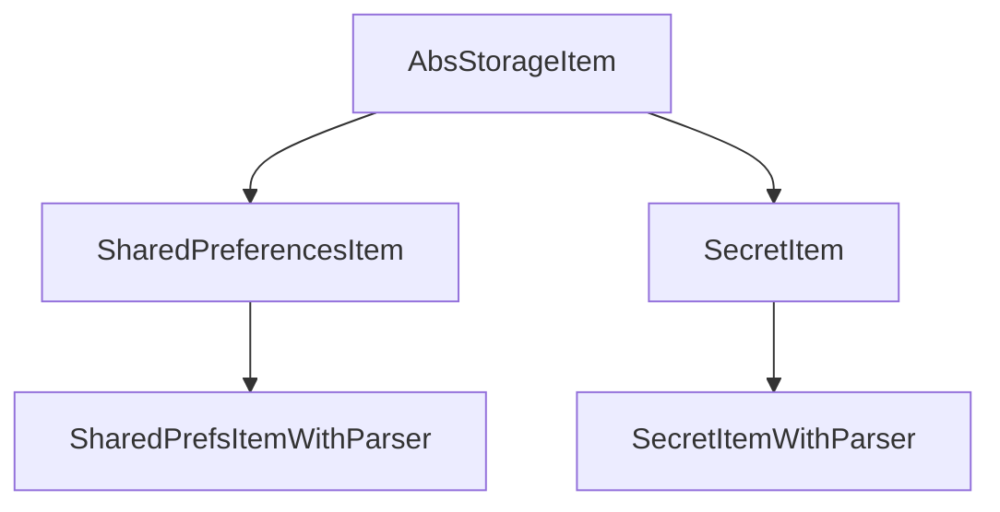

<!--
SPDX-FileCopyrightText: 2020 - 2023 Sami Kouatli <sami.kouatli@allcircuits.com>

SPDX-License-Identifier: LicenseRef-ALLCircuits-ACT-1.1
-->

# ACT local storage manager <!-- omit from toc -->

## Table of contents

- [Table of contents](#table-of-contents)
- [Presentation](#presentation)
- [Architecture](#architecture)
  - [The two storages](#the-two-storages)
  - [The items](#the-items)
  - [The managers](#the-managers)
- [How to use](#how-to-use)
  - [Installation](#installation)
  - [Declare the values of an application](#declare-the-values-of-an-application)
  - [Register the managers](#register-the-managers)
  - [Read and write a value](#read-and-write-a-value)
- [Configuration](#configuration)
- [Testing](#testing)

## Presentation

This package keeps the values an application has to remember between two runs. It offers two
storages, and the choice between them is the one which matters: the properties are written in clear
text, the secrets are written where the platform keeps its secrets.

It decides nothing about what an application stores: which values exist, under which keys and of
which type is declared by the application, one member per value.

The storages themselves are the ones of
[shared_preferences](https://pub.dev/packages/shared_preferences) and of
[flutter_secure_storage](https://pub.dev/packages/flutter_secure_storage).

## Architecture

### The two storages

| Storage    | Written where                | Types                                    |
| ---------- | ---------------------------- | ---------------------------------------- |
| Properties | A clear text file of the app | `bool`, `int`, `double`, `String`, lists |
| Secrets    | The keychain or the keystore | `bool`, `int`, `double`, `String`        |

Neither survives the application being uninstalled, nor its data being cleared by the user. A
property is readable by an advanced user or by any application on a rooted device, which is what
makes the difference between the two.

The secrets are written as strings, which is why they support fewer types than the properties: a
value is cast to a string on the way in and parsed on the way out.

On iOS, the secrets are unreachable between a restart of the device and the first time it is
unlocked; reading one before that raises a `PlatformException`.

### The items

An item is one value: a key, a type, and the two methods to read and write it. The kind of item
says which storage the value goes to, and whether the application parses it itself:



The two items with a parser are for the values which are not of a type the storage knows: the
application gives the two functions which turn its value into a stored one and back. Storing a null
value deletes the key, in every kind of item.

A `SharedPreferencesItem` also pushes on a stream every value written through it, so a part of an
application can follow a property it does not own. Nothing is pushed when the value is deleted.

The storages are reached through two singletons rather than through the managers, because an item
is declared as a member of a manager which is abstract: it could not find its own manager back.
Those singletons are internal to the package.

### The managers

`AbstractPropertiesManager` and `AbstractSecretsManager` are what an application derives, one
member per value. Beyond holding those members, each does one thing when it is initialized:

- the properties manager reads whether the application has already been started, and remembers that
  it now has. `isFirstStart` stays true for the whole run which discovered it,
- the secrets manager reads that answer and, on a first start, clears the secrets. This is needed
  on iOS, where the keychain outlives the application: without it, an application which is
  reinstalled would find the secrets of its previous install.

The secrets manager therefore depends on the properties manager and on the configuration of the
application, which is what the `dependsOn` of its builder declares.

## How to use

### Installation

Add the package to the `dependencies` of your package:

```yaml
dependencies:
  act_local_storage_manager:
    path: ../act_local_storage_manager
```

### Declare the values of an application

```dart
class AppPropertiesManager extends AbstractPropertiesManager {
  final lastOpenedPage = SharedPreferencesItem<String>("lastOpenedPage");

  final theme = SharedPrefsItemWithParser<AppTheme, String>(
    "theme",
    parser: AppTheme.parse,
    castTo: (theme) => theme.name,
  );
}

class AppSecretsManager extends AbstractSecretsManager {
  const AppSecretsManager({required super.propertiesGetter, required super.confGetter});

  final refreshToken = const SecretItem<String>("refreshToken", doNotMigrate: true);
}
```

`doNotMigrate` keeps a secret on the device it was written on, which only means something on iOS.

The configuration manager of the application has to carry the variable this package reads:

```dart
class AppConfigManager extends AbstractConfigManager with MixinStoresConf {
  AppConfigManager({required super.logger});
}
```

### Register the managers

```dart
GlobalManager.instance
  ..register(AppPropertiesBuilder(AppPropertiesManager.new))
  ..register(AppSecretsBuilder(() => AppSecretsManager(
        propertiesGetter: globalGetIt().get<AppPropertiesManager>,
        confGetter: globalGetIt().get<AppConfigManager>,
      )));
```

### Read and write a value

```dart
final properties = globalGetIt().get<AppPropertiesManager>();

await properties.lastOpenedPage.store("home");
final page = await properties.lastOpenedPage.load();

// Forget the value
await properties.lastOpenedPage.delete();
```

A value which is written elsewhere in the application can be followed:

```dart
properties.theme.updateStream.listen(_onThemeChanged);
```

## Configuration

| Key                                 | Default | What it does                                    |
| ----------------------------------- | ------- | ----------------------------------------------- |
| `stores.secrets.cleanWhenReInstall` | `true`  | Clears the secrets on the first start of an app |

Set it to false for an application which is expected to find its secrets again after being
reinstalled.

## Testing

The tests write and read through the real items, over the in memory storages the two plugins offer
to a test. They cover every type each storage accepts, the value which is replaced, the one which
is forgotten because it was deleted or stored as null, and the types which are refused because
neither storage knows how to keep them.

The items with a parser are covered on the value they parse back, on the value which cannot be
parsed and comes back as null, and on the cast which refuses a value. The stream of a property is
covered on what it pushes and on the deletion, which pushes nothing.

The managers are driven through their initialization: the first start which is announced once and
not the next time, the secrets which are cleared on that first start, and the ones which are kept
because the application has already been started or because the configuration says so.

```console
> flutter test
```
