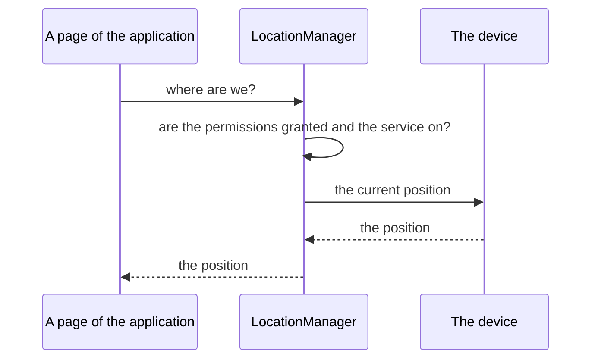

<!--
SPDX-FileCopyrightText: 2023 Benoit Rolandeau <benoit.rolandeau@allcircuits.com>

SPDX-License-Identifier: LicenseRef-ALLCircuits-ACT-1.1
-->

# ACT Location manager <!-- omit from toc -->

## Table of contents <!-- omit from toc -->

- [Presentation](#presentation)
- [Architecture](#architecture)
  - [What the manager needs](#what-the-manager-needs)
  - [Following the location of the device](#following-the-location-of-the-device)
  - [Switching the location on](#switching-the-location-on)
  - [Asking for a position](#asking-for-a-position)
- [How to use](#how-to-use)
  - [Installation](#installation)
  - [Register the manager](#register-the-manager)
  - [Ask for a position](#ask-for-a-position)
  - [Change the configuration](#change-the-configuration)
- [Platform files](#platform-files)
- [Testing](#testing)

## Presentation

This package answers where the device is. It is an `AbstractPeriphManager` over the `geolocator`
plugin: the permissions the location needs, the service the user switches on, and the positions
themselves, behind one manager.

What it adds to the plugin is everything which happens before a position can be asked for. The
permissions of the location are not the same on Android and on iOS, asking for the location at all
times is a second question which only makes sense once the first one is granted, and the service may
be switched off at any moment, including while the application is open.

It answers one position at a time, the current one or the last one the device remembers. Following a
device which moves is not offered.

## Architecture

### What the manager needs

The permissions the manager declares depend on its configuration:

| Configuration             | Permissions                                                  |
| ------------------------- | ------------------------------------------------------------ |
| the location while in use | the location while in use, explained again if it was refused |
| the location at all times | the same, and then the location at all times                 |

The location at all times is asked for after the location while in use, never before: a device which
was not allowed to read the location at all cannot be asked to read it in the background. On iOS it
is asked for in the settings of the device rather than in the application, because that is the only
place iOS lets a user grant it.

### Following the location of the device

The service of the location is read once when the manager starts, and then followed: the device says
when it is switched on and when it is switched off, and the manager tells the application. An error
on that stream is logged and nothing more; the manager keeps following, because a device which
stumbles once still answers afterwards.

### Switching the location on

A location which is already switched on is answered at once. A location which is off cannot be
switched on by the application, so the user is sent to the settings of the device: the page of the
application which explains why is displayed first, and it is that page which sends the user away.
Coming back to the application is what has the service read again, and the whole thing gives up
after a few seconds.

### Asking for a position



Every position goes through the permissions and the service first, and a page which does not want
the user bothered says so: then what is already known is read, and nothing is asked.

A device which raises rather than answering leaves the manager with no position, and the error is
logged. One error is read further than the others: a device which says that its location service is
disabled has the manager say so to the whole application, because that is a state the stream of the
service may not have told about yet.

## How to use

### Installation

Add the package to the `dependencies` of your package:

```yaml
dependencies:
  act_location_manager:
    path: ../act_location_manager
```

### Register the manager

```dart
class AppGlobalManager extends AbsGlobalManager {
  @override
  Future<void> registerManagers() async {
    registerManagerAsync(const PlatformBuilder());
    registerManagerAsync(AppLifeCycleBuilder());
    registerManagerAsync(PermissionsBuilder());
    registerManagerAsync(LocationBuilder());
  }
}
```

The view builder of the application registers the page which explains why the location has to be
switched on, and the pages of its permissions:

```dart
onEnablePage(route: AppRoutes.enableLocation, element: EnableServiceElement.location);
onPermissionPage(
  route: AppRoutes.locationPermission,
  permElement: PermissionElement.locationWhenInUse,
  permAction: PermissionViewAction.askPermission,
);
```

### Ask for a position

```dart
final manager = globalGetIt().get<LocationManager>();

final position = await manager.getCurrentPosition();
final lastKnown = await manager.getLastKnownPosition(askPermissionToUser: false);
```

Following whether the location can be used at all:

```dart
manager.enabledStream.listen(_onLocationServiceChanged);
manager.permissionsStream.listen(_onLocationPermissionsChanged);
```

### Change the configuration

```dart
class AppLocationManager extends LocationManager {
  @override
  Future<LocationInitConfig> getInitConfig() async => const LocationInitConfig(
    accuracy: LocationAccuracy.best,
    isLocationUsageAlways: true,
    timeLimitWhenGettingPosition: Duration(seconds: 5),
  );
}

class AppLocationBuilder extends DerivedLocationBuilder<AppLocationManager> {
  AppLocationBuilder() : super(AppLocationManager.new);
}
```

## Platform files

The permissions of the location are declared by the application, not by this package. The
`AndroidManifest.xml` needs the location permissions the configuration asks for, and the
`Info.plist` needs the usage descriptions iOS shows to the user. An application which asks for the
location at all times needs the background ones as well. See the documentation of the `geolocator`
plugin for the exact keys.

## Testing

The tests drive the manager over the location of a device which answers what each test decided, over
the permissions of a device which answer the same way, over the pages of an application which answer
what the test lined up, and over a life cycle which leaves the application and comes back as soon as
it is waited for. The plugin of the location and the plugin of the permissions are the boundary of
this package, so they are what is stood in for.

The permissions the manager declares are covered on the configuration which asks for the location
while in use, on the one which asks for it at all times and the order the two are asked in, and on
the iOS user who is sent to the settings rather than asked in the application. Following the device
is covered on the service which is read when the manager starts, on the two ways it changes, and on
the error which is logged without the following being given up.

Switching the location on is covered on the service which is already on, on the user who is sent to
the settings, on the service which is found on afterwards, and on the user who leaves the page.
Asking for a position is covered on the position which is answered, on the accuracy and the time
limit of the configuration and on the ones which are given instead, on the permissions which are
refused, on the device which raises, on the device which says that its service is disabled, and on
the caller which wants nothing asked of the user.

```console
> flutter test
```
