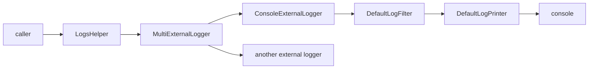

<!--
SPDX-FileCopyrightText: 2020 - 2023 Sami Kouatli <sami.kouatli@allcircuits.com>
SPDX-FileCopyrightText: 2023 Benoit Rolandeau <benoit.rolandeau@allcircuits.com>

SPDX-License-Identifier: LicenseRef-ALLCircuits-ACT-1.1
-->

# ACT logger manager <!-- omit from toc -->

## Table of contents

- [Table of contents](#table-of-contents)
- [Presentation](#presentation)
- [Architecture](#architecture)
  - [From a message to the console](#from-a-message-to-the-console)
  - [The logger before the manager](#the-logger-before-the-manager)
  - [The categories](#the-categories)
  - [The two levels](#the-two-levels)
  - [The format of a message](#the-format-of-a-message)
  - [The errors nobody caught](#the-errors-nobody-caught)
- [How to use](#how-to-use)
  - [Installation](#installation)
  - [Register the manager](#register-the-manager)
  - [Log a message](#log-a-message)
  - [Log from a package or a service](#log-from-a-package-or-a-service)
  - [Add an external logger](#add-an-external-logger)
- [Configuration](#configuration)
- [Testing](#testing)

## Presentation

This package holds the logger of an application: the manager every other manager, service and
package logs through.

A message is written by the external loggers the manager owns. The console is the one this package
brings; another one, which sends the messages to a crash reporting service or writes them to a file,
is added by the application without changing anything for the callers.

The package decides what a message looks like, which of them are written and where they go. It knows
nothing about what is logged, and it never reads a message back: it keeps no history and offers no
way to search the logs.

## Architecture

### From a message to the console



`LogsHelper` is what a caller holds: it carries the categories of its owner and hands the message to
the external logger, stamped with the time.

`MultiExternalLogger` is the one logger the helpers write to, and it fans the message out to the
loggers it owns. It owns them: it initializes a logger which is added after it, and disposes the one
it replaces, removes or clears.

`ConsoleExternalLogger` is the external logger of this package. It wraps the `logger` package, with
`DefaultLogFilter` to decide whether a message is written and `DefaultLogPrinter` to turn it into
the lines which are printed.

`LoggerSingleton` holds the `MultiExternalLogger` of the application. It exists so that a helper can
be built anywhere, including in the classes which run before the managers are ready, without going
through the `GlobalManager`.

### The logger before the manager

`LoggerManager.getSafeLogger` gives a logger which writes to the console and which is ready before
any manager is initialized. It is what the global manager logs its own start with.

When the manager is initialized, it registers the external loggers of the application, then removes
that safe logger: the console keeps working throughout, first through the safe logger and then
through the one built from the configuration.

`DefaultLoggerManager` is the implementation to use when the console is the only destination. An
application which needs another one derives `LoggerManager` and overrides
`buildExternalLoggersToReplaceSafeLogger`.

### The categories

A category says where a message comes from. A logger which creates a sub logger appends a sub
category to its own, so `manager/http/retry` is read as a path: the first category is the widest and
the last one the most precise.

### The two levels

A message is dropped when its level is below the minimum level of the logger which is asked to write
it, and every logger on the way has one: the helper of the caller, the multi logger of the
application, and each external logger. The helper and the multi logger have no minimum level of
their own by default, which leaves the decision to the external loggers.

`wouldBeLogged` asks the same question without logging anything, which is what a caller uses before
building an expensive message.

### The format of a message

`LogFormatUtility` writes the lines every external logger of the package prints:

```text
2025-01-08T11:50:38.470987Z-[info][default/other]: Global manager initialized.
```

The time is written in the universal time zone, the level in lower case, and the categories between
brackets, separated by a slash. A part which is missing is left out, prefix included. An error and a
stack trace are written on their own line, with the same prefix as the message.

### The errors nobody caught

When it is initialized, the manager takes over `FlutterError.onError` and the error callback of the
platform dispatcher: an error which no `try`/`catch` handled is logged at the error level instead of
being lost. An application which wants to do more with those errors, such as showing a screen or
reporting them, adds a handler or a callback to the manager rather than replacing those two
callbacks.

## How to use

### Installation

Add the package to the `dependencies` of your package:

```yaml
dependencies:
  act_logger_manager:
    path: ../act_logger_manager
```

### Register the manager

The manager reads its level from the config manager, so it depends on it:

```dart
GlobalManager.instance.register(
  DefaultLoggerBuilder<AppConfigManager>(loggerConfigGetter: globalGetIt().get<AppConfigManager>),
);
```

The config manager of the application has to carry the variables of the logger, which
`MixinDefaultLoggerConfig` declares:

```dart
class AppConfigManager extends AbstractConfigManager
    with MixinCslLoggerConfig, MixinLoggerConfig, MixinDefaultLoggerConfig {
  AppConfigManager({required super.logger});
}
```

### Log a message

```dart
appLogger().w("The value is out of range: $value");
```

One method per level is available: `t`, `d`, `i`, `w`, `e` and `f`, from the most detailed to the
most serious. Each of them accepts an error and a stack trace after the message:

```dart
try {
  await doSomething();
} catch (error, stackTrace) {
  appLogger().e("The operation failed", error, stackTrace);
}
```

`logMessages` is for the messages coming from a library which says nothing about their level; they
are logged at the default level of the logger which receives them.

### Log from a package or a service

Create a sub logger, so that the messages of that class carry its category:

```dart
class MyManager extends AbsWithLifeCycle {
  final MixinActLogger _logger;

  MyManager({required MixinActLogger logger})
    : _logger = logger.createAbsSubLogger(subCategory: "myManager");
}
```

A package which logs takes a `MixinActLogger` rather than reaching for the manager itself: it then
logs the same way in an application and in a test.

### Add an external logger

```dart
await globalGetIt().get<LoggerManager>().addExternalLogger(AppLoggers.crash, CrashLogger());
```

The manager takes the ownership of the logger: it initializes it, and disposes it when it is removed
or when the manager itself is disposed.

## Configuration

| Key                           | Type     | Default | Description                                  |
| ----------------------------- | -------- | ------- | -------------------------------------------- |
| `logs.level`                  | `string` | `warn`  | Minimum level of the messages of the app     |
| `logs.console.level`          | `string` | `all`   | Minimum level of the messages of the console |
| `logs.console.printInRelease` | `bool`   | `false` | Write to the console in a release build      |

A level is written as its name (`trace`, `debug`, `info`, `warn`, `error`, `fatal`), as its initial,
or as `all` and `off` for the two ends. A name which is not one of these leaves the default level in
place.

The console prints nothing in a release build unless `logs.console.printInRelease` is set, whatever
the levels say.

## Testing

The tests give the classes of the package a fake external logger, which records the messages instead
of writing them anywhere, and read the console through the zone of the test for the ones which do
write to it.

They cover the fan out of the multi logger and the ownership of the loggers it holds, the categories
and the levels a sub logger inherits or overrides, every prefix the format utility produces, the
conversion of the levels to the ones of the `logger` package and back, the levels the console logger
takes from the configuration, the removal of the safe logger once the loggers of the application are
registered, and the errors of the framework and of the platform the manager logs and hands over.

The logger singleton is never released, so the tests of a file share the one it creates: the file
which covers it checks the not created case first, and the other files clear the loggers of that
singleton between two tests.

```console
> flutter test
```
