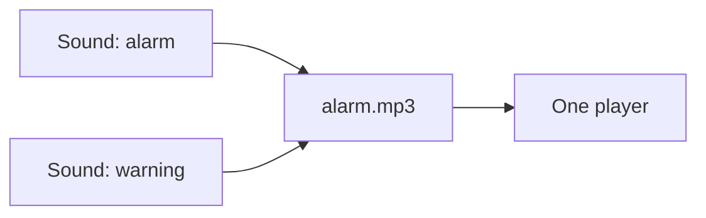

<!--
SPDX-FileCopyrightText: 2020 - 2023 Sami Kouatli <sami.kouatli@allcircuits.com>

SPDX-License-Identifier: LicenseRef-ALLCircuits-ACT-1.1
-->

# ACT Music player manager <!-- omit from toc -->

## Table of contents

- [Table of contents](#table-of-contents)
- [Presentation](#presentation)
- [Architecture](#architecture)
  - [Naming the sounds](#naming-the-sounds)
  - [One player per file](#one-player-per-file)
  - [Playing and stopping](#playing-and-stopping)
- [How to use](#how-to-use)
  - [Installation](#installation)
  - [Declare the sounds of an application](#declare-the-sounds-of-an-application)
  - [Register the manager](#register-the-manager)
  - [Play a sound](#play-a-sound)
- [Known limitations](#known-limitations)
- [Testing](#testing)

## Presentation

This package plays the sounds an application ships with. It only plays those: a sound is declared
once, loaded when the application starts, and played by the name the application gave it.

It is a wrapper around [audioplayers](https://pub.dev/packages/audioplayers), and it exists so that
an application deals with its own sounds rather than with players, files and release modes.

## Architecture

### Naming the sounds

An application names its sounds with an enum, and `AbstractMusicSoundHelper` binds each value to the
file it comes from. A `MusicSound` is named by its value, not by its file: two values may share a
file, and the application still plays one or the other by name.

### One player per file

Every file gets a player of its own, built and loaded into memory when the manager is initialized,
so that playing a sound costs nothing more than starting it. Two sounds which share a file therefore
share a player, and cannot be played at once.



Asking for a sound the application never declared is refused with a warning rather than played as
silence.

### Playing and stopping

A sound which is already playing is stopped before it is played again, so the same sound never
overlaps itself. A caller may also ask for every other sound to be stopped first, which is what an
alarm does.

`doNotPlayIfPrevSameSoundStartedBefore` guards a sound which is played over and over: the manager
measures how long ago the same sound started and does nothing when that is less than the duration
given. Without it, a sound asked for faster than it lasts would be restarted before it is heard.

A sound plays once unless the caller asks for a loop, and a player which was looping is put back to
playing once when it is stopped.

## How to use

### Installation

Add the package to the `dependencies` of your package:

```yaml
dependencies:
  act_music_player_manager:
    path: ../act_music_player_manager
```

### Declare the sounds of an application

```dart
enum AppSound { click, alarm }

class AppSoundHelper extends AbstractMusicSoundHelper<AppSound> {
  AppSoundHelper()
      : super(musicSounds: const {
          AppSound.click: MusicSound(value: AppSound.click, filePath: "click.mp3"),
          AppSound.alarm: MusicSound(value: AppSound.alarm, filePath: "alarm.mp3"),
        });
}
```

The files are read from the folder the manager is given, which has to be declared as an asset folder
in the `pubspec.yaml` of the application.

### Register the manager

```dart
GlobalManager.instance.register(MusicPlayerBuilder<AppSound>(
  audioFilePrefix: "assets/sounds/",
  musicSoundsHelper: AppSoundHelper(),
));
```

### Play a sound

```dart
final manager = globalGetIt().get<MusicPlayerManager<AppSound>>();

await manager.play(AppSound.click);

// An alarm, in a loop, over the silence of everything else
await manager.play(AppSound.alarm, loop: true, stopAllTheOthersSounds: true);

// A sound which a user may trigger faster than it lasts
await manager.play(
  AppSound.click,
  doNotPlayIfPrevSameSoundStartedBefore: const Duration(milliseconds: 200),
);

await manager.stop(AppSound.alarm);
```

## Known limitations

`getDuration` answers a duration of zero, and the stream of `onPlayerComplete` never pushes
anything. Both come from the player underneath rather than from this package, and an application
should not rely on either for now.

## Testing

The tests cover what the manager decides before it reaches a player: the sound it refuses because
the application never declared it, and the calls which do nothing because the sounds have not been
loaded. The sounds of an application are covered on the name a sound goes by, on the file every
sound is read from, and on the two sounds which share one.

Playing itself is not covered: the players are the ones of the plugin, they talk to the audio of the
device, and building one already needs that device to answer.

```console
> flutter test
```
