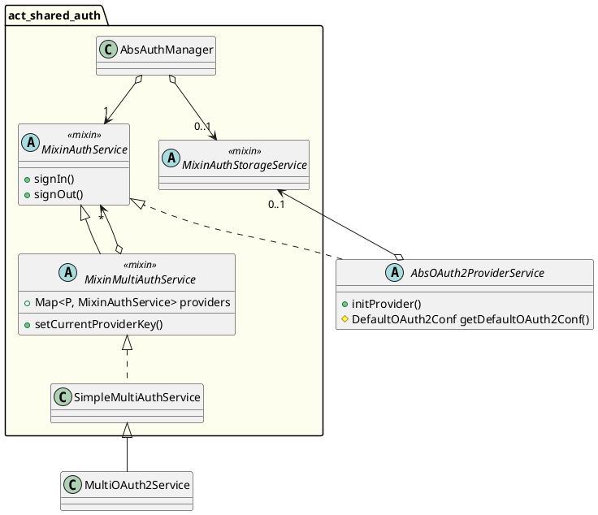

<!--
SPDX-FileCopyrightText: 2025 Benoit Rolandeau <benoit.rolandeau@allcircuits.com>

SPDX-License-Identifier: LicenseRef-ALLCircuits-ACT-1.1
-->

# ACT OAuth 2.0 core  <!-- omit from toc -->

## Table of contents

- [Table of contents](#table-of-contents)
- [Presentation](#presentation)
- [Architectural design](#architectural-design)
  - [Introduction](#introduction)
  - [Diagram](#diagram)

## Presentation

This package contains the common elements to connect to OAuth 2.0 client from Identity Providers.

Each kind of providers supported by ourselves will have a dedicated package.

## Architectural design

### Introduction

This package allows to use OAuth2 providers as `MixinAuthService`, but only defines the interfaces.

The implementation of those interfaces are done in specific package by provider.

### Diagram

The class `MultiOAuth2Service` does nearly the same thing as `SimpleMultiAuthService` but calls the
`initProvider()` method of `AbsOAuth2ProviderService` if the `MixinAuthService` linked derived from
this class.
