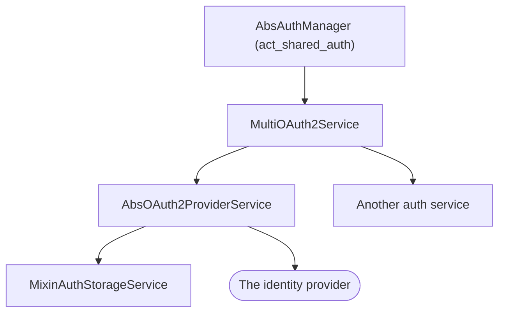
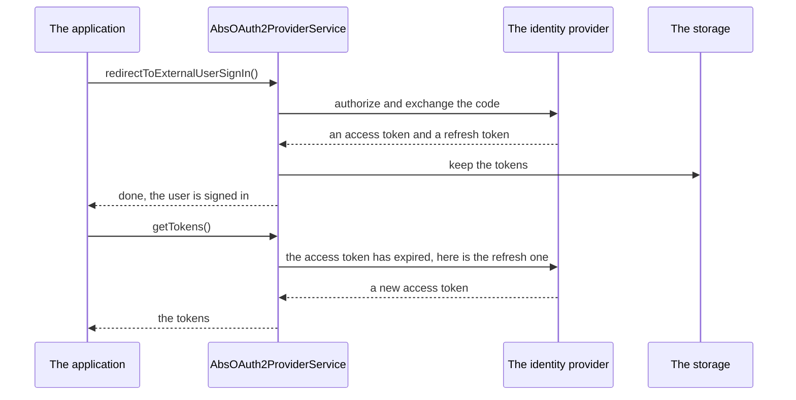

<!--
SPDX-FileCopyrightText: 2025 Benoit Rolandeau <benoit.rolandeau@allcircuits.com>

SPDX-License-Identifier: LicenseRef-ALLCircuits-ACT-1.1
-->

# ACT OAuth 2.0 core  <!-- omit from toc -->

## Table of contents

- [Table of contents](#table-of-contents)
- [Presentation](#presentation)
- [Architecture](#architecture)
  - [Where this package sits](#where-this-package-sits)
  - [The life of a session](#the-life-of-a-session)
  - [Naming the provider](#naming-the-provider)
  - [Several providers in one application](#several-providers-in-one-application)
- [How to use](#how-to-use)
  - [Installation](#installation)
  - [Write the service of a provider](#write-the-service-of-a-provider)
  - [Register the service](#register-the-service)
  - [Offer several providers](#offer-several-providers)
- [Configuration](#configuration)
- [Testing](#testing)

## Presentation

This package signs the users of an application in through an OAuth 2.0 identity provider. It holds
what every provider shares: the configuration which says where the provider is, the browser round
trip which brings a token back, the refreshing of a token which has expired, and the session which
is ended at the provider.

It talks to no provider in particular: a package per provider derives the service of this one and
answers where its provider is. Nothing here knows the API of an application either; the tokens it
gets are handed to `act_shared_auth`, which is what the rest of an application speaks to.

The browser round trip itself is made by
[flutter_appauth](https://pub.dev/packages/flutter_appauth).

## Architecture

### Where this package sits


```mermaid
flowchart TD
    manager["AbsAuthManager (act_shared_auth)"]
    multi["MultiOAuth2Service"]
    service["AbsOAuth2ProviderService"]
    other["Another auth service"]
    storage["MixinAuthStorageService"]
    provider(["The identity provider"])

    manager --> multi
    multi --> service
    multi --> other
    service --> storage
    service --> provider
```

`AbsOAuth2ProviderService` is an authentication service of `act_shared_auth`, so an application
reaches it the way it reaches any other: through its authentication manager. What it adds is the
OAuth 2.0 round trip and the tokens which come back from it.

The storage of the tokens is optional and is handed over rather than chosen: an application which
wants its users to stay signed in between two runs gives the service one, and the service reads it
when it is handed over and writes to it at every change.

### The life of a session


```mermaid
sequenceDiagram
    participant app as The application
    participant service as AbsOAuth2ProviderService
    participant provider as The identity provider
    participant storage as The storage

    app->>service: redirectToExternalUserSignIn()
    service->>provider: authorize and exchange the code
    provider-->>service: an access token and a refresh token
    service->>storage: keep the tokens
    service-->>app: done, the user is signed in

    app->>service: getTokens()
    service->>provider: the access token has expired, here is the refresh one
    provider-->>service: a new access token
    service-->>app: the tokens
```

A user is signed in as long as one of the two tokens is still valid. Asking for the tokens when the
access one has expired refreshes it; when the refresh one has expired too, nothing is given back
and the user is signed out.

A provider which hands only a refresh token over is asked for an access token straight away, so
that what the application gets is always a usable pair. A provider which hands nothing usable over
is an error, and the user stays signed out.

Signing out ends the session at the provider first: the tokens are only forgotten once the provider
answered, so a provider which is unreachable leaves the user signed in rather than half signed out.

The two moments which speak to the provider are protected by a mutex, so a page which asks for the
tokens while a sign in is still running waits rather than starting a second round trip.

### Naming the provider

`DefaultOAuth2Conf` says where the provider is, in one of three ways, and one of them is enough:

| What is named          | What it is                                                       |
| ---------------------- | ---------------------------------------------------------------- |
| `issuer`               | A well known provider, whose discovery document is found from it |
| `discoveryUrl`         | The discovery document of the provider                           |
| `serviceConfiguration` | The endpoints of the provider, one by one                        |

A package which knows its provider passes a default issuer when it reads the configuration, so that
an application only has to write its client identifier. A configuration which names none of the
three is refused: nothing could be reached with it.

The scheme the provider comes back to the application through is the one the application registered
with the platform. The two URLs which are built from it are the one of a sign in, which ends with
`oauthredirect`, and the one of a sign out, which is the bare scheme.

### Several providers in one application

`MultiOAuth2Service` is the service of an application which offers several ways of signing in. It
is the one of `act_shared_auth` with one thing added: the services which speak OAuth 2.0 are handed
the library and the logger they need when the application starts, and they are closed when the
providers are cleared. The other services are left alone.

## How to use

### Installation

Add the package to the `dependencies` of your package:

```yaml
dependencies:
  act_oauth2_core:
    path: ../act_oauth2_core
```

### Write the service of a provider

```dart
class AcmeAuthService extends AbsOAuth2ProviderService {
  static const _defaultIssuer = "https://identity.acme.example";

  final Map<String, dynamic> confJson;

  AcmeAuthService({required this.confJson}) : super(logsCategory: "acme");

  @override
  Future<DefaultOAuth2Conf> getDefaultOAuth2Conf() async =>
      DefaultOAuth2Conf.tryToParseFromJson(confJson, defaultIssuer: _defaultIssuer)!;
}
```

### Register the service

The service is initialized by `initProvider` and not by `initLifeCycle`, because it is only usable
once it has been given the library which speaks to the provider:

```dart
final service = AcmeAuthService(confJson: confJson);
await service.initProvider(parentLogsHelper: logsHelper, appAuth: const FlutterAppAuth());
await service.setStorageService(tokensStorage);
```

An application which offers one way of signing in hands that service to its authentication manager;
the sign in itself is asked for through the manager:

```dart
final result = await authManager.redirectToExternalUserSignIn();
if (result.status == AuthSignInStatus.done) {
  _openTheHomePage();
}
```

### Offer several providers

```dart
enum AppProviders { acme, corporate }

final service = MultiOAuth2Service<AppProviders>(
  providers: {
    AppProviders.acme: AcmeAuthService(confJson: acmeConf),
    AppProviders.corporate: CorporateAuthService(confJson: corporateConf),
  },
  currentProvider: AppProviders.acme,
);
await service.initLifeCycle();
```

The service which is current is the one every call goes to, and it is the only one which is handed
the storage of the tokens, so that two providers never read the tokens of each other.

## Configuration

The configuration of a provider is read from a json object, which an application usually keeps in
its own configuration:

| Key                     | Needed           | What it is                                        |
| ----------------------- | ---------------- | ------------------------------------------------- |
| `clientId`              | Always           | The identifier of the application at the provider |
| `appAuthRedirectScheme` | Always           | The scheme the provider comes back through        |
| `scopes`                | Always           | What the application asks the provider for        |
| `issuer`                | One of the three | The well known provider                           |
| `discoveryUrl`          | One of the three | The discovery document of the provider            |
| `serviceConfiguration`  | One of the three | The endpoints, one by one                         |

The endpoints of a provider which is named that way are `authorizationEndpoint`, `tokenEndpoint`
and, for a provider which offers one, `endSessionEndpoint`.

## Testing

The tests drive the services over an identity provider which answers what each test lined up: the
library the package speaks to opens a browser and reaches a server, which no test can do, so it is
that library which is stood in for. Everything else is the real one, the storage of the tokens
included, which the tests keep in memory.

The service is covered on the sign in which brings tokens back, the one the user gave up, the one
the provider refused, and the one which only brings a refresh token back and asks for an access
token straight away. The sign out is covered on the session which is ended and the tokens which are
forgotten, and on the provider which is unreachable and leaves the user signed in.

The tokens are covered on the user who is still signed in, the access token which is refreshed, and
the refresh token which has expired too. The storage is covered on the tokens it hands over when it
is set, and on the ones of the run which are kept over the ones it held.

The configurations are covered on every way of naming a provider, on the default issuer of a
package which knows its own, and on the values which are missing or of the wrong type.

```console
> flutter test
```
