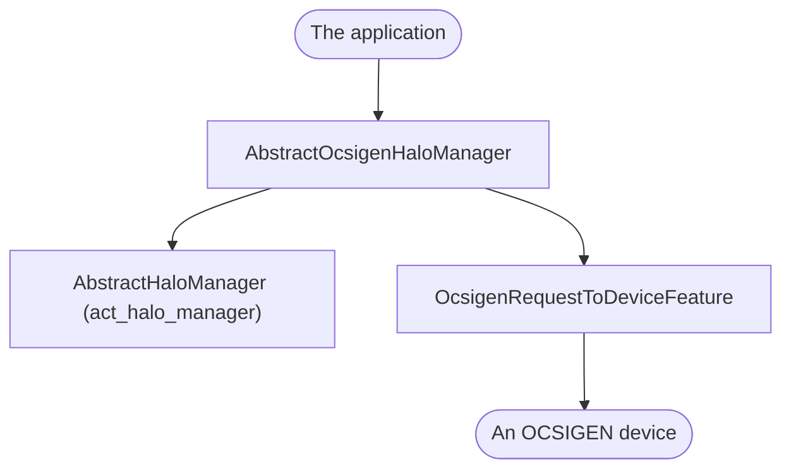

<!--
SPDX-FileCopyrightText: 2023 Benoit Rolandeau <benoit.rolandeau@allcircuits.com>

SPDX-License-Identifier: LicenseRef-ALLCircuits-ACT-1.1
-->

# ACT OCSIGEN Halo manager <!-- omit from toc -->

## Table of contents

- [Table of contents](#table-of-contents)
- [Presentation](#presentation)
- [Architecture](#architecture)
  - [What this package adds](#what-this-package-adds)
  - [The requests of an OCSIGEN device](#the-requests-of-an-ocsigen-device)
  - [The answers which are read back](#the-answers-which-are-read-back)
  - [Ending a communication](#ending-a-communication)
- [How to use](#how-to-use)
  - [Installation](#installation)
  - [Write the manager of an application](#write-the-manager-of-an-application)
  - [Register the manager](#register-the-manager)
  - [Connect a device to a network](#connect-a-device-to-a-network)
- [Testing](#testing)

## Presentation

This package speaks to the devices of the OCSIGEN range over HALO. It is the layer above
`act_halo_manager`: the protocol, the retries and the ways of reaching a device are already there,
and what this package adds is the list of requests those devices answer and the reading of what
they answer with.

Most of those requests are about the WiFi of a device: scanning the networks around it, joining
one, forgetting one, or asking where it stands. The rest is what an application needs to make a
device its own: claiming it, reading its serial number, telling it where it is, and echoing a value
to see whether the line is up.

It decides nothing about how a device is reached: the transport, whether it is BLE or anything
else, belongs to the application, which declares it in the configuration of its manager.

## Architecture

### What this package adds



The manager an application derives is the HALO one with the feature replaced: where the base
manager builds a feature which only knows how to send a request, this one builds a feature which
knows the requests of an OCSIGEN device by name. `ocsigenRequestToDevice` is that feature, and it
is what an application calls.

`OcsigenRequestIdHelper` is the other half: it is the list of requests the manager reads an answer
against. An application which adds requests of its own passes them to it, and a request which
carries the value of an OCSIGEN one replaces it.

### The requests of an OCSIGEN device

| Request                              | What it does                                        |
| ------------------------------------ | --------------------------------------------------- |
| `claimDevice`                        | Claims the device for a user, with a key            |
| `getSerialNumber`                    | Reads the serial number of the device               |
| `setGpsCoordinates`                  | Tells a device without a GPS where it is            |
| `echo`                               | Asks the device to repeat a value                   |
| `wiFiSsidScan`, `wiFiCompleteScan`   | Lists the networks the device sees                  |
| `wiFiConnect`, `wiFiDisconnect`      | Joins or leaves a network                           |
| `wiFiGetStatus`, `wiFiGetMacAddress` | Reads where the device stands and which chip it has |
| `getSavedWiFi`, `forgetSavedWiFi`    | Reads and forgets the networks it comes back to     |
| `apWifiEnable`                       | Opens or closes the access point of the device      |
| `quitCommunication`                  | Says how the communication ended                    |

Two of them need something said about what travels on the wire:

- the coordinates of a device are sent as whole numbers, because a device reads no decimals: the
  caller says how many digits after the comma it keeps, and both values are multiplied by that
  power of ten. The device is told the same number, so that it can read them back,
- the way of authenticating on a network is a parameter old devices do not read. An application
  which speaks to one asks for the default way and says that the device supports none, and the
  parameter is left out of the request. Asking for another way on such a device is refused rather
  than sent and misread.

### The answers which are read back

An answer of a device is a list of values, and this package turns three of them into models:

- `OcsigenWiFiCompleteScanResult` reads one network per four values: the name, how well it is
  heard, its channel, and the way of authenticating on it,
- `OcsigenWiFiStatusResult` reads one status per five values: the network, the address of the
  device on it, the netmask, the gateway, and the state of the connection,
- `OcsigenWiFiConnectResult` reads the one value which says whether the device joined the network,
  and why it did not.

An answer whose number of values is not a whole number of models is refused, because there is no
way of telling which value belongs to which model. A value which names something the package does
not know, on the other hand, is kept: the model carries the unknown state and, for a connection,
the raw value the device answered, so that an application can still show what happened.

### Ending a communication

`quitCommunication` tells a device how the communication ended before it is dropped. The status is
of the type a project chooses, because most projects have their own reasons for hanging up, and
`RestrictedEndComStatus` holds the two which are reserved: everything went well, and something went
wrong. A project which writes its own statuses keeps those two values for what they mean.

## How to use

### Installation

Add the package to the `dependencies` of your package:

```yaml
dependencies:
  act_ocsigen_halo_manager:
    path: ../act_ocsigen_halo_manager
```

### Write the manager of an application

```dart
enum AppHwType { ble }

class DeviceManager extends AbstractOcsigenHaloManager<AppHwType> {
  @override
  Future<HaloManagerConfig<AppHwType>?> initHaloManagerConfig() async =>
      HaloManagerConfig<AppHwType>(
        hardwareLayer: AppHwTypeHelper(hardwareServices: _hardwareServices),
        requestIdHelper: OcsigenRequestIdHelper(
          childRequests: {for (final id in AppRequestId.values) id.uniqueId: id},
        ),
      );
}

class DeviceBuilder extends AbstractOcsigenHaloBuilder<DeviceManager> {
  DeviceBuilder(super.factory);
}
```

### Register the manager

```dart
GlobalManager.instance.register(DeviceBuilder(DeviceManager.new));
```

### Connect a device to a network

```dart
final manager = globalGetIt().get<DeviceManager>();
final requests = manager.ocsigenRequestToDevice;

final networks = await requests.wiFiCompleteScan(hardwareType: AppHwType.ble);

final result = await requests.wiFiConnect(
  hardwareType: AppHwType.ble,
  ssid: networks!.first.ssid,
  password: password,
  authMode: networks.first.authMode,
);

if (result?.status.isError ?? true) {
  _showTheError(result?.status);
}
```

Reading where the device stands afterwards says whether it is still connecting or already on:

```dart
final status = await requests.wiFiGetStatus(materialType: AppHwType.ble);
final isConnected = status?.first.urc == OcsigenWiFiUrc.ok;
```

## Testing

The tests drive the feature over a device which answers what each test lined up, and which records
the packet it was sent: what a test asserts is what travels on the wire, and the protocol below is
the real one.

Every request is covered on the packet it builds, on the answer it reads back, and on the device
which could not be reached. The requests which refuse to send something are covered too: a way of
authenticating a device does not read, a value which does not fit in a byte, and coordinates which
do not fit in what the device reads.

The models are covered on the answer of a device which carries one value set, several, or none, on
the answer which is refused because it does not carry whole models, and on the values the package
does not know, which are kept rather than dropped. The list of requests is covered on the ones
OCSIGEN devices answer, on the ones an application adds, and on the one which replaces an OCSIGEN
request.

```console
> flutter test
```
