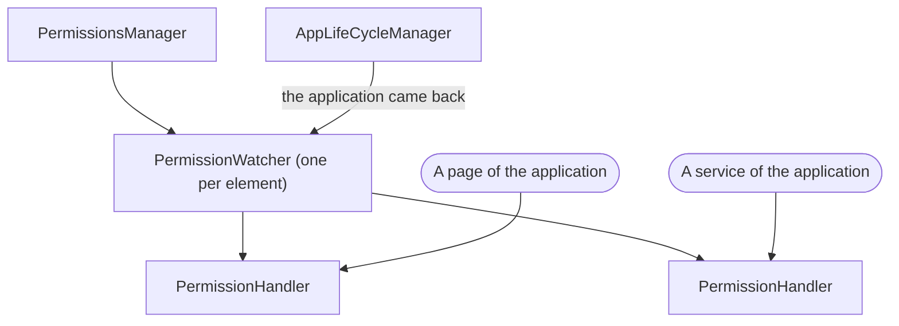
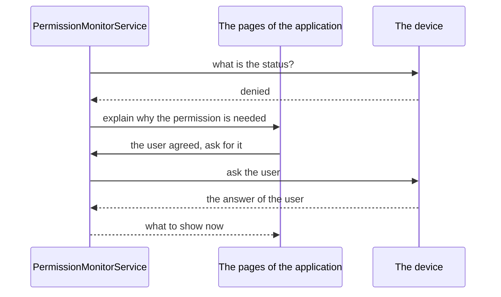

<!--
SPDX-FileCopyrightText: 2020 - 2023 Sami Kouatli <sami.kouatli@allcircuits.com>
SPDX-FileCopyrightText: 2023 Anthony Loiseau <anthony.loiseau@allcircuits.com>
SPDX-FileCopyrightText: 2023 Benoit Rolandeau <benoit.rolandeau@allcircuits.com>

SPDX-License-Identifier: LicenseRef-ALLCircuits-ACT-1.1
-->

# ACT Permission manager <!-- omit from toc -->

## Table of contents <!-- omit from toc -->

- [Presentation](#presentation)
- [Architecture](#architecture)
  - [What an element stands for](#what-an-element-stands-for)
  - [The status of an element](#the-status-of-an-element)
  - [Who watches a permission](#who-watches-a-permission)
  - [Asking the user](#asking-the-user)
  - [The permissions a service needs](#the-permissions-a-service-needs)
- [How to use](#how-to-use)
  - [Installation](#installation)
  - [Register the manager](#register-the-manager)
  - [Watch a permission](#watch-a-permission)
  - [Declare the permissions a service needs](#declare-the-permissions-a-service-needs)
  - [Register the pages which explain](#register-the-pages-which-explain)
- [Testing](#testing)

## Presentation

This package answers one question: may the application do what it is about to do? It groups the
permissions of the device under the features they serve, reads their status, asks the user for them,
and follows them for as long as something is interested.

What it adds to the `permission_handler` plugin is the grouping and the waiting. A feature such as
the Bluetooth needs different permissions on Android and on iOS, and different ones again depending
on the version of Android; the application names the feature and this package names the permissions.
A permission is not a value which is read once either: the user may change it in the settings of the
device, so it is read again every time the application comes back to the foreground.

It displays nothing itself. Which page explains why a permission is needed, and which one tells the
user that it was refused for good, are pages of the application, registered with
`act_contextual_views_manager`.

## Architecture

### What an element stands for

A `PermissionElement` is a feature of the application, not a permission of the device.
`PermissionElementHelper` is what turns one into the other, reading the platform and its version:

| Element                 | Android                                            | iOS                       |
| ----------------------- | -------------------------------------------------- | ------------------------- |
| `background`            | to be left running                                 | nothing                   |
| `ble`                   | scanning and connecting, or the location before 31 | the Bluetooth             |
| `locationAlways`        | the location at all times                          | the location at all times |
| `locationWhenInUse`     | the location while in use                          | the location while in use |
| `trackingAuthorization` | nothing                                            | the tracking of the user  |
| `wifi`                  | nothing                                            | nothing                   |

An element which asks for nothing on the platform of the moment is granted, which is what lets an
application ask for a feature without knowing whether the device has anything to say about it.

The Bluetooth of an Android older than version 31 asks for the location, which the application has
no reason to know: `isAskingLocation` is what tells a page whether it has to explain the location to
the user before it asks for the Bluetooth.

### The status of an element

An element carries several permissions, so it has to carry one status. The worst one wins, in this
order:


Reading the status of an element stops as soon as one permission is refused for good, since nothing
worse can be found.

### Who watches a permission



The manager holds one watcher per element and hands out handlers. A watcher only follows the
application while at least one handler is open: the first handler wakes it up and the last one which
is closed puts it back to sleep. Whoever asks for a handler owns it and has to close it.

A watcher reads the permission once and remembers it. It reads it again when the application comes
back to the foreground, because that is where the user may have changed it. Coming back is read
strictly: only `paused` counts as leaving and only `resumed` counts as coming back, so a dialog of
the system which merely covers the application is not mistaken for a trip to the settings.

Every change of the status is pushed on a stream, and a status which did not change is never pushed.
That last point matters: a permission which goes from refused to refused for good says nothing to a
page which only cares about being granted.

### Asking the user



`PermissionMonitorService` is what a feature asks before it does something. A permission which is
already granted goes through without anything being displayed. A permission which is not is
explained first: the page of the application is displayed, and it is that page which asks for the
permission, through the action it is handed. A user who leaves that page without answering leaves
the permission denied, and nothing is ever asked of the device.

A permission which was refused for good, or which the device restricts, cannot be asked for again:
the page which says so is displayed instead, and the action it is handed opens the settings of the
device. The application is then waited for: leaving it and coming back is what has the permission
read again, and the whole thing gives up after four seconds.

A caller which wants none of those pages says so, and then the permission is asked of the device
directly, or the settings are opened directly.

The refusal of a user who was already asked once is worth a special mention. On Android, the device
answers `denied` a second time rather than `permanentlyDenied`; asking whether a rationale has to be
shown is what tells the two apart, and a caller which asks for that reads such a permission as
refused for good.

### The permissions a service needs

A service of an application mixes `MPermissionsService` in and names the permissions it needs. Each
of them is followed on its own, and the service has what it needs when every one of them is granted;
that answer is pushed on a stream, so a page can follow it without asking again.

A permission may only be worth asking for once another one is granted: the location before the
Bluetooth, for instance. `whenAskingDependsOn` is what says so, and the order the permissions are
declared in does not matter, only the dependencies do. A permission whose dependency was refused is
never asked for. Every other permission still is, so that the user answers everything in one go
rather than one refusal at a time.

## How to use

### Installation

Add the package to the `dependencies` of your package:

```yaml
dependencies:
  act_permissions_manager:
    path: ../act_permissions_manager
```

### Register the manager

```dart
class AppGlobalManager extends AbsGlobalManager {
  @override
  Future<void> registerManagers() async {
    registerManagerAsync(const PlatformBuilder());
    registerManagerAsync(AppLifeCycleBuilder());
    registerManagerAsync(PermissionsBuilder());
  }
}
```

### Watch a permission

```dart
final handler = globalGetIt().get<PermissionsManager>().getAHandler(PermissionElement.ble);

final status = await handler.currentStatus;
handler.statusStream.listen(_onPermissionUpdated);
```

A handler which is no longer needed has to be closed, otherwise the permission is watched forever:

```dart
await handler.close();
```

The status of a permission can also be read once, without watching anything:

```dart
final manager = globalGetIt().get<PermissionsManager>();

if (await manager.isGranted(PermissionElement.locationWhenInUse)) {
  ...
}
```

### Declare the permissions a service needs

```dart
class BleService extends AbsWithLifeCycle with MPermissionsService {
  @override
  List<PermissionConfig> getPermissionsConfig() => const [
    PermissionConfig(element: PermissionElement.locationWhenInUse),
    PermissionConfig(
      element: PermissionElement.ble,
      whenAskingCheckRationale: true,
      whenAskingDependsOn: [PermissionElement.locationWhenInUse],
    ),
  ];
}

class BleServiceBuilder extends AbsLifeCycleFactory<BleService>
    with MPermissionsServiceBuilder<BleService> {
  BleServiceBuilder() : super(BleService.new);
}
```

Before it does something which needs those permissions, the service asks:

```dart
if (await checkAndAskPermissions()) {
  ...
}
```

Reading what is already known, without asking the user anything:

```dart
final granted = await checkPermissions(askActionToUser: false);
```

### Register the pages which explain

The view builder of the application mixes `MixinPermissionServiceViewBuilder` in and registers one
page or one dialog per element and per action:

```dart
class AppViewBuilder extends AbstractViewBuilder with MixinPermissionServiceViewBuilder {
  @override
  Future<void> initProcess() async {
    onPermissionPage(
      route: AppRoutes.blePermission,
      permElement: PermissionElement.ble,
      permAction: PermissionViewAction.askPermission,
    );
    onPermissionDialog(
      permElement: PermissionElement.ble,
      permAction: PermissionViewAction.informPermanentlyDenied,
      displayDialog: _showPermanentlyDeniedDialog,
    );
  }
}
```

A page which is displayed that way is handed the action to call, and `PermissionRequestUiBloc`
follows the service which asked for it:

```dart
class BlePermissionBloc extends PermissionRequestUiBloc<BleService> {
  BlePermissionBloc({required super.config})
      : super(manager: globalGetIt().get<BleService>());
}
```

## Testing

The tests drive the package over the permissions of a device which answers what each test decided
and records which ones were asked for, over a life cycle the test moves in and out of the
application, and over the pages of an application which answer what the test lined up. The plugin of
the permissions is the boundary of this package, so it is what is stood in for; the grouping, the
statuses, the watchers and the asking are the real ones.

The elements are covered on each platform they are read on: Android and iOS, the version of Android
which needs the location to scan the Bluetooth and the one which does not, the version which is
unknown, and the device which is neither. The status of an element is covered on the whole order of
the statuses and on the reading which stops at a permission refused for good.

The watchers are covered on the status which is read once and remembered, on the reading which
happens again when the application comes back, on the states which are not read as leaving or coming
back, and on the watcher which sleeps when its last handler is closed and keeps working while one is
left. Asking the user is covered on the permission which is already granted, the one which is
explained first, the page the user leaves without answering, the permission which is refused for
good and has the settings opened, and the refusal of a user who was already asked once.

The permissions a service needs are covered on the dependency which is asked for first, on the one
which is never asked for because its dependency was refused, on the permissions which are all asked
for even when one is refused, on what is answered without asking the user anything, and on the
service which is disposed and stops watching.

What is out of reach is the three hundred milliseconds the package waits before it reads a
permission again, which the device answered as refused right after it was granted: the wait is read
from the clock of the device rather than from a timer a test can move.

```console
> flutter test
```
