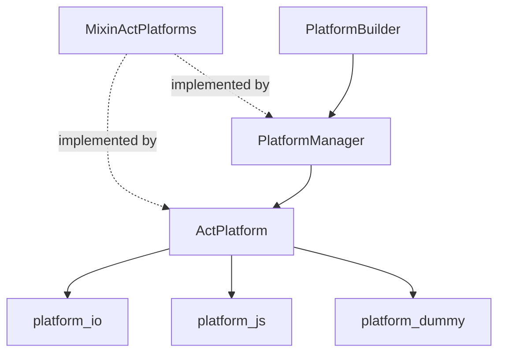

<!--
SPDX-FileCopyrightText: 2020 - 2023 Sami Kouatli <sami.kouatli@allcircuits.com>
SPDX-FileCopyrightText: 2023 Benoit Rolandeau <benoit.rolandeau@allcircuits.com>

SPDX-License-Identifier: LicenseRef-ALLCircuits-ACT-1.1
-->

# ACT Platform manager <!-- omit from toc -->

## Table of contents

- [Table of contents](#table-of-contents)
- [Presentation](#presentation)
- [Architecture](#architecture)
  - [Conditional imports](#conditional-imports)
  - [The manager](#the-manager)
- [How to use](#how-to-use)
  - [Installation](#installation)
  - [Register the manager](#register-the-manager)
  - [Branch on the platform](#branch-on-the-platform)
- [Testing](#testing)

## Presentation

This package contains a platform manager for your app.

It answers one question, from anywhere in the application and without importing `dart:io`: which
platform is this running on. It also gives the environment variables of that platform and, on
Android and iOS, the version of the system.

That last point is why it is a manager and not a set of constants: the version is read from a native
plugin, which cannot be done while the object is built.

## Architecture



### Conditional imports

`dart:io` does not exist on the web and `dart:js_interop` does not exist anywhere else, so neither
can be imported by a package which supports both. `ActPlatform` therefore imports one of three
files, chosen at compile time:

| File                 | Chosen when                     | Answers from                     |
| -------------------- | ------------------------------- | -------------------------------- |
| `platform_io.dart`   | `dart:io` is available          | `Platform` of the core library   |
| `platform_js.dart`   | `dart:js_interop` is available  | `kIsWeb`, and false for the rest |
| `platform_dummy.dart`| Neither is available            | false for everything             |

`ActPlatform` is a constant singleton over that choice, and `MixinActPlatforms` is the contract the
three of them and the manager all answer.

### The manager

`PlatformManager` forwards every platform question to the singleton, and adds the two answers an
application asks for the most: `isMobile` for Android and iOS, `isDesktop` for Linux, macOS and
Windows.

`version` is the only value which is not there from the start: `initLifeCycle` reads the SDK level
on Android and the system version on iOS, and leaves it null everywhere else.

`PlatformBuilder` is the factory to register the manager with, and it depends on no other manager.

## How to use

### Installation

Add the package to the `dependencies` of your package:

```yaml
dependencies:
  act_platform_manager:
    path: ../act_platform_manager
```

### Register the manager

```dart
GlobalManager.instance.register(const PlatformBuilder());
```

### Branch on the platform

```dart
final platformManager = globalGetIt().get<PlatformManager>();

if (platformManager.isMobile) {
  return const MobileLayout();
}

return const DesktopLayout();
```

The environment variables are read the same way, and are empty on the web:

```dart
final level = platformManager.environment["LOG_LEVEL"];
```

## Testing

The manager takes the platform singleton itself rather than receiving it, so it cannot be given a
fake without changing its constructor. The tests therefore run against the platform they are run on,
which is the io implementation, and assert what holds whatever that platform is: exactly one
platform is reported, the manager reports the same one as the singleton, and `isMobile` and
`isDesktop` follow from the platform answers rather than being read again.

The reading of the system version is left out: it comes from a native plugin, and only on the two
platforms the tests cannot run on.

```console
> flutter test
```
