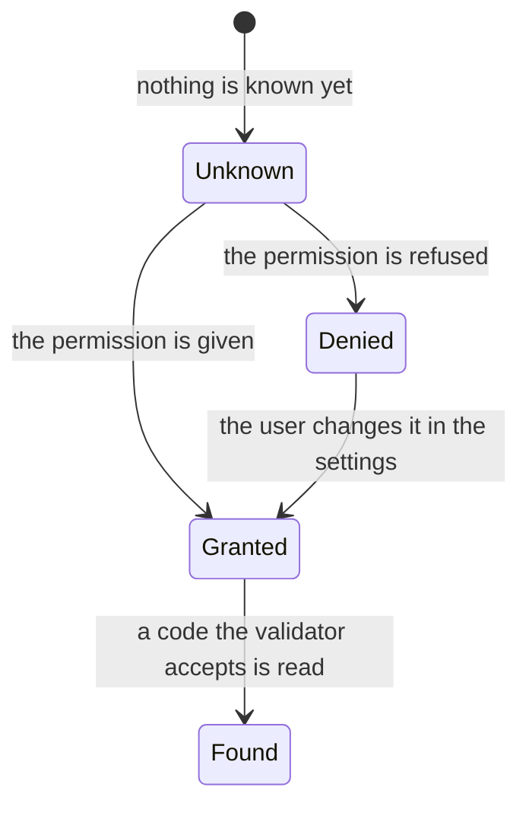

<!--
SPDX-FileCopyrightText: 2023 Benoit Rolandeau <benoit.rolandeau@allcircuits.com>

SPDX-License-Identifier: LicenseRef-ALLCircuits-ACT-1.1
-->

# ACT QR Code <!-- omit from toc -->

## Table of contents

- [Table of contents](#table-of-contents)
- [Presentation](#presentation)
- [Architecture](#architecture)
  - [Displaying a code](#displaying-a-code)
  - [Reading a code](#reading-a-code)
- [How to use](#how-to-use)
  - [Installation](#installation)
  - [Display a code](#display-a-code)
  - [Read a code](#read-a-code)
- [Testing](#testing)

## Presentation

This package holds the two widgets of an application which works with QR codes: the one which
displays a code, and the one which reads one with the camera.

The two are independent. Displaying a code needs nothing from the device; reading one needs the
camera and the permission which goes with it.

The reader is deprecated: it comes from an older application, it has not been reworked since, and
whether it still behaves is unknown. A new application should not build on it.

## Architecture

### Displaying a code

`QrCodeImage` draws the code as a vector picture. It builds the picture once and keeps it, because
encoding a text as a code costs enough for it to be worth not doing it at every build. The picture
is built again when the text, the colour or the correction level changes, and kept when only the
size does: the same picture is drawn larger or smaller.

The correction level is how much of a code can be damaged or hidden and still be read. A higher
level survives more damage but makes the code denser, so the default is the lowest one, which suits
a code displayed on a screen.

| Level      | Recoverable |
| ---------- | ----------- |
| `low`      | 7%          |
| `medium`   | 15%         |
| `quartile` | 25%         |
| `high`     | 30%         |

The encoding itself comes from [barcode](https://pub.dev/packages/barcode), and the picture is
drawn by [flutter_svg](https://pub.dev/packages/flutter_svg).

### Reading a code

`QrCodeReader` shows what the camera sees, freezes it once a code the caller accepts has been read,
and hands that code over. A validator filters the codes an application is not interested in, so
that a user pointing at the wrong code changes nothing.

`QrCodeBloc` holds what the reader knows: whether the camera permission has been granted, and
whether a code has been found.



The bloc reads the permission as soon as it is built, and asks for it when it has not been granted
yet. It does not ask again when the permission was permanently denied, because the platform would
answer without showing anything to the user; the reader then offers to open the settings of the
application instead.

A state is always built from the previous one, and only carries what changed: reporting a code
keeps the permission which is known, and reporting a permission keeps the code which was found.

## How to use

### Installation

Add the package to the `dependencies` of your package:

```yaml
dependencies:
  act_qr_code:
    path: ../act_qr_code
```

### Display a code

```dart
QrCodeImage(
  text: serialNumber,
  color: Theme.of(context).colorScheme.onSurface,
  size: 200,
  errorCorrectLevel: BarcodeQRCorrectionLevel.medium,
)
```

Nothing has to be registered, and the widget reaches nothing outside of itself.

### Read a code

The reader needs the camera permission to be declared by the application: `NSCameraUsageDescription`
in the property list on iOS, and `android.permission.CAMERA` in the manifest on Android.

```dart
QrCodeReader(
  size: 200,
  autoFlash: true,
  validator: (String scanned) => scanned.startsWith("ACT-"),
  onDataFound: (String scanned) => setState(() => _lastCode = scanned),
  askPermissionInfo: AskPermissionInfo(
    permButton: ({required VoidCallback onPressed}) => RawMaterialButton(
      onPressed: onPressed,
      child: Text(Tr.of(context).openSettings),
    ),
    textAskingPermission: Text(Tr.of(context).cameraNeeded),
    textWhenPermissionDenied: Text(Tr.of(context).cameraRefused),
  ),
)
```

## Testing

The tests of the widget which displays a code pump it and read the picture it drew: the size it is
drawn at, the pictures which differ because the text, the colour or the correction level differ,
the picture which is built again when one of those changes, and the one which is kept when only the
size changes.

The bloc is tested with the platform answering the permissions the test decides, which covers the
permission which is already granted, the one which is asked for and then given, the one which is
refused, and the one which was permanently denied and is not asked for again. The states are
covered on their own, including the one which refuses to be built while no permission is known.

The reader widget is not covered: it shows a camera preview, which a test has no way to feed.

```console
> flutter test
```
