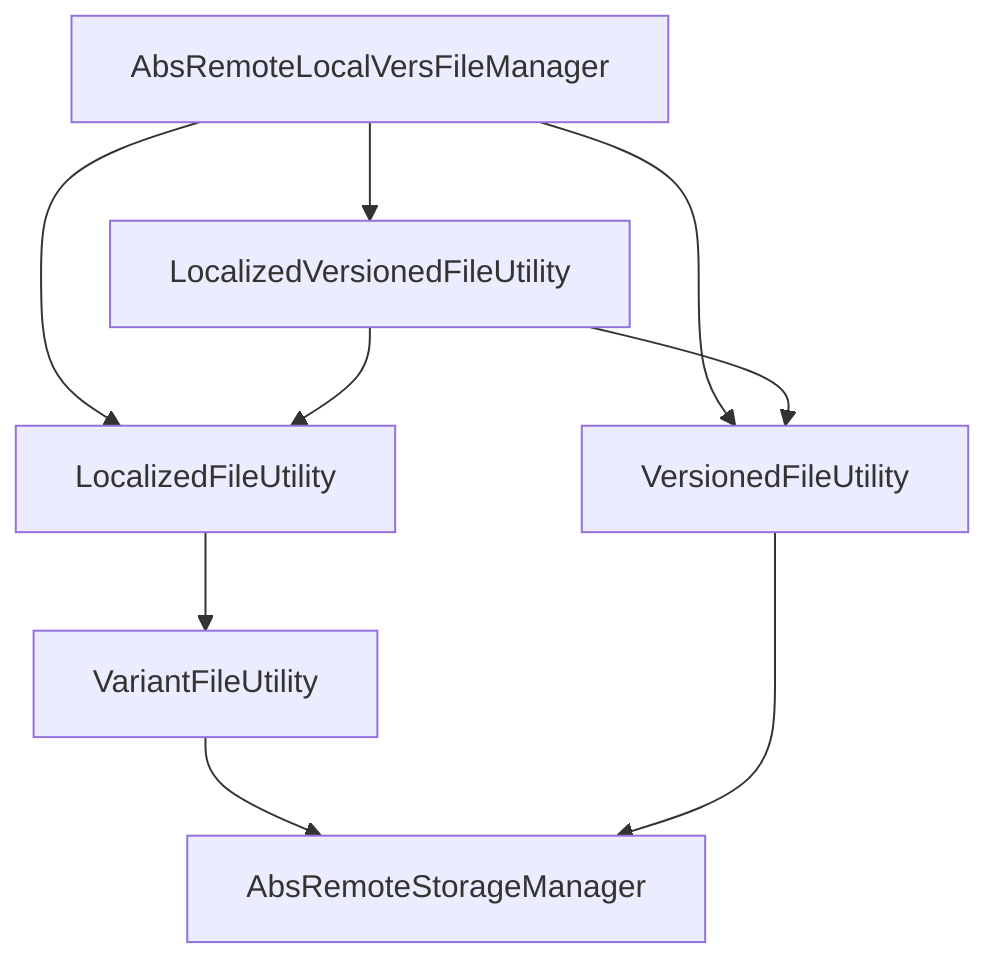

<!--
SPDX-FileCopyrightText: 2025 Anthony Loiseau <anthony.loiseau@allcircuits.com>

SPDX-License-Identifier: LicenseRef-ALLCircuits-ACT-1.1
-->

# Act Remote Localized Versioned File Manager <!-- omit from toc -->

## Table of contents <!-- omit from toc -->

- [Presentation](#presentation)
- [Architecture](#architecture)
  - [The three ways of asking for a file](#the-three-ways-of-asking-for-a-file)
  - [The layout of a folder](#the-layout-of-a-folder)
  - [How a locale is chosen](#how-a-locale-is-chosen)
  - [Where an option comes from](#where-an-option-comes-from)
  - [What is asked of the storage](#what-is-asked-of-the-storage)
- [How to use](#how-to-use)
  - [Installation](#installation)
  - [Declare the folders of an application](#declare-the-folders-of-an-application)
  - [Write the manager](#write-the-manager)
  - [Register the manager](#register-the-manager)
  - [Read a file](#read-a-file)
- [Configuration](#configuration)
- [Testing](#testing)

## Presentation

This package reads the files an application keeps on a remote storage and which come in several
shapes: translated, versioned, or both. Reading the terms a user agrees to, or the notes of a
release, is what it is for; so is downloading the firmware a device expects.

It downloads nothing itself and caches nothing: the storage is asked for one file at a time, and
whether that file is kept on the device is the answer of the storage. What this package brings is
the layout of a folder, the order the locales are tried in, and the stamp file which says which
version is the current one.

## Architecture

### The three ways of asking for a file



The manager is what an application derives and calls; each of its methods is one of the utilities
above, with the options of the folder already applied.

`VariantFileUtility` is the one every localized lookup ends on: a file which exists under one of
several names is asked for name after name, and the first one the storage answers with wins. A
locale is one such name, which is why the localized utility is written on top of it.

The answer of every call says which locale and which version were found, next to the file itself,
so that an application can show what it read and remember it.

### The layout of a folder

A folder of translated files holds one sub folder per locale, written in lower case with an
underscore, and the same file name in each:

```text
terms/
├── en_gb/
│   └── terms.md
├── en_us/
│   └── terms.md
└── fr/
    └── terms.md
```

A folder of versioned files holds a stamp file which names the current version, and one file per
version. The name of a file is built from its version by the application, which is what lets a
version carry an extension or a prefix:

```text
terms/
├── current.txt         # ex: "v3"
├── v1.md
├── v2.md
└── v3.md
```

A folder which is both is the two put together: one sub folder per locale, each holding its own
stamp file and its own versions. A locale may therefore be behind another one, which is what
happens while a translation is being written:

```text
terms/
├── en_gb/
│   ├── current.txt     # ex: "v1"
│   └── v1.md
└── fr_fr/
    ├── current.txt     # ex: "v2"
    ├── v1.md
    └── v2.md
```

### How a locale is chosen

The locales a lookup is given are expanded before anything is asked of the storage: a locale which
names a country is followed by the language alone. Asking for `[fr_FR, en_GB]` therefore looks for
`fr_fr`, then `fr`, then `en_gb`, then `en`, and the first folder which holds the file wins.

The locale which is given back is the one which was asked for, and not the name of the folder it
was found in: a caller which compares it with the locale of the application finds them equal.

### Where an option comes from

Four options say how a file is read: the locales, the way a version is turned into a file name, and
whether the version and the file are kept by the storage. Each is read from the first of these
which decided it:

1. what the caller of the method named,
2. what the application overrode, in `getOptionsOverrides`,
3. what the configuration of the application names for that folder,
4. the default: the locales of the application, the version itself as a file name, the version not
   kept, and the file kept.

An override of the application replaces the options of the configuration one by one, so a folder
can have its file name written in code and its caching left in the configuration.

### What is asked of the storage

Only reading one file is ever asked of the storage: no folder is ever listed. A file which is not
there has to be answered as an error rather than raised, because that is how a locale which has no
translation is told apart from one which does.

The error which is given back when nothing is found is the one of the first lookup, which is the
one of the best locale: it says why the file the application really wanted could not be read.

## How to use

### Installation

Add the package to the `dependencies` of your package:

```yaml
dependencies:
  act_remote_local_vers_file_manager:
    path: ../act_remote_local_vers_file_manager
```

### Declare the folders of an application

```dart
enum AppDirType with MixinRemoteLocalVersFileType {
  terms("terms"),
  releaseNotes("release_notes");

  @override
  final String dirId;

  const AppDirType(this.dirId);
}

class AppConfigManager extends AbstractConfigManager
    with MixinRemoteLocalVersFileConfig<AppDirType> {
  AppConfigManager({required super.logger});

  @override
  List<AppDirType> getMultiDirTypes() => AppDirType.values;
}
```

### Write the manager

```dart
class AppFilesManager extends AbsRemoteLocalVersFileManager<AppDirType> {
  AppFilesManager({required super.configManagerGetter});

  @override
  AbsRemoteStorageManager getStorageManager(AppDirType dirType) =>
      globalGetIt().get<AppStorageManager>();

  @override
  Future<Locale> getCurrentLocale() async => globalGetIt().get<LocalesManager>().currentLocale;

  @override
  Future<Locale> getDefaultLocale() async => const Locale("en", "GB");

  @override
  Future<Map<AppDirType, RemoteLocalDirOptions>> getOptionsOverrides() async => {
        AppDirType.terms: RemoteLocalDirOptions(versionToFileName: (version) => "$version.md"),
      };
}

class AppFilesBuilder
    extends AbsRemoteLocalVersFileBuilder<AppDirType, AppConfigManager, AppFilesManager> {
  AppFilesBuilder(super.factory);
}
```

### Register the manager

```dart
GlobalManager.instance.register(
  AppFilesBuilder(() => AppFilesManager(configManagerGetter: globalGetIt().get<AppConfigManager>)),
);
```

### Read a file

```dart
final manager = globalGetIt().get<AppFilesManager>();

final result = await manager.getLocalizedVersionedFile(dirType: AppDirType.terms);

if (result.result == StorageRequestResult.success) {
  _showTheTerms(await result.data!.file.readAsString());
  _rememberTheVersionTheUserAgreedTo(result.data!.version);
}
```

Reading the current version alone is what an application asks when it only wants to know whether
the user has to agree again:

```dart
final current = await manager.getFileLocalizedCurrentVersion(dirType: AppDirType.terms);
final hasToAgree = current.data?.version != agreedVersion;
```

## Configuration

| Key                           | What it does                                     |
| ----------------------------- | ------------------------------------------------ |
| `remoteLocalVersFile.config`  | The options of every folder, one entry per folder |

The value is a json object whose keys are the identifiers of the folders:

```yaml
remoteLocalVersFile:
  config: >
    {
      "terms": { "locales": ["fr_FR", "en_GB"], "cacheVersion": false, "cacheFile": true }
    }
```

A folder which is not named there is read with the defaults, and a folder the application does not
know is dropped rather than read.

## Testing

The tests drive the utilities and the manager over a storage which serves the files the test wrote
on the machine and records what it was asked. The files are real ones, because the utilities read
them, and only the remote storage is stood in for.

The lookups are covered on the file which is found straight away, the one which is found on a later
variant, the fallback from a locale to its language, and the case where nothing is found, which
answers the error of the first lookup. The versions are covered on the stamp file which is read,
the one which is written with spaces around it, the one which names nothing, the version the caller
already knows, and the version which names a file which is not there.

The manager is covered on the four options and on where each of them comes from: what the caller
named, what the application overrode, what the configuration says, and the default. The
configuration itself is covered on the folders it names, on the ones the application does not know,
and on the values which cannot be read.

```console
> flutter test
```
