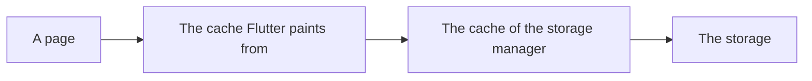

<!--
SPDX-FileCopyrightText: 2024 Théo Magne <theo.magne@allcircuits.com>

SPDX-License-Identifier: LicenseRef-ALLCircuits-ACT-1.1
-->

# Act Remote Storage Manager UI <!-- omit from toc -->

## Table of contents

- [Table of contents](#table-of-contents)
- [Presentation](#presentation)
- [Architecture](#architecture)
  - [The two caches](#the-two-caches)
  - [The key of an image](#the-key-of-an-image)
  - [The provider](#the-provider)
  - [The widget](#the-widget)
- [How to use](#how-to-use)
  - [Installation](#installation)
  - [Open the images to the application](#open-the-images-to-the-application)
  - [Display an image](#display-an-image)
  - [Replace an image which changed](#replace-an-image-which-changed)
- [Testing](#testing)

## Presentation

This package displays the images an application keeps on a remote storage. It builds on
[the remote storage manager](../act_remote_storage_manager/README.md), which downloads the files and
keeps a copy of them, and adds what it takes to paint one of those files on a page.

It brings the widget an application uses, the image provider behind it, and the mixin which opens
the images of a storage manager to both.

## Architecture

### The two caches

Two caches sit between a page and the storage, and they have to be told apart:

- the cache of the storage manager, which keeps the file of an image on the device;
- the cache Flutter paints from, which keeps the image it decoded from that file in memory.

An image which changed on the storage is downloaded again once the first one is cleared, but the
page keeps painting the old one until the second one is cleared too. `MixinImageCacheService` is
what closes that gap: it remembers, for every file it hands over, the keys Flutter painted it under,
and clears both caches at once.



Clearing the second cache does not redraw the page. The page has to be reloaded afterwards for the
new image to show.

### The key of an image

The same file is painted at several sizes, and each size is its own image for Flutter. So the key of
an image carries the size it was decoded at, in the pixels of the device, which is what
`createKey` builds: `20_10_aFile` for the file `aFile` at twenty pixels wide and ten high. A size
which was not asked for is left out of the key, and so is one which has no bound.

### The provider

`StorageManagerImageProvider` is the `ImageProvider` which reads an image out of the storage
manager. It asks the manager for the file, decodes it, and resizes it to the size the page asked
for. A size is given in the units of the page, so the provider needs the pixel ratio of the device
to turn it into pixels; asking for a size without it is a mistake the provider refuses.

The provider gives up when the storage answers no file, which is what the error widget of an image
is shown for.

### The widget

`StorageManagerImage` is the widget a page holds. It is an `Image` over the provider, which displays
what the application asks for while the file is being downloaded and decoded, and what it asks for
when the image cannot be loaded at all.

## How to use

### Installation

Add the package to the `dependencies` of the application:

```yaml
dependencies:
  act_remote_storage_ui:
    path: ../act_remote_storage_ui
```

### Open the images to the application

The mixin goes on the storage manager of the application, which is where both caches are:

```dart
class AppStorageManager extends AbsRemoteStorageManager<AppConfigManager>
    with MixinImageCacheService<AppConfigManager> {
  @override
  Future<MixinStorageService> getStorageService() async => AppStorageService();
}
```

### Display an image

```dart
StorageManagerImage<AppStorageManager>(
  fileId: "aFolder/anImage.png",
  width: 120,
  height: 80,
  fit: BoxFit.cover,
  placeholderBuilder: (context) => const CircularProgressIndicator(),
  errorBuilder: (context, error, stackTrace) => const Icon(Icons.broken_image),
)
```

### Replace an image which changed

```dart
await globalGetIt().get<AppStorageManager>().clearImageFileFromCache("aFolder/anImage.png");
// then reload the page which displays it
```

## Testing

The keys are covered on the sizes they carry, on the size which is rounded up to the pixel above and
on the one which has no bound. The provider is covered on the key it reads an image under, on the
size it refuses without the pixel ratio of the device, on the image it paints from the file the
storage answered with, on the resizing, and on the giving up when the storage answers no file.

The widget is covered on a page which displays a real image, written to a real file by the test:
what is displayed while the file is being read, what is left once the image is painted, what is
displayed when the image cannot be loaded, and the size the page asked for.

Reading a file and drawing an image happen outside the clock of a widget test, one step at a time,
so the tests give the real event loop a turn and pump a frame as many times as the steps it takes.

The cache of the storage manager is left out, as it is in that package: it writes on the device,
through a database and a folder a test has no access to. The applications of the tests therefore use
no cache, which is also the path where the manager says so in the logs.

```console
> flutter test
```
