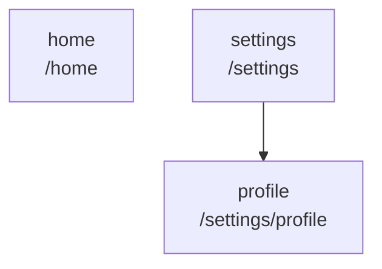

<!--
SPDX-FileCopyrightText: 2023 Nicolas Butet <nicolas.butet@allcircuits.com>
SPDX-FileCopyrightText: 2024 Benoit Rolandeau <benoit.rolandeau@allcircuits.com>

SPDX-License-Identifier: LicenseRef-ALLCircuits-ACT-1.1
-->

# ACT Router Manager <!-- omit from toc -->

## Table of contents

- [Table of contents](#table-of-contents)
- [Presentation](#presentation)
- [Architecture](#architecture)
  - [Naming the pages](#naming-the-pages)
  - [Describing the pages](#describing-the-pages)
  - [Navigating](#navigating)
  - [Transitions and orientation](#transitions-and-orientation)
  - [Redirections](#redirections)
- [How to use](#how-to-use)
  - [Installation](#installation)
  - [Declare the pages of an application](#declare-the-pages-of-an-application)
  - [Write the routes helper](#write-the-routes-helper)
  - [Register the manager](#register-the-manager)
  - [Navigate](#navigate)
  - [Redirect](#redirect)
- [Be careful](#be-careful)
- [Testing](#testing)

## Presentation

This package is the navigation of an application. It wraps
[go_router](https://pub.dev/packages/go_router) so that the pages are named by an enum instead of by
strings: a page which does not exist is then a compilation error rather than a route which fails at
runtime.

It draws no page and holds no state of its own beyond the navigation: what a page displays is
written by the application, in the callback it registers for that page.

## Architecture

### Naming the pages

An application declares its pages as an enum with `MixinRoute`. A page says which page it hangs
under, and the path it answers on is built from that: a page at the root of the tree answers on
`/<name>`, and a nested one on the path of its parents followed by its own name.



### Describing the pages

`AbstractRoutesHelper` is where an application declares, for each page, the widget to build. The
helper is also where the page the application starts on, the page displayed when an unknown one is
asked for, and the defaults of the transitions and of the orientation are declared.

Every page of the enum has to be given a callback: the tree is built from the enum, so a page
without one would be a route with nothing to display, and building the routes fails rather than
letting the application run with a hole in it.

A page which needs an argument reads it from the state through `checkAndCastExtra`, which fails
loudly when the argument is missing or of another type, rather than building a page with nothing in
it.

### Navigating

`AbstractRouterManager` is the manager an application registers. Besides `push`, `pop` and
`replace`, it brings the methods go router does not have and the flutter navigator does:

| Method                         | What it does                                                |
| ------------------------------ | ----------------------------------------------------------- |
| `pushAndRemoveUntil`           | Pops while a predicate says so, then pushes                 |
| `pushAndRemoveUntilMatchThis`  | Goes back to a page, or replaces the first one with it      |
| `pushAndRemoveUntilMatchOne`   | Goes back to one of several pages, then pushes over it      |
| `pushAndRemoveUntilFirstRoute` | Empties the stack and leaves one page                       |
| `pushOrJoin`                   | Goes back to the page if it is stacked, pushes it otherwise |
| `popUntil`                     | Pops while a predicate says so                              |
| `popUntilMatchThis`            | Goes back to a page                                         |
| `popUntilMatchOne`             | Goes back to one of several pages                           |
| `popUntilMatchThisThenPop`     | Goes back past a page, replacing the first one if it cannot |

Popping stops at the page the application starts on: attempting to go back from it replaces it
rather than leaving the application without a page.

`getCurrentTopView`, `isRouteInNavStack`, `getFirstRouteInNavStack` and `getCurrentNavStack` answer
about the stack. The last one walks the whole stack, so prefer the others when one of them answers
the question.

The future a push answers with only completes once the page it pushed is popped, and it carries
what that page was popped with. A caller which only wants the page displayed must not await it.

### Transitions and orientation

A page is displayed with a transition, chosen in this order: the one the callback of the page
returns, then the one the route declares, then the default of the helper. The orientation of the
screen follows the same order.

The orientation is applied by an observer of the navigation, which the helper registers on its own:
whenever the top page changes, the orientation of that page is asked for, whether it is pushed,
replaced, popped or removed.

### Redirections

A service of an application decides where the navigation may go, through `MixinRedirectService`.
The service registers itself on the manager, and its `onRedirect` is called every time a page is
asked for: answering null lets the page through, answering another page displays that one instead.

Only one redirection can be registered at a time. Registering a second one is refused rather than
silently replacing the first, and unregistering is refused to anyone but the service which
registered it. A service which redirects has to be careful not to send back a page which redirects
again, which would loop.

## How to use

### Installation

Add the package to the `dependencies` of your package:

```yaml
dependencies:
  act_router_manager:
    path: ../act_router_manager
```

### Declare the pages of an application

```dart
enum AppRoute with MixinRoute {
  home,
  settings,
  profile;

  @override
  MixinRoute? get parent => switch (this) {
        AppRoute.profile => AppRoute.settings,
        _ => null,
      };

  @override
  RouteTransition? get transition => switch (this) {
        AppRoute.profile => RouteTransition.fade,
        _ => null,
      };

  @override
  ScreenOrientationOption? get screenOrientation => null;
}
```

### Write the routes helper

```dart
class AppRoutesHelper extends AbstractRoutesHelper<AppRoute> {
  AppRoutesHelper({required super.logsHelper})
      : super(values: AppRoute.values, initialRoute: AppRoute.home) {
    onPage(AppRoute.home, (context, state) => const RoutePageDetails(widget: HomePage()));
    onPage(AppRoute.settings, (context, state) => const RoutePageDetails(widget: SettingsPage()));
    onPage(
      AppRoute.profile,
      (context, state) =>
          RoutePageDetails(widget: ProfilePage(id: checkAndCastExtra<String>(state))),
    );
  }
}
```

### Register the manager

```dart
class AppRouterManager extends AbstractRouterManager<AppRoute> {
  @override
  Future<AbstractRoutesHelper<AppRoute>> createRoutesHelper(LogsHelper logsHelper) async =>
      AppRoutesHelper(logsHelper: logsHelper);
}
```

```dart
GlobalManager.instance.register(
  AbstractRouterBuilder<AppRouterManager>(factory: AppRouterManager.new),
);
```

The router of the manager is what the application is built on:

```dart
MaterialApp.router(routerConfig: globalGetIt().get<AppRouterManager>().router)
```

### Navigate

```dart
final manager = globalGetIt().get<AppRouterManager>();

// Display a page over the current one, and wait for what it answers
final result = await manager.push<String>(AppRoute.profile, extra: userId);

// Go back to a page wherever it is in the stack
manager.popUntilMatchThis(AppRoute.home);

// Leave a single page in the stack
await manager.pushAndRemoveUntilFirstRoute(AppRoute.home);
```

### Redirect

```dart
class AuthRedirectService extends AbsWithLifeCycle with MixinRedirectService<AppRoute> {
  @override
  AbstractRouterManager<AppRoute> getRouterManagerFromGlobal() =>
      globalGetIt().get<AppRouterManager>();

  @override
  Future<void> initLifeCycle() async {
    await super.initLifeCycle();
    await initRedirectService();
  }

  @override
  Future<AppRoute?> onRedirect(BuildContext context, AppRoute route, GoRouterState state) async {
    await super.onRedirect(context, route, state);

    return (_isSignedIn || route == AppRoute.home) ? null : AppRoute.home;
  }
}
```

## Be careful

With GoRouter at least at version `13.2.1`, the automatic orientation update doesn't work with
GoRouter `replace` method.

We temporally fix this problem in the manager. That's why we strongly advise to use the push, pop,
replace methods of the `AbstractRouterManager` instead of using directly the methods of
`GoRouter`.

## Testing

The tests build the router of an application whose pages are an enum of the test, display it, and
navigate through it. They cover every method which pops and pushes, and read the stack back after
each of them: the page which is displayed, the page which is replaced and dropped, the popping
which stops on the first page, and the pushes which replace it when there is nothing left to pop.

The paths built from the tree of the pages, the routes built from that tree, the transition and the
orientation chosen for a page among the three places one can be declared, and the extra which is
refused because it is missing or of another type are covered on their own.

The orientation observer is tested with the platform answering in place of the device, so what the
application would ask for is read back after a page is pushed, replaced or popped. The redirections
are covered on the registration, which accepts only one at a time, and on the page which is
displayed instead of the one asked for.

```console
> flutter test
```
