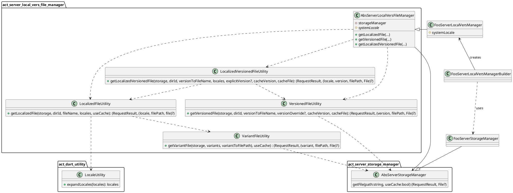

<!--
SPDX-FileCopyrightText: 2025 Anthony Loiseau <anthony.loiseau@allcircuits.com>

SPDX-License-Identifier: LicenseRef-ALLCircuits-ACT-1.1
-->

# Act Server Localized Versioned File Manager <!-- omit from toc -->

This package helps accessing translated and/or versioned files within a ServerStorageManager.

Retrieving GCU/GDPR texts from a remote server is a typical use case of this package,
as well as retrieving a firmware blob.

## Table of contents <!-- omit from toc -->

- [Features](#features)
  - [Key features](#key-features)
  - [Locales automatic expansion](#locales-automatic-expansion)
- [Requirements](#requirements)
  - [Localized files requirements](#localized-files-requirements)
  - [Versioned files requirements](#versioned-files-requirements)
  - [Localized and Versioned files requirements](#localized-and-versioned-files-requirements)
  - [Server storage requirements](#server-storage-requirements)
- [Technical details](#technical-details)
  - [Class diagram](#class-diagram)
- [How to use this package](#how-to-use-this-package)

## Features

### Key features

This package lets you:

- Download a localized file from a ServerStorageManager
- Download a versioned file from a ServerStorageManager
- Download a localized and versioned file from a ServerStorageManager

Those downloads can be cached, which is a feature of the ServerStorageManager.

Caller can retrieve effective locale and version of found file, alongside file itself.

### Locales automatic expansion

Locales are automatically expanded to help finding appropriate content.

If caller ask for a document in [fr_fr, en] locales, document is searched as:

1. fr_fr
2. fr
3. en

## Requirements

Files on the storage server must be stored using a specific layout.

### Localized files requirements

- Any localized file must be handled within a dedicated folder
- Such folder must contain one sub-folder per locale, underscore and lowercase
- Wanted file must exist in all local sub-folders, with the same name

Example:

```text
my_file/
├── en_gb/
│   └── my_file.md
├── en_us/
│   └── my_file.md
└── fr/
    └── my_file.md
```

### Versioned files requirements

- Any versioned file must be handled within a dedicated folder
- Such folder must contain a "current" text file (with no file extension)
- This "current" file must contain current version string
- Folder must have a file whose name is derived from this version string

Example:

```text
my_file/
├── current             # ex: "v3"
├── v1.md
├── v2.md
└── v3.md
```

### Localized and Versioned files requirements

A mix of the two.
Per-local sub-folders must contain a "current" file and its sibling file.

```text
foo/
├── en_gb
│   ├── current             # ex: "v1"
│   └── v1.md
├── en_us
│   ├── current             # ex: "v1"
│   └── v1.md
└── fr
    ├── current             # ex: "v2"
    ├── v1.md
    └── v2.md
```

### Server storage requirements

Only getFile feature is used from the server storage manager.
Especially listFiles is not used.

Localized files lookup is performed using consecutive file access trials
until one is found, therefore server storage must properly handle attempts
to read a non-existent file.

## Technical details

### Class diagram

Here is a class diagram of the package and its environment:



## How to use this package

To use this package you need to:

- Have a AbsServerStorageManager implementation
- Create manager subclass of AbsServerLocalVersFileManager
