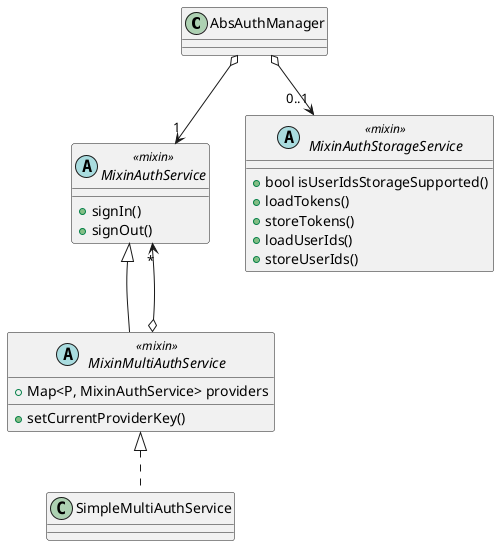

<!--
SPDX-FileCopyrightText: 2024 Benoit Rolandeau <benoit.rolandeau@allcircuits.com>

SPDX-License-Identifier: LicenseRef-ALLCircuits-ACT-1.1
-->

# ACT Shared authentication  <!-- omit from toc -->

## Table of contents

- [Table of contents](#table-of-contents)
- [Presentation](#presentation)
- [Architectural design](#architectural-design)
  - [Introduction](#introduction)
  - [Diagram](#diagram)

## Presentation

The goal of this package is to abstract the call of user authentication service: to have always the
same methods, the same way to store information, etc.

Therefore, if you change the authentication service, even if the low level code change, you won't
need to update all the caller classes (BLoC, views, other managers, etc.).

When another manager needed to know if the user is authenticated it will go through the classes
created here and not the specific classes.

## Architectural design

### Introduction

To simplify the app mobile design, we considere that there is only one user connected in the app at
a time. In other words, the final user only connects once in the app with an username and password
and the info linked are sufficient to access external services.

### Diagram

The `AbsAuthManager` manager is used to know the current user and if it's currently connected (or
not).

The `MixinAuthService` defines abstract methods to implement (it's an interface) for managing the
user authentication.

If the user has the possibily to sign in through multiple providers, for instance: to an internal
provider, Google, Facebook or Apple. You have to use the `MixinMultiAuthService` which manages
multiple `MixinAuthService`. However, it only allows to use different auth service but not in
parallel. You can't be connected with multiple account at the same time.

`MixinAuthStorageService` is used to store the authentication data: tokens and user ids (password +
username). We separate the authentication logic from the storage.

The service which implements `MixinAuthService` has to manage itself the storage of elements
through the `MixinAuthStorageService` (we don't develop a generic way to do it). This is because
each service has particularities which can't be generalised; for instance, Cognito library stores
itself the tokens.
